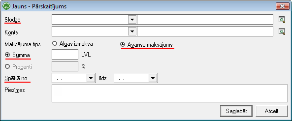

.. 294
 
Pārskaitījumi
*****************
 

Izmantojot Pārskaitījumu žurnālu, iespējams nodefinēt ikmēneša
izmaksājamos avansus.
Nodefinētie avansi dod iespēju automatizēti veidot avansu izmaksu
sarakstus par avansu summām, kas katru mēnesi atkārtojas.Šīs
automatizēti pievienotās summas avansu izmaksu sarakstā pēc tam ir arī
iespēja koriģēt pēc aktīvā perioda aktuālās informācijas.
Pārskaitījumu žurnālā tiek pievienots katra strādājošā ikmēneša avansa
summa. Izvēloties slodzi lietotājam laukā Bankas konts ir iespēja
nodefinēt strādājošā bankas kontu uz kuru tiks pārskaitīts avanss.
|images_ozols/24545.gif| Veidojot avansu izmaksas ierakstu obligāti
sadaļā Maksājuma tips ir jānorāda Avanss.

JaunuPārskaitījumu strādājošajam iespējams pievienot, rīku joslā
nospiežot pogu: |images_ozols/25605.png|

|images_ozols/26252.png|

Slodze: no saraksta jāizvēlas strādājošā slodze, kurai Avansu
pārskaitījums tiks definēts

Konts: atbilstoši izvēlētajai slodzei, tiks ielādēts :doc:`Partnera
kartiņā<312>` ievadītais strādājošā Privātkonts

Maksājuma tips: nepieciešams izvēlēties tipu: "Avansa maksājums"

Summa: nepieciešams ievadīt pārskaitāmā avansa summu
Spēkā no: nepieciešams norādītAvansa pārskaitījumaspēkā stāšanas
datumu no (mēneša pirmais datums, no kura šis avansa pārskaitījums ir
spēkā)

Spēkā līdz: ja nav zināms konkrēts datums, līdz kuram
noteiktaispārskaitījums būs spēkā, šo datumuvar neaizpildīt

|images_ozols/24545.gif| Daudzdimensiju uzskaitē (budžeti, ekonomiskās
klasifikācijas kodi, utt.) lietotājam papildus obligāti veidojot
avansu izmaksas ierakstu jānorāda no kādām dimensijām avanss tiks
veidots. Jānorāda summa, un jānorāda periods, kurā nodefinētā avansa
summa ir aktīva.

.. |images_ozols/24545.gif| image:: images_ozols/24545.gif
       :scale: 100%

.. |images_ozols/25605.png| image:: images_ozols/25605.png
       :scale: 100%

.. |images_ozols/24545.gif| image:: images_ozols/24545.gif
       :scale: 100%


 
