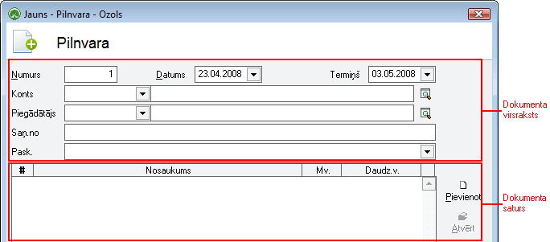
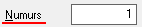
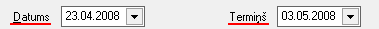
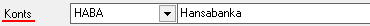
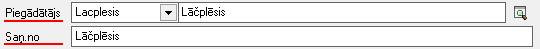
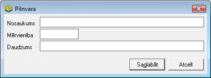

.. 303
 
Pilnvara
************
 

Izvēloties dokumenta veidu Pilnvara, tiks atvērts jauns logs:

|images_ozols/25532.png|

Pilnvaras virsrakstaaizpildīšana
++++++++++++++++++++++++++++++++

Lai aizpildītuPilnvarasVirsrakstu, nepieciešams:

1. Pilnvaras Numuru ievadīt nav nepieciešams - sistēma automātiski
piedāvā nākamo brīvo numuru pēc kārtas.

|images_ozols/25534.png|

2. Norādīt datumu, kurāpilnvara tiek veidota un pilnvaras derīguma
termiņu:

|images_ozols/25535.png|

3. Iespējams norādīt uzņēmuma bankas kontu, kuru nepieciešams uzrādīt
Pilnvaras izsniedzēja - uzņēmuma rekvizītos:

|images_ozols/25536.png|

4. Nepieciešams norādīt Piegādātāju - Partneri, no kura šī Pilnvara ir
saņemta:

|images_ozols/25537.png|

|images_ozols/24545.gif| Japiegādātājs nav datu bāzē, izmantojot
komandu |images_ozols/24743.png| atveras partneru saraksta logs un ir
iespējams pievienot jaunu partneri partneru sarakstā. Partnera
pievienošanu un aizpildīšanu skatīt :doc:` Partneris <312>` .

5. Laukā "Pask.", iespējams ievadīt Pilnvaras paskaidrojošo tekstu:

|images_ozols/25538.png|

Pilnvarassaturaaizpildīšana
+++++++++++++++++++++++++++

Lai aizpildītu Pilnvaras Saturu, dokumenta satura daļā nepieciešams
nospiest |images_ozols/24708.png| un tiks atvērts operācijas satura
logs, kurā nepieciešams aizpildīt satura ierakstus:

|images_ozols/25539.png|

.. |images_ozols/24545.gif| image:: images_ozols/24545.gif
       :scale: 100%

.. |images_ozols/24743.png| image:: images_ozols/24743.png
       :scale: 100%

.. |images_ozols/25538.png| image:: images_ozols/25538.png
       :scale: 100%

.. |images_ozols/24708.png| image:: images_ozols/24708.png
       :scale: 100%


 
