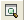
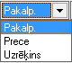

.. 304
 
Izejošais rēķins
********************
 
Norēķinu uzskaitei par uzņēmuma pircējiem un piegādātājiem, kā arī
preču uzskaitei noliktavās tiek izmantoti iepirkuma un pārdošanas
dokumenti.


Pārdošanas dokumenti ir pieejami no izvēlnes >Dokumenti > Norēķini >
Pārdošanas dokumenti


Jaunapārdošanas dokumenta pievienošana
Izmantojot Pārdošanas dokumentus, tiek realizēts preces, krājumi vai
pakalpojumi uzņēmuma pircējiem. Iespējams izmantot dažādus pārdošanas
dokumentu veidus, kurus iespējams definēt Norēķinu Sarakstos:
:doc:`Pārdošanas dokumentu veidi<157>` .


Lai pievienotu jaunu pārdošanas dokumentu, atrodoties zem moduļa
"Norēķini", sadaļas "Dokumenti", jāizvēlas pārdošanas dokumentu
žurnāls un komanda |images_ozols/24879.png| vai arī jāizvēlas
Norēķini->Jauns->Pārdošanas dokuments un tiks atvērts jauns pārdošanas
dokuments:


|images_ozols/26474.png|


Pārdošanasdokumenta virsraksta aizpildīšana
```````````````````````````````````````````

Lai aizpildītuPārdošanas dokumenta Virsrakstu, nepieciešams:


**1.** Izvēlēties iepirkuma dokumenta veidu, nospiežot uz dokumenta
veida nosaukumu:


|images_ozols/26475.png|


Pārdošanasdokumenta veidi ir definējami Sarakstā: :doc:`Pārdošanas
dokumentu veidi<157>`


**2.** Nepieciešams aizpildīt pārējos laukus Pārdošanas dokumenta
virsrakstā:


|images_ozols/26476.png|


**Numurs:** lauks tiek aizpildīts automātiski un paredzēts uzņēmuma
iekšējai uzskaitei. Numuri programmā tiek automātiski veidoti pēc
kārtas;

**Datums:** nepieciešams norādīt pārdošanas dokumenta izrakstīšanas
datumu;

**Nolikt.:** nepieciešams norādīt noliktavu, no kuras
pakalpojums/preces tiek izrakstīta;

|images_ozols/24545.gif| Ja uzņēmums uzskaitaizejošās preces,
krājumus, inventāru pa noliktavām, tad programmā jāizveido tik
:doc:`Noliktavas<142>` cik nepieciešams. Noliktava jānorāda pārdošanas
dokumentu aizpildīšanā, pat, ja operācija nav saistīta ar preču
kustību noliktavās.


**Dokuments:** izvēloties dokumenta veidu "Pavadzīme", nepieciešams
aizpildīt šos laukus, izvēloties sēriju un numuru sarakstā, kas
ievadīti :doc:`Stingrās uzskaites dokumentu<180>` žurnālā.

**Pircējs:** nepieciešams izvēlēties partneri no saraksta.

|images_ozols/24545.gif| Ja pircējs nav datu bāzē, izmantojot komandu
|images_ozols/24743.png| atveras partneru saraksta logs un ir
iespējams pievienot jaunu pircēju partneru sarakstā. Lai pievienotu
jaunu :doc:`Partneri<312>` , jāizmanto komanda
|images_ozols/24879.png| no rīku joslas un atveras jauna partnera
ievades kartiņa.
**Apmaksas veids:** iespēja norādīt pārdošanas dokumenta apmaksas
termiņu. Šo termiņu iespējams piesaistīt konkrētam partnerim,
definējot to :doc:`Partnera<112>` aprakstā, sadaļā "Pārējie dati";
**Termiņš:** lauks tiek aprēķināts automātiski, ja aizpildīts lauks -
apmaksas veids.

**Paskaidrojums:** brīvi definējams lauks. Paskaidrojumu iespējams
ievadīt ar roku vai izvēlēties jau iepriekš sagatavotu paskaidrojuma
tekstu.


|images_ozols/24545.gif| Lai pievienotu jaunu :doc:`Paskaidrojuma
tekstu<370>` , jāizmanto komanda |images_ozols/24635.gif| un
pievienot.


Pārdošanasdokumenta satura aizpildīšana
```````````````````````````````````````

Lai aizpildītu Pārdošanas dokumenta Saturu, dokumenta satura daļā
nepieciešams izmantot komandu |images_ozols/24879.png| un tiks atvērts
pārdošanas satura logs:


|images_ozols/26477.png|


Aizpildot satura laukus, vispirms nepieciešams norādīt iepirkuma
veidu: krājums, pakalpojums, pamatlīdzeklis vai prece:


|images_ozols/26478.png|


Tālāk nepieciešams norādīt preces nosaukumu, uzņēmumā izmantotās
dimensijas un norādīt satura ieraksta daudzumu,summu un nodokli. Lai
saglabātu satura ierakstu, jāizmanto komanda |images_ozols/24867.png|
vai komanda |images_ozols/24617.jpg| lai atceltu satura ieraksta
rindu. Dokumenta saturs var sastāvēt no vairākiem satura ierakstiem,
kas kopsummā veido dokumenta Virsrakstā norādīto summu. Lai pievienotu
nākamo satura ierakstu, jāizmanto komanda |images_ozols/24879.png| .


Sagatavotās pavadzīmes apakšējā daļā iespējams izvēlēties valūtu,
pavadzīmes izsniedzēju un saņēmēju:


|images_ozols/26479.png|


**Valūta:** iespēja izvēlēties saņemtā iepirkuma dokumenta valūtu.Ja
valūta ir LVL, tad blakus esošais lauks "Kurss" būs tukšs. Ievadot
kādu no citām valūtām, piemēram, EUR, blakus laukā "Kurss" automātiski
parādīsies Latvijas Bankas kurss uz rēķina saņemšanas datumu.


|images_ozols/24545.gif| Ja valūtas kurss dienas sākumā nav ievadīts,
tad parādīsies lodziņš kur tiks piedāvāts ielādēt Latvijas bankas
valūtas kursus uz rēķina saņemšanas dienu. Lai ielādētu Bankas kursus
ir jāizvēlas komanda |images_ozols/24902.png| . Nospiežot pogu
|images_ozols/24867.png| tiks ielādēti visi Latvijas Banka kursi tām
valūtām, kuras ir definētas programmā. Iepirkuma dokumentā parādīsies
attiecīgajai dokumenta valūtai atbilstošais kurss.

Izsniedza: Atbildīgā persona no :doc:`Partneru<112>` saraksta.


Pārdošanas dokumenta grāmatošana
````````````````````````````````

Pārdošanasdokumentu iespējams grāmatot no atvērtaPārdošanas dokumenta
vai izvēloties (iezīmējot) dokumentuPārdošanas dokumentu žurnālā. Lai
iegrāmatotuPārdošanas dokumentu, nepieciešams vispirms apstiprināt
dokumentu, izmantojot komandu |images_ozols/24740.png| no rīku joslas.
Apstiprinātu dokumentu ir iespējams grāmatot, izmantojot komandu
|images_ozols/24741.png| . Dokumentu grāmatošanu skatīt
:doc:`Dokumentu grāmatošanas principi<14044>` .


Pievienotāpārdošanas dokumenta labošana
```````````````````````````````````````

Labojumus saglabātajāPārdošanas dokumentā iespējams veikt atverot
Pārdošanas dokumentu, kurš vienlaicīgi pieejams
apskatei/labošanaipārdošanas dokumentu žurnālā. Lai veiktu labojumus
Pārdošanas dokumentā, šo dokumentu nepieciešams atvērt, izmantojot
komandu |images_ozols/24709.png| no rīku joslas un atvērtajā ierakstā
iespējams veikt nepieciešamos labojumus. Pēc labojumu veikšanas,
veiktās izmaiņas iespējams |images_ozols/24867.png| vai
|images_ozols/24617.jpg| .


.. |images_ozols/24879.png| image:: images_ozols/24879.png
       :scale: 100%


.. |images_ozols/26475.png| image:: images_ozols/26475.png
       :scale: 100%




.. |images_ozols/24879.png| image:: images_ozols/24879.png
       :scale: 100%


.. |images_ozols/24635.gif| image:: images_ozols/24635.gif
       :scale: 100%

.. |images_ozols/24879.png| image:: images_ozols/24879.png
       :scale: 100%




.. |images_ozols/24867.png| image:: images_ozols/24867.png
       :scale: 100%

.. |images_ozols/24617.jpg| image:: images_ozols/24617.jpg
       :scale: 100%

.. |images_ozols/24879.png| image:: images_ozols/24879.png
       :scale: 100%

.. |images_ozols/26479.png| image:: images_ozols/26479.png
       :scale: 100%


.. |images_ozols/24902.png| image:: images_ozols/24902.png
       :scale: 100%

.. |images_ozols/24867.png| image:: images_ozols/24867.png
       :scale: 100%

.. |images_ozols/24740.png| image:: images_ozols/24740.png
       :scale: 100%

.. |images_ozols/24741.png| image:: images_ozols/24741.png
       :scale: 100%

.. |images_ozols/24709.png| image:: images_ozols/24709.png
       :scale: 100%

.. |images_ozols/24867.png| image:: images_ozols/24867.png
       :scale: 100%

.. |images_ozols/24617.jpg| image:: images_ozols/24617.jpg
       :scale: 100%


 
