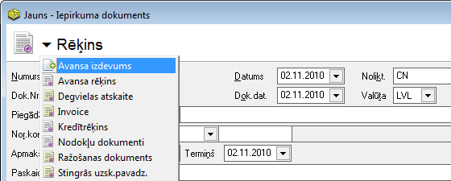
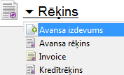
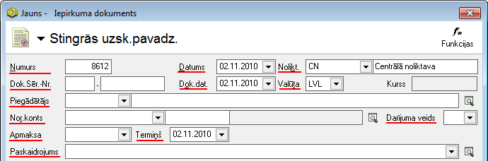
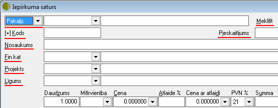
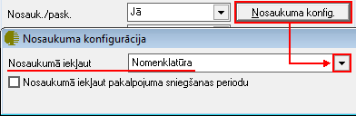

.. 310
 
Iepirkuma dokuments
***********************
 


Norēķinu uzskaitei par uzņēmuma pircējiem un piegādātājiem, kā arī
preču uzskaitei noliktavās tiek izmantoti iepirkuma un pārdošanas
dokumenti.

Iepirkuma dokumenti ir pieejami no izvēlnes >Dokumenti > Norēķini >
Iepirkumu dokumenti


Jauna iepirkuma dokumenta pievienošana
``````````````````````````````````````
Izmantojot Iepirkuma dokumentus, tiek ievadīti uzņēmumā saņemtie
pakalpojumi/preces/krājumi un pamatlīdzekļi, tādejādi veicot norēķinu
uzskaiti ar piegādātājiem.Iepirkumu dokumentu ievadei var izmantot
dažādus dokumenta veidus, kurus iespējams definēt Norēķinu Sarakstos:
:doc:`Iepirkumu dokumentu veids<158>`


Lai pievienotu jaunu iepirkuma dokumentu, atrodoties zem moduļa
"Norēķini", sadaļas "Dokumenti", jāizvēlas iepirkuma dokumentu žurnāls
un komanda .. image:: images_ozols/24879.png
:scale: 100%
vai arī jāizvēlas Norēķini->Jauns->Iepirkumu dokuments un tiks atvērts
jauns iepirkuma dokuments:



:scale: 100%


Iepirkuma dokumenta virsraksta aizpildīšana
```````````````````````````````````````````

Lai aizpildītu Iepirkuma dokumenta Virsrakstu, nepieciešams:


**1.** Izvēlēties iepirkuma dokumenta veidu, nospiežot uz dokumenta
veida nosaukumu:



:scale: 100%


Iepirkuma dokumenta veidi ir definējami Sarakstā: :doc:`Iepirkumu
dokumentu veidi<158>` .


**2.** Nepieciešams aizpildīt pārējos laukus Iepirkuma dokumenta
virsrakstā:



:scale: 100%


**Numurs:** lauks tiek aizpildīts automātiski turpinot uzņēmumā
saņemto iepirkumu dok.numerāciju pēc kārtas:

**Dok.Sēr.-Nr**.: nepieciešams ievadīt rēķina vai preču pavadzīmes
numuru;


**Datums:** datums, kad reāli iepirkuma dokuments saņemts no
piegādātāja;

**Dok.datums:** datums, kad iepirkuma dokuments sagatavots (rēķina vai
pavadzīmes izrakstīšanas datums);

**Noliktava**: iespēja izvēlēties noliktavu.


.. image:: images_ozols/24545.gif
:scale: 100%
Ja uzņēmums uzskaita ieejošās preces, krājumus, inventāru pa
noliktavām, tad programmā jāizveido tik noliktavas cik nepieciešams
(skatīt :doc:`Noliktavas<142>` )un vadot iepirkuma dokumentu šajā logā
jāizvēlas tā noliktava, uz kuru attiecas iepērkamā prece. Noliktava
jānorāda visos iepirkumu dokumentos, pat, ja operācija nav saistīta ar
preču kustību noliktavās.

**Valūta:** iespēja izvēlēties saņemtā iepirkuma dokumenta valūtu.Ja
valūta ir LVL, tad blakus esošais lauks "Kurss" būs tukšs. Ievadot
kādu no citām valūtām, piemēram, EUR, blakus laukā "Kurss" automātiski
parādīsies Latvijas Bankas kurss uz rēķina saņemšanas datumu.


.. image:: images_ozols/24545.gif
:scale: 100%
Ja valūtas kurss dienas sākumā nav ievadīts, tad parādīsies lodziņš
kur tiks piedāvāts ielādēt Latvijas bankas valūtas kursus uz rēķina
saņemšanas dienu. Lai ielādētu Bankas kursus ir jāizvēlas komanda ..
image:: images_ozols/24902.png
:scale: 100%
. Nospiežot pogu .. image:: images_ozols/24867.png
:scale: 100%
tiks ielādēti visi Latvijas Banka kursi tām valūtām, kuras ir
definētas programmā. Iepirkuma dokumentā parādīsies attiecīgajai
dokumenta valūtai atbilstošais kurss.


**Piegādātājs:** no saraksta iespējams izvēlēties partneri.


.. image:: images_ozols/24545.gif
:scale: 100%
Ja piegādātājs nav datu bāzē, izmantojot komandu .. image::
images_ozols/24743.png
:scale: 100%
atveras partneru saraksta logs un ir iespējams pievienot jaunu
piegādātāju partneru sarakstā. Lai pievienotu jaunu partneri ir
jāizmanto komanda .. image:: images_ozols/24879.png
:scale: 100%
no rīku joslas un atveras jauna:doc:` Partnera<312>` ievades
kartiņa.:doc:`<312>`

**Apmaksas veids**: iespēja norādīt iepirkuma dokumenta apmaksas
termiņu. Šo termiņu iespējams piesaistīt konkrētam partnerim,
nodefinējot to :doc:`Partnera<112>` aprakstā, sadaļā "Pārējie dati";

**Termiņš: **lauks tiek aprēķināts automātiski, ja aizpildīts lauks -
apmaksas veids.


**Paskaidrojums:** brīvi definējams lauks. Paskaidrojumu iespējams
ievadīt ar roku vai izvēlēties jau iepriekš sagatavotu paskaidrojuma
tekstu.

.. image:: images_ozols/24545.gif
:scale: 100%
Lai pievienotu jaunu :doc:`Paskaidrojuma tekstu<370>` , jāizmanto
komanda .. image:: images_ozols/24635.gif
:scale: 100%
un pievienot.

**Darījuma veids:** lauku nepieciešams aizpildīt, ievadot informāciju
par saņemtajiem darījumiem no ārvalstīm, norādot Intrastat darījuma
veidu.


Iepirkuma dokumenta satura aizpildīšana

Lai aizpildītu Iepirkuma dokumenta Saturu, dokumenta satura daļā
nepieciešams izmantot komandu .. image:: images_ozols/24879.png
:scale: 100%
un tiks atvērtsiepirkuma satura logs:



:scale: 100%


Aizpildot satura laukus, vispirms nepieciešams norādīt iepirkuma
veidu: krājums, pakalpojums, pamatlīdzeklis vai prece:


.. image:: images_ozols/26473.png
:scale: 100%


Tālāk nepieciešams norādīt preces nosaukumu, uzņēmumā izmantotās
dimensijas un norādīt satura ieraksta daudzumu,summu un nodokli.


Lai saglabātu satura ierakstu, jāizmanto komanda .. image::
images_ozols/24867.png
:scale: 100%
vai komanda .. image:: images_ozols/24617.jpg
:scale: 100%
, lai atceltu satura ieraksta rindu. Dokumenta saturs var sastāvēt no
vairākiem satura ierakstiem, kas kopsummā veido dokumenta Virsrakstā
norādīto summu. Lai pievienotu nākamo satura ierakstu, jāizmanto
komanda .. image:: images_ozols/24879.png
:scale: 100%
.


Iepirkuma dokumenta grāmatošana
```````````````````````````````

Iepirkuma dokumentu iespējams grāmatot no atvērta Iepirkuma dokumenta
vai izvēloties (iezīmējot) dokumentu Iepirkuma dokumentu žurnālā. Lai
iegrāmatotu Iepirkuma dokumentu, nepieciešams vispirms apstiprināt
dokumentu, izmantojot komandu.. image:: images_ozols/24740.png
:scale: 100%
no rīku joslas. Apstiprinātu dokumentu ir iespējams grāmatot,
izmantojot komandu .. image:: images_ozols/24741.png
:scale: 100%
. Dokumentu grāmatošanu skatīt :doc:`Dokumentu grāmatošanas
principi<14044>` .


Pievienotā iepirkuma dokumenta labošana
```````````````````````````````````````

Labojumus saglabātajā Iepirkuma dokumentā iespējams veikt atverot
Iepirkuma dokumentu, kurš vienlaicīgi pieejams apskatei/labošanai
iepirkuma dokumentu žurnālā. Lai veiktu labojumus Iepirkuma dokumentā,
šo dokumentu nepieciešams atvērt, izmantojot komandu .. image::
images_ozols/24709.png
:scale: 100%
no rīku joslas un atvērtajā ierakstā iespējams veikt nepieciešamos
labojumus. Pēc labojumu veikšanas, veiktās izmaiņas iespējams ..
image:: images_ozols/24867.png
:scale: 100%
vai .. image:: images_ozols/24617.jpg
:scale: 100%


Satura formas lauku konfigurācija
`````````````````````````````````

Lai lietotājam, aizpildot dokumenta saturu, aizpildītos lauki kods un
nosaukums , iepirkuma dokumentā jānospiež poga .. image::
images_ozols/25814.png
:scale: 100%
un jāizvēlas .. image:: images_ozols/26096.png
:scale: 100%
. Iepirkumu dokumentu saturu formas lauku konfigurācijā jānorāda
parametrs, lai šie lauki aizpildītos no nomenklatūras (Pakalpojuma
kartiņas):



:scale: 100%


Vienreizēji šādu darbību veicos, iepirkuma saturā, izvēloties
Pakalpojumu, tiks aizpildīti lauki – kods+ nosaukums.


 
