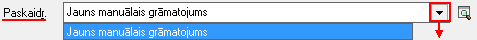
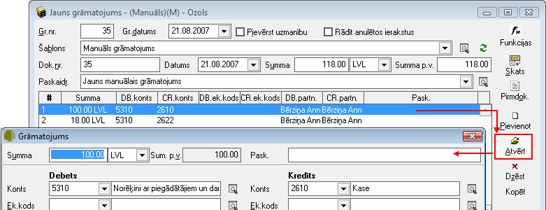

.. 331
 
Grāmatojums
***************
 
:doc:`<628>`

Grāmatojums ir pirmdokumenta kontējums. Grāmatojums tiek izveidots
dokumenta veidā, un visi izveidotie grāmatojumi ir pieejami
:doc:`Grāmatojumu žurnālā<131>` . Grāmatojums ar pirmdokumentu ir
cieši saistīts, no pirmdokumenta ar CTRL+G komandas palīdzību var
izsaukt dokumenta grāmatojumu. No grāmatojuma ekrāna formas var atvērt
grāmatojuma pirmdokumentu. Aktīvās grāmatojumu atskaites sniedz
detalizāciju līdz pat grāmatojuma atvēršanai no atskaites formas.
Grāmatojot dokumentu, jāizvēlas :doc:`Grāmatojumu šablons<135>` , lai
automatizēti izveidotu kontējumu.

Grāmatojuma satura kolonnas var konfigurēt, nosakot kādu informāciju
jāparāda grāmatojuma saturā.


Jauna manuālā grāmatojuma pievienošana
``````````````````````````````````````

Izvēloties dokumenta veidu Grāmatojums, tiks atvērts jauns logs:


|images_ozols/25096.png|


Manuālā grāmatojuma virsraksta aizpildīšana
+++++++++++++++++++++++++++++++++++++++++++


Lai aizpildītu Grāmatojuma Virsrakstu, nepieciešams:


1. Norādīt Grāmatojuma datumu (pēc noklusējuma, laukā Gr.datums tiek
ielikts tekošās dienas datums):


|images_ozols/25097.png|


2. Ierakstīt grāmatojuma kopējo summu un norādīt grāmatojuma valūtu
(ja izvēlētā valūta atšķiras no datu bāzē norādītās pamatvalūtas,
laukā summa p.v. ievadītā summa tiks uzrādīta pamatvalūtā, aprēķināta
pēc LB kursa)


|images_ozols/25098.png|


3. Iespēja aizpildīt Grāmatojuma Paskaidrojumu, izvēloties
paskaidrojuma tekstu nonodefinētajiem :doc:`Grāmatojumu
paskaidrojuiem<628>` vai ierakstot Paskaidrojuma tekstu manuāli:


|images_ozols/25099.png|


Manuālā grāmatojuma Satura aizpildīšana
+++++++++++++++++++++++++++++++++++++++

Lai aizpildītu Grāmatojuma Saturu, dokumenta satura daļā nepieciešams
nospiest |images_ozols/24708.png| un tiks atvērts operācijas satura
logs, kurā nepieciešams aizpildīt satura ierakstus (uzņēmumā
izmantotās dimensijas) un norādīt satura ieraksta summu:


|images_ozols/25100.png|


|images_ozols/24545.gif| Ja grāmatojuma satura ieraksta rindiņu Debeta
un Kredīta pusē nepieciešams norādīt atšķirīgas dimensijas (Piemēram,
DB puses EK atšķirīgs no CR puses EK), satura logā iespējams atzīmēt
izvēles rūtiņu: |images_ozols/25103.png| , tādejādi labojot vienas
puses ierakstus, labojums automātiski nepārnesīsies uz otru satura
ieraksta pusi.

Pēcsatura ierakstu aizpildīšanas,ierakstu iespējams
|images_ozols/24615.jpg| vai |images_ozols/24617.jpg| .


Manuālā grāmatojuma Satura ierakstu labošana
++++++++++++++++++++++++++++++++++++++++++++

Lai veiktu labojumus,satura ierakstunepieciešams atvērt, izmantojot
rīku joslas pogu |images_ozols/24709.png| (ALT+A), unatvērtajāierakstā
iespējams veiktnepieciešamos labojumus:


|images_ozols/25105.png|


Manuālā grāmatojuma saglabāšana un apstiprināšana
+++++++++++++++++++++++++++++++++++++++++++++++++


Pēc nepieciešamo satura ierkastu pievienošanas, grāmatojuma
dokumentātiek parādīts operācijas kontējums.


Jagrāmatojums ir aizpildīts, ir divas iespējas, kā saglabāt
grāmatojumu:

1) nospiežot pogu |images_ozols/24615.jpg| - grāmatojums tiks
saglabāts :doc:`Grāmatojumu žurnālā<131>` , bet tas nebūs
Apstiprināts, un līdz ar to būs iespēja veikt korekcijas, ja tas būs
nepieciešams;

2) rīku joslā nospiežot pogu |images_ozols/24740.png| (Ctrl+R)-
izpildot šo darbību, grāmatojums vienlaicīgi tiks saglabāts un
apstiprināts, kasnozīmē, kagrāmatojuma sagatavošana ir pabeigta.
Apstiprinātais grāmatojums būs pieejams :doc:`Grāmatojumu
žurnālā<131>` .

.. |images_ozols/25096.png| image:: images_ozols/25096.png
       :scale: 100%


.. |images_ozols/25098.png| image:: images_ozols/25098.png
       :scale: 100%



.. |images_ozols/24708.png| image:: images_ozols/24708.png
       :scale: 100%

.. |images_ozols/25100.png| image:: images_ozols/25100.png
       :scale: 100%

.. |images_ozols/24545.gif| image:: images_ozols/24545.gif
       :scale: 100%


.. |images_ozols/24615.jpg| image:: images_ozols/24615.jpg
       :scale: 100%

.. |images_ozols/24617.jpg| image:: images_ozols/24617.jpg
       :scale: 100%

.. |images_ozols/24709.png| image:: images_ozols/24709.png
       :scale: 100%



.. |images_ozols/24615.jpg| image:: images_ozols/24615.jpg
       :scale: 100%

.. |images_ozols/24740.png| image:: images_ozols/24740.png
       :scale: 100%


 
