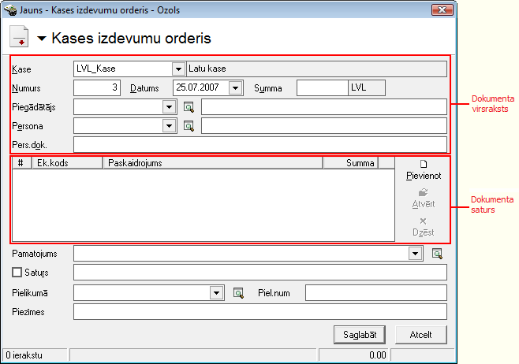
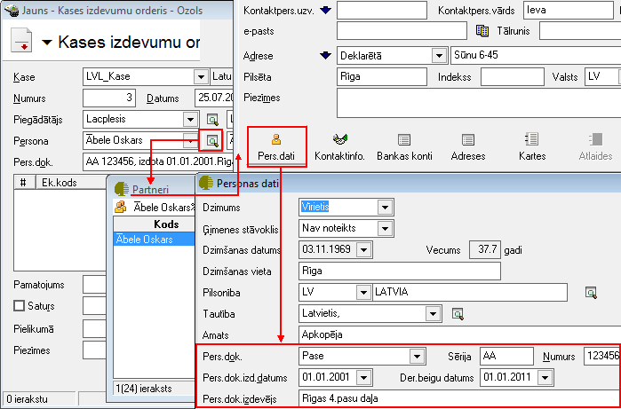

.. 332
 
Kases izdevumu orderis
**************************
 


Kases izdevumu orderis jāveido, kad tiek noformēta operācija par
skaidras naudas izmaksu no uzņēmuma kases. Dokumentam ir iebūvēta
standarta izdrukas forma. Dokuments tiek saglabāts žurnālā :doc:`Kases
izdevumi<225>` . Darījuma atšifrēšanai pa finanšu (EK) kodiem,
jāaizpilda dokumenta saturs. Lai dokumenta izdrukā parādītos
grāmatojumu konti, dokuments pirms izdrukāšanas ir jāiegrāmato.


JaunaKases izdevumu orderapievienošana
``````````````````````````````````````

Izvēloties dokumenta veidu Kases izdevumu orderis, tiks atvērts jauns
logs:


|images_ozols/24996.png|


Kases izdevumu orderaVirsraksta aizpildīšana
++++++++++++++++++++++++++++++++++++++++++++


Lai aizpildītu Kases izdevumu ordera Virsrakstu, nepieciešams:


1. Norādīt Uzņēmuma kasi, no kura šis maksājums tiks izpildīts:


|images_ozols/24826.png|


2. Izvēlēties Datumu, kurā šisKases izdevumu orderistiek veidots:


|images_ozols/24811.png|


3.Ievadīt kopējo Kases izdevumu ordera summu:


|images_ozols/24812.png|


4. No saraksta izvēlēties nepieciešamo Piegādātāju - Juridisku vai
fizisku personu , kurai šī skaidras naudas operācijatiks noformēts:


|images_ozols/24827.png|


5. No saraksta izvēlēties nepieciešamo Personu - fizisku personu,
kurai šī skaidras naudas operācijatiks noformēts:


|images_ozols/24828.png|


Aizpildot lauku Persona , lauks Pers.dok. tiks aizpildīts automātiski,
pie nosacījuma, ja šie personas dati būs aizpildīti Partnera kartiņā:


|images_ozols/24831.png|


|images_ozols/24545.gif| Noformējot skaidras naudas operāciju
Juridiskai personai, laukā Piegādātājs jāvada Juridiskās personas
nosaukums un laukā Persona - Fiziskās personas nosaukums, kura šo
Juridisko personu pārstāv. Noformējot skaidras naudas operāciju
fiziskai personai, gan laukā Piegādātājs , gan Persona , jānorāda
Fiziskas personas nosaukums.


Kases izdevumu ordera Satura aizpildīšana
+++++++++++++++++++++++++++++++++++++++++

Lai aizpildītu Kases izdevumu orderaSaturu, dokumenta satura daļā
nepieciešams nospiest |images_ozols/24708.png| un tiks atvērts
operācijas satura logs, kurā nepieciešams aizpildīt satura ierakstus
(uzņēmumā izmantotās dimensijas) un norādīt satura ieraksta summu:


|images_ozols/24832.png|


|images_ozols/24545.gif| Dokumenta saturs var sastāvēt no vairākiem
satura ierakstiem, kas kopsummā veido Dokumenta Virsrakstā norādīto
summu.Pievienot nākamo satura ierakstu iespējams, satura daļā
nospiežot pogu |images_ozols/24708.png| .


Kases izdevumu ordera Pamatojuma un Satura aizpildīšana
+++++++++++++++++++++++++++++++++++++++++++++++++++++++


Kases izdevumu orderalauki Pamatojums un Saturs tiek drukāti kases
izdevumu ordera rindā Pamatojums.

Lauku Kases izdevuma ordera Pamatojums , iespējams aizpildīt manuāli
vai izvēloties no :doc:`Kases paskaidrojumu saraksta<136>` :


|images_ozols/24835.png|


Aktivizējot izvēli Saturs, laukā tiek salikti dokumenta satura finanšu
(EK) kodi un summas, līdz ar to iespējams automatizēti iegūt
informāciju par summas sadalījumu pa EK kodiem vai maksājuma PVN
summu:


|images_ozols/24730.png|


Kases izdevuma ordera Pielikuma informācijas aizpildīšana
+++++++++++++++++++++++++++++++++++++++++++++++++++++++++


Lauku Pielikumā , Kases izdevumu orderim iespējams aizpildīt manuāli
vai izvēloties no :doc:`Kases pielikumu saraksta<137>` , laukā
Piel.num. nepieciešams ierakstīt attiecīgā Pielikuma dokumenta numuru:


|images_ozols/24838.png|


Kad visi nepieciešamie lauki ir aizpildīti, Kases izdevumu orderis ir
sagatavots un to ir iespējams:

1. Saglabāt,nospiežot pogu |images_ozols/24615.jpg| -dokuments tiks
saglabāts un būs pieejams apskatei/labošanai/grāmatošanai :doc:`Kases
izdevumu žurnālā<225>` .

2. Apstiprināt, nospiežot rīku joslā pogu |images_ozols/24740.png|
-Kases izdevumu orderistiks Apstiprināts un to būs iespējams Grāmatot.


Kases izdevumu orderagrāmatošana
````````````````````````````````

Lai dokumenta izdrukā parādītos grāmatojumu konti, dokuments pirms
izdrukāšanas ir jāiegrāmato.

Kases izdevumu orderiiespējams grāmatot no atvērta Kases izdevumu
ordera dokumenta vai izvēloties (iezīmējot)dokumentu :doc:`Kases
izdevumu žurnālā<225>` .

Lai iegrāmatotu Kases izdevumu orderi, dokumentu nepieciešams
Apstiprināt, nospiežot rīku joslā pogu |images_ozols/24740.png| .

Apstiprinātu dokumentu ir iespējams grāmatot, nospiežot rīku joslā
pogu |images_ozols/24741.png| .


Instrukcija - :doc:`Dokumentu grāmatošanas principi<14044>`


Pievienotā Kases izdevumu ordera labošana
`````````````````````````````````````````

Labojumus saglabātajādokumentā iespējams veikt atverot Kases izdevumu
orderi, kurš pieejams apskatei/labošanai :doc:`Kases izdevumu
žurnālā<225>` . Lai veiktu labojumusKases izdevumu
orderī,dokumentunepieciešams atvērt, izmantojot rīku joslas pogu
|images_ozols/24709.png| (ALT+A), unatvērtajāierakstā iespējams
veiktnepieciešamos labojumus:


|images_ozols/24839.png|


Pēc labojumu veikšanas, veiktā izmaiņas iespējams
|images_ozols/24615.jpg| vai |images_ozols/24617.jpg| .



.. |images_ozols/24826.png| image:: images_ozols/24826.png
       :scale: 100%

.. |images_ozols/24811.png| image:: images_ozols/24811.png
       :scale: 100%

.. |images_ozols/24812.png| image:: images_ozols/24812.png
       :scale: 100%


.. |images_ozols/24828.png| image:: images_ozols/24828.png
       :scale: 100%



.. |images_ozols/24545.gif| image:: images_ozols/24545.gif
       :scale: 100%

.. |images_ozols/24708.png| image:: images_ozols/24708.png
       :scale: 100%


.. |images_ozols/24545.gif| image:: images_ozols/24545.gif
       :scale: 100%

.. |images_ozols/24708.png| image:: images_ozols/24708.png
       :scale: 100%

.. |images_ozols/24835.png| image:: images_ozols/24835.png
       :scale: 100%


.. |images_ozols/24838.png| image:: images_ozols/24838.png
       :scale: 100%

.. |images_ozols/24615.jpg| image:: images_ozols/24615.jpg
       :scale: 100%

.. |images_ozols/24740.png| image:: images_ozols/24740.png
       :scale: 100%

.. |images_ozols/24740.png| image:: images_ozols/24740.png
       :scale: 100%

.. |images_ozols/24741.png| image:: images_ozols/24741.png
       :scale: 100%

.. |images_ozols/24709.png| image:: images_ozols/24709.png
       :scale: 100%


.. |images_ozols/24615.jpg| image:: images_ozols/24615.jpg
       :scale: 100%

.. |images_ozols/24617.jpg| image:: images_ozols/24617.jpg
       :scale: 100%


 
