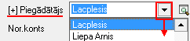

.. 347
 
Bankas maksājuma uzdevums
*****************************
 


Bankas maksājuma uzdevums noformē naudas pārskaitījumu no uzņēmuma
:doc:`Banku konta<141>` - pārskaitījums uzņēmuma piegādātājiem, algu
izmaksas, nodokļu maksājumi, utt.. Maksājuma uzdevumus var drukāt,
izmantojot iebūvēto izdrukas formu, vai eksportēt uz :doc:`Bankas
elektronisko norēķinu sistēmām<160>` , lai tālāk nosūtītu apstrādei uz
banku. Dokuments tiek saglabāts žurnālā :doc:`Bankas izdevumi<224>` .


Jauna Bankas maksājuma uzdevuma pievienošana
````````````````````````````````````````````

Izvēloties dokumenta veidu Bankas maksājuma uzdevums, tiks atvērts
jauns logs:


.. image:: images_ozols/24991.png
:scale: 100%


Bankas maksājuma uzdevuma Virsraksta aizpildīšana
+++++++++++++++++++++++++++++++++++++++++++++++++


Lai aizpildītu Bankas maksājuma uzdevuma Virsrakstu, nepieciešams:


1. Norādīt Uzņēmuma bankas kontu, no kura šis maksājums tiks
izpildīts:


.. image:: images_ozols/24724.png
:scale: 100%


2. Izvēlēties Datumu, kurā šis Bankas maksājuma uzdevums tiek veidots:


.. image:: images_ozols/24725.png
:scale: 100%


3. Norādīt nepieciešamo Bankas maksājuma valūtu un ievadīt kopējo
Dokumenta summu:


.. image:: images_ozols/24726.png
:scale: 100%


4. No saraksta izvēlēties nepieciešamo partneri (Piegādātāju), kuram
šis naudas pārskaitījums tiks noformēts:



:scale: 100%


Izvēloties nepieciešamo Piegādātāju, lauki Nor.konts , Reģ.nr. , Banka
un Kods tiks aizpildīti automātiski no :doc:`Partnera kartiņas<312>` .


Bankas maksājuma uzdevumaSatura aizpildīšana
++++++++++++++++++++++++++++++++++++++++++++

Lai aizpildītu Bankas maksājuma uzdevuma Saturu, dokumenta satura daļā
nepieciešams nospiest .. image:: images_ozols/24708.png
:scale: 100%
un tiks atvērts operācijas satura logs, kurā nepieciešams aizpildīt
satura ierakstus (uzņēmumā izmantotās dimensijas) un norādīt satura
ieraksta summu:


.. image:: images_ozols/24728.png
:scale: 100%


.. image:: images_ozols/24545.gif
:scale: 100%
Dokumenta saturs var sastāvēt no vairākiem satura ierakstiem, kas
kopsummā veido Dokumenta Virsrakstā norādīto summu.Pievienot nākamo
satura ierakstu iespējams, satura daļā nospiežot pogu .. image::
images_ozols/24708.png
:scale: 100%
.


Maksājuma dokumenta Mērķa un Satura aizpildīšana
++++++++++++++++++++++++++++++++++++++++++++++++


Maksājuma dokumentu lauki Mērķis un Saturs tiek drukāti maksājuma
uzdevuma rindā Maksājuma mērķis.

Lauku Bankas maksājuma uzdevuma Mērķis, iespējams aizpildīt manuāli
vai izvēloties no :doc:`Bankas paskaidrojumu saraksta<147>` :


.. image:: images_ozols/24729.png
:scale: 100%


Aktivizējot izvēli Saturs, laukā tiek salikti dokumenta satura finanšu
(EK) kodi un summas, līdz ar to iespējams automatizēti iegūt
informāciju par summas sadalījumu pa EK kodiem vai maksājuma PVN
summu:


.. image:: images_ozols/24730.png
:scale: 100%


Sagatavojot Bankas maksājuma uzdevumu, dokumentam, kurš sagatavots
izvēloties uzņēmuma :doc:`Banku kontu<141>` , kuram piesaistīta kāda
no :doc:`Bankas elektronisko norēķinu sistēmām<160>` , ekrāna formā
automātiski ir aktivizēta izvēle Eksportēt uz bankas elektronisko
norēķinu sistēmu:


.. image:: images_ozols/24733.png
:scale: 100%


Visi dokumenti, kuriem ir šāda izvēle, var tik eksportēti uz
elektronisko banku norēķinu sistēmu, lai būtu iespējams
veikt:doc:`Datu apmaiņu ar banku<451>` .


Maksājumu uzdevuma starpbankas datu aizpildīšana
++++++++++++++++++++++++++++++++++++++++++++++++


Bankas izdevumu dokumentiem iespējams aizpildīt datus par starpbanku,
Maksājuma uzdevuma logā aktivizējot izvēli Starpbanka:

.. image:: images_ozols/24732.png
:scale: 100%


Kad visi nepieciešamie lauki ir aizpildīti, Bankas maksājuma uzdevums
ir sagatavots un to ir iespējams:

1. Saglabāt,nospiežot pogu .. image:: images_ozols/24615.jpg
:scale: 100%
-dokuments tiks saglabāts un būs pieejams
apskatei/labošanai/grāmatošanai :doc:`Bankas izdevumu žurnālā<224>` .

2. Apstiprināt, nospiežot rīku joslā pogu .. image::
images_ozols/24740.png
:scale: 100%
- Bankas maksājuma uzdevums tiks Apstiprināts un to būs iespējams
Grāmatot.


Bankas maksājuma uzdevuma grāmatošana
`````````````````````````````````````

Bankas maksājumu uzdevumu iespējams grāmatot no atvērta Bankas
maksājuma uzdevuma dokumenta vai izvēloties (iezīmējot)dokumentu
:doc:`Bankas izdevumu žurnālā<224>` .

Lai iegrāmatotu Bankas maksājuma uzdevumu, dokumentu nepieciešams
Apstiprināt, nospiežot rīku joslā pogu .. image::
images_ozols/24740.png
:scale: 100%
.

Apstiprinātu dokumentu ir iespējams grāmatot, nospiežot rīku joslā
pogu .. image:: images_ozols/24741.png
:scale: 100%
.


Instrukcija - :doc:`Dokumentu grāmatošanas principi<14044>`


Pievienotā Bankasmaksājuma uzdevumalabošana
```````````````````````````````````````````

Labojumus saglabātajādokumentā iespējams veikt atverot Bankas
maksājuma uzdevumu, kurš pieejams apskatei/labošanai:doc:`Bankas
izdevumu žurnālā<224>` . Lai veiktu labojumusBankas maksājuma
uzdevumā,dokumentunepieciešams atvērt, izmantojot rīku joslas pogu..
image:: images_ozols/24709.png
:scale: 100%
(ALT+A), unatvērtajāierakstā iespējams veiktnepieciešamos labojumus:


.. image:: images_ozols/24736.png
:scale: 100%


Pēc labojumu veikšanas, veiktā izmaiņas iespējams .. image::
images_ozols/24615.jpg
:scale: 100%
vai .. image:: images_ozols/24617.jpg
:scale: 100%
.



 
