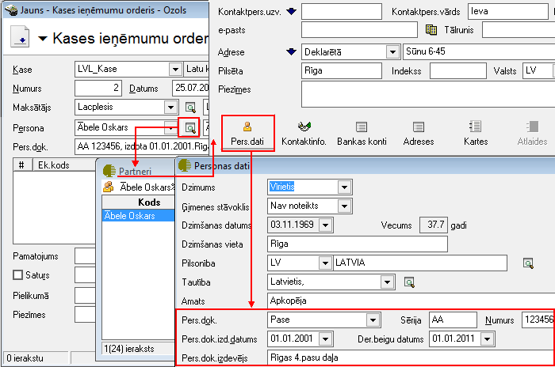
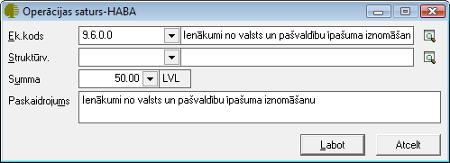
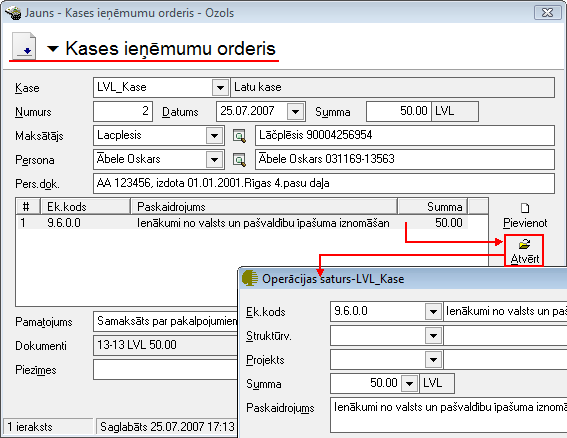

.. 350
 
Kases ieņēmumu orderis
**************************
 


Kases ieņēmumu orderis jāveido, kad tiek saņemta nauda kasē no
uzņēmuma darījuma partneriem. Kases ieņēmumu orderi tiek saglabāti
dokumentu žurnālā :doc:`Kases ieņēmumi<227>` , un dokumentam ir
iebūvēta standarta izdrukas forma. Darījuma atšifrēšanai pa finanšu
(EK) kodiem, jāaizpilda dokumenta saturs. Lai dokumenta izdrukā
parādītos grāmatojumu konti, dokuments pirms izdrukāšanas ir
jāiegrāmato.


JaunaKases ieņēmumu orderapievienošana
``````````````````````````````````````

Izvēloties dokumenta veidu Kases ieņēmumu orderis, tiks atvērts jauns
logs:


|images_ozols/24995.png|


Kasesieņēmumu orderaVirsraksta aizpildīšana
+++++++++++++++++++++++++++++++++++++++++++


Lai aizpildītu Kasesieņēmumu ordera Virsrakstu, nepieciešams:


1. Norādīt Uzņēmuma kasi, uz kurusaņemta nauda kasē no uzņēmuma
darījuma partneriem:


|images_ozols/24826.png|


2. Izvēlēties Datumu, kurā šisKasesieņēmumu orderistiek veidots:


|images_ozols/24811.png|


3.Ievadīt kopējo Kasesieņēmumu ordera summu:


|images_ozols/24812.png|


4. No saraksta izvēlēties nepieciešamo Maksātāju - Juridisku vai
fizisku personu, no kura nauda kasē tiek saņemta:


|images_ozols/24859.png|


5. No saraksta izvēlēties nepieciešamo Personu - fizisku personu, no
kuras nauda kasē tiek saņemta:


|images_ozols/24828.png|


Aizpildot lauku Persona , lauks Pers.dok. tiks aizpildīts automātiski,
pie nosacījuma, ja šie personas dati būs aizpildīti Partnera kartiņā:


|images_ozols/24862.png|


|images_ozols/24545.gif| Noformējot skaidras naudas operāciju
Juridiskai personai, laukā Piegādātājs jāvada Juridiskās personas
nosaukums un laukā Persona - Fiziskās personas nosaukums, kura šo
Juridisko personu pārstāv. Noformējot skaidras naudas operāciju
fiziskai personai, gan laukā Piegādātājs , gan Persona , jānorāda
Fiziskas personas nosaukums.


Kases ieņēmumu orderaSatura aizpildīšana
++++++++++++++++++++++++++++++++++++++++

Lai aizpildītu dokumenta Saturu, dokumenta satura daļā nepieciešams
nospiest pogu |images_ozols/24708.png| un tiks atvērts operācijas
satura logs, kurā nepieciešams aizpildīt satura ierakstus (uzņēmumā
izmantotās dimensijas) un norādīt satura ieraksta summu:


|images_ozols/24818.png|


|images_ozols/24545.gif| Dokumenta saturs var sastāvēt no vairākiem
satura ierakstiem, kas kopsummā veido Dokumenta Virsrakstā norādīto
summu.Pievienot nākamo satura ierakstu iespējams, satura daļā
atkārtoti nospiežot pogu |images_ozols/24708.png| .


Kasesieņēmumu ordera Pamatojuma aizpildīšana
++++++++++++++++++++++++++++++++++++++++++++


Kasesieņēmuma orderalauks Pamatojums tiek drukāts kasesieņēmumu ordera
rindā Pamatojums.

Lauku Kasesieņēmumu ordera Pamatojums , iespējams aizpildīt manuāli
vai izvēloties no :doc:`Kases paskaidrojumu saraksta<136>` :


|images_ozols/24835.png|


Dokumentu piesaiste Kases ieņēmumu orderim
++++++++++++++++++++++++++++++++++++++++++


Kases ieņēmumu orderim iespējams piesaistītStingrās uzskaites
dokumentusno :doc:`Darījumu apliecinošo kvīšu<286>` , :doc:`Kultūras
un citu pasākumu ieejas biļešu<252>` vai :doc:`Caurlaižu<773>`
žurnāla,nospiežot uz lauka Dokumenti labajā pusē esošās lupas pogas un
pievienojot nepieciešamo Stingrās uzskaites dokumentu:


|images_ozols/24868.png|


Kad izvēlēts nepieciešamais uzskaites dokuments un ierakstīta
dokumenta summa, ierakstu iespējams pievienot, nospiežot
|images_ozols/24874.png| vai arī, ja nevēlaties dokumentu pievienot -
|images_ozols/24875.png| .


Lai izvēlētos uzskaites dokumentus piesaistītu Kases ieņēmumu orderim,
logā "Darījumu apliecinošās kvītis" nepieciešams nospiest
|images_ozols/24876.png| un dokuments tikspievienots Kases ieņēmumu
orderim:


|images_ozols/24877.png|


Kad visi nepieciešamie lauki ir aizpildīti, Kases ieņēmumu orderis ir
sagatavots un to ir iespējams:

1. Saglabāt,nospiežot pogu |images_ozols/24615.jpg| -dokuments tiks
saglabāts un būs pieejams apskatei/labošanai/grāmatošanai :doc:`Kases
ieņēmumu žurnālā<227>` .

2. Apstiprināt, nospiežot rīku joslā pogu |images_ozols/24740.png| -
Kases ieņēmumu orderis tiks Apstiprināts un to būs iespējams Grāmatot.


Kases ieņēmumu orderagrāmatošana
````````````````````````````````

Kases ieņēmumu orderiiespējams grāmatot no atvērta dokumenta vai
izvēloties (iezīmējot)dokumentu :doc:`Kases ieņēmumu žurnālā<227>` .

Lai iegrāmatotu Kases ieņēmumu orderi, dokumentu nepieciešams
Apstiprināt, nospiežot rīku joslā pogu |images_ozols/24740.png| .

Apstiprinātu dokumentu ir iespējams grāmatot, nospiežot rīku joslā
pogu |images_ozols/24741.png| .


Instrukcija - :doc:`Dokumentu grāmatošanas principi<14044>`


PievienotāKases ieņēmumu ordera labošana
````````````````````````````````````````

Labojumus saglabātajādokumentā iespējams veikt atverot dokumentu Kases
ieņēmumu orderis, kurš pieejams apskatei/labošanai :doc:`Kases
ieņēmumu žurnālā<227>` .

Lai veiktu labojumus,dokumentunepieciešams atvērt, izmantojot rīku
joslas pogu |images_ozols/24709.png| (ALT+A), unatvērtajāierakstā
iespējams veiktnepieciešamos labojumus:


|images_ozols/24878.png|


Pēc labojumu veikšanas, veiktā izmaiņas iespējams
|images_ozols/24615.jpg| vai |images_ozols/24617.jpg| .

.. |images_ozols/24995.png| image:: images_ozols/24995.png
       :scale: 100%

.. |images_ozols/24826.png| image:: images_ozols/24826.png
       :scale: 100%

.. |images_ozols/24811.png| image:: images_ozols/24811.png
       :scale: 100%

.. |images_ozols/24812.png| image:: images_ozols/24812.png
       :scale: 100%

.. |images_ozols/24859.png| image:: images_ozols/24859.png
       :scale: 100%




.. |images_ozols/24545.gif| image:: images_ozols/24545.gif
       :scale: 100%

.. |images_ozols/24708.png| image:: images_ozols/24708.png
       :scale: 100%



.. |images_ozols/24545.gif| image:: images_ozols/24545.gif
       :scale: 100%

.. |images_ozols/24708.png| image:: images_ozols/24708.png
       :scale: 100%


.. |images_ozols/24868.png| image:: images_ozols/24868.png
       :scale: 100%


.. |images_ozols/24875.png| image:: images_ozols/24875.png
       :scale: 100%

.. |images_ozols/24876.png| image:: images_ozols/24876.png
       :scale: 100%


.. |images_ozols/24615.jpg| image:: images_ozols/24615.jpg
       :scale: 100%

.. |images_ozols/24740.png| image:: images_ozols/24740.png
       :scale: 100%

.. |images_ozols/24740.png| image:: images_ozols/24740.png
       :scale: 100%

.. |images_ozols/24741.png| image:: images_ozols/24741.png
       :scale: 100%

.. |images_ozols/24709.png| image:: images_ozols/24709.png
       :scale: 100%



.. |images_ozols/24615.jpg| image:: images_ozols/24615.jpg
       :scale: 100%

.. |images_ozols/24617.jpg| image:: images_ozols/24617.jpg
       :scale: 100%


 
