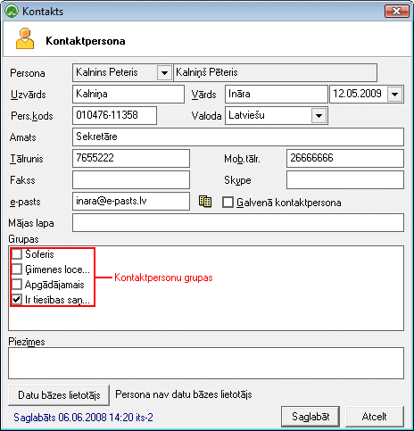

.. 389
 
Kontakts
************
 

Jauns kontakts kā kontaktpersona tiek pievienots jau esošam partnerim:

|images_ozols/25720.png|

Tiek izvēlēts partneris, kuram tiks pievienota šī kontaktpersona. Ir
iespējams norādīt kontaktpersonas kontaktus, kā ārī piesaistīt
:doc:`kontaktpersonu grupām<113>` . Jaunu kontaktpersonu ir iespējams
pievienot arī caur :doc:`Partnera pievienošanu<312>` , :doc:`partneru
sarakstu<112>` un :doc:`kontaktusarakstu<189>` . Lai saglabātu
pievienotot kontaktpersonu, jānospiež poga |images_ozols/25621.png| .
Visi pievienotie kontakti tiek saglabāti :doc:`kontaktu sarakstā<189>`
.

.. |images_ozols/25621.png| image:: images_ozols/25621.png
       :scale: 100%


 
