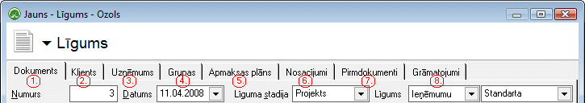
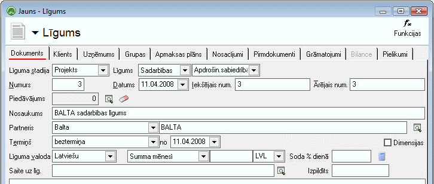
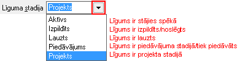
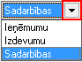
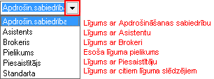
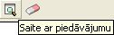

.. 394
 
Līgums
**********
 

Līgumi tiek izmantoti, lai uzskaitītu uzņēmuma attiecības un saistības
ar pircējiem un piegādātājiem.

:scale: 100%

1. Dokuments
++++++++++++

Lapaspusē Dokuments ir jāaizpilda Līguma dokumenta pamat dati

:scale: 100%

:scale: 100%

Līgums (līguma veids):

:scale: 100%

Brokeru uzņēmumiem ir vēl viena papildus izvēlne pie Līguma - ar ko
tiks slēgts sadarbībaslīgums:

:scale: 100%

Numurs - Programmas piešķirtais numurs pēc kārtas.

Datums - Līguma pievienošanas sistēmai datums.

Iekšējais num. - Iekšējais numurs, kas brīvi ir tikts sagatavots
uzņēmuma iekšienē.

Ārējais num. - Numurs, kas ir redzams līguma slēdzējam.

Piedāvājums - Iespēja Līgumu sasaistīt ar esošu izveidotu sistēmā
Piedāvājumu, kur lauciņā atspoguļojas Piedāvājuma numurs

:scale: 100%

Nosaukums - Līguma nosaukums. Informācija par ko tiek slēgts līgums.

Partneris - jānorāda partneris ar kuru tiek slēgts līgums.

Termiņš - iespēja norādīt uz kādu termiņu vai bez termiņu noslēgts
līgums, un no kura datuma stājās spēkā.

Līguma valoda - ja ir vairāku valodu līgumi, tad ir iespēja norādīt
konkrētam līgumam valodu.

Atkarībā no līguma veida, iespēja norādīt līguma summu uz visu līgumu,
Summa dienā vai Summa mēnesī.

Ja konkrētajā līgumā ir atrunāta soda naudas aprēķināšana, tad
jānorāda Soda % dienā.

:doc:` Līguma kopēšana <237>`

Līgumu žurnālā, atzīmējot konkrēto līgumu, jānospiež peles labais
taustiņš un jāizvēlas Kopēt. Tiek nokopēts līgums.


 
