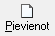

.. 409
 
Rīkojumu dokuments
**********************
 
Lai strādājošā algu aprēķinā aprēķinātu, piemēram, atvaļinājuma naudu,
kā arī pieņemtu/atlaistu darbiniekuvai izpildītu citas darbības, kas
veic izmaiņas strādājošā slodzes kalendārā, jāveido rīkojuma
dokumenti.

Rīkojumu dokumentu saraksts atrodas :doc:`Rīkojumu dokumentu
žurnālā<209>` .
Pievienojot jaunu strādājošo, pirmais rīkojums par pieņemšanu darbā
tiek aizpildīts slodzes ievades formā. Pēc slodzes saglabāšanas šis
rīkojums tiek saglabāts :doc:`Rīkojumu žurnālā<209>` , un, lai šis
rīkojums piedalītos algu aprēķinos, tas :doc:`Rīkojumu žurnālā<209>`
obligāti jāapstiprina.

Lai pievienotu jaunu rīkojumu, rīku joslā jānospiež poga
|images_ozols/25605.png| (Alt+P):

|images_ozols/25738.png|

Slodze: strādājošais kuram tiek pievienots rīkojums;

Datums: datums, kurā iesniegts rīkojums;

Veids: rīkojuma veids (ar podziņu |images_ozols/24635.gif| tiek
atvērts rīkojuma veidu saraksts);

Stājies spēkā no_ līdz_ : rīkojuma stāšanaš spēkā datums;

Statuss: rīkojuma statuss;

Pamatojums: iespējams nodefinēt pamatojumu;

Saturs>>: iespējams pievienot rīkojuma saturu.

Lai rīkojumu saglabātu, jānospiež poga |images_ozols/25621.png| .

Lai rīkojumu izdrukātu, rīku joslā jānospiež poga
|images_ozols/24944.png| (Ctrl+P).

Rīkojuma veids nosaka vai un kāds kods tiks piemērots strādājošajam
ziņojumā par darbinieku kustību. Rīkojuma veida konfigurācija nosaka,
kādi darba laika uzskaites dati tiks pievienoti slodzes kalendāram.
No rīkojuma var atvērt |images_ozols/25739.png| , kā arī ja Rīkojuma
veids ir "Pieņemšana darbā", no Rīkojuma dokumenta loga iespējams
atvērt arī |images_ozols/25740.png| .

.. |images_ozols/25738.png| image:: images_ozols/25738.png
       :scale: 100%

.. |images_ozols/24635.gif| image:: images_ozols/24635.gif
       :scale: 100%

.. |images_ozols/25621.png| image:: images_ozols/25621.png
       :scale: 100%

.. |images_ozols/25740.png| image:: images_ozols/25740.png
       :scale: 100%


 
