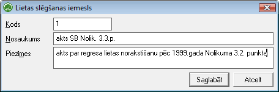

.. 4207
 
Lietu slēgšanas iemesli
***************************
 

Sarakstā tiek saglabāti lietu slēgšanas iemesli.

Jaunslietu slēgšanas iemeslstiek pievienots ar pogu
|images_ozols/24708.png| . Pēc informācijas aizpildīšanas jāspiež poga
Saglabāt , lai saglabātu ierakstu sistēmā.

|images_ozols/26311.png|

|images_ozols/25621.png| - jāspiež šī poga lai saglabātu ievadītos
datus.

|images_ozols/25675.png| - jāspiež šī poga, ja lietotājs nevēlas
saglabāt aizpildītos datus.

.. |images_ozols/24708.png| image:: images_ozols/24708.png
       :scale: 100%

.. |images_ozols/25621.png| image:: images_ozols/25621.png
       :scale: 100%


 
