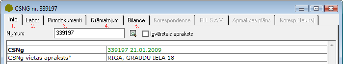

.. 4209
 
CSNg. žurnāls
*****************
 

Ceļu satiksmes negadījumužurnālā saraksta veidā tiek parādīti
reģistrētie ceļu satiksmes negadījumi, balstoties uz kuriem tiek
veidotas :doc:`Atlīdzību lietas<4205>` .

IzveidotāCSNG kartiņa sastāv no vairākām lapaspusēm - Info, Labot,
Pirmdokumenti, Grāmatojumi, Bilance:

|images_ozols/26307.png|

1. Info -CSNg info lapā redzama informācija par CSNg numuru, datumu un
vietas apraksts.

2. Labot - šajā lapā, uzklikšķinot uz atbilstošajiem ierakstiem,
iespējams iegūtinformāciju par izveidoto :doc:`Atlīdzību lietu<4205>`
un :doc:`Regresa lietu<4210>` , balstoties uzCSNg informāciju.

3. Pirmdokumenti -CSNg kartiņas lapāattēlota visa informācija par
Pirmdokumentiem, kas saistīti ar atbilstošo ceļu satiksmes negadījumu.
Jebkuru no dokumentiem iespējams pievienot/atvērt/drukāt/. Norēķinu
dokumentu, izvēloties pogu "Funkcijas", iespējams saistīt ar kādu no
Finanšu dokumentiem.

4. Grāmatojumi -CSNg kartiņas lapā attēlota visa informācija par
Grāmatojumiem, kas saistīti arCSNg numuru. Jebkuru no grāmatojumiem
iespējams Atvērt. Tāpat arī no šīs lapas iespējams izveidot manuālo
grāmatojumu.

5. Bilance -CSNg kartiņas lapā attēlota informācija par bilances
stāvokli, balstoties uz veiktajiem grāmatojumiem saistībā ar
izvēlētoCSNgnumuru.


 
