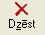
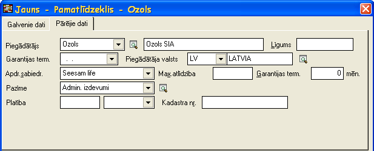

.. 433
 
Pamatlīdzekļu ienākšanas dokuments
**************************************
 

Pamatlīdzekļu ienākšanas dokuments jāveido ņemot uzskaitē jaunus
pamatlīdzekļus. Dokuments pēc saglabāšanas tiek pievienots
:doc:`Pamatlīdzekļu dokumentu sarakstā<233>` . Pamatlīdzekļu
ienākšanas dokumentu iespējams arī automatizēti ģenerēt no
:doc:`Iepirkumu dokumentu žurnāla<210>` (skat. zemāk Automātiska
pamatlīdzekļu ienākšanas dokumenta izveide no iepirkuma dokumenta ),
kas ir jāpapildina ar trūkstošo informāciju.

Pievienojot jaunu dokumentu jāizvēlas pamatlīdzekļu dokumenta veids
Pamatlīdzekļu ienākšanas dokuments .

|images_ozols/25051.png|

Numurs - jānorāda pamatlīdzekļa dokumenta numurs. Šis numurs strādājot
ar sistēmu tiek piešķirts automātiski pēc iebūvētā
:doc:`numeratora<139>` . Visiem pamatlīdzekļu dokumentiem ir viena
numerācija.

Datums - pamatlīdzekļu dokumenta izveidošanas datums.

Paskaidrojums - jānorāda dokumenta paskaidrojums.Šī informācijatiek
rādīta pamatlīdzkļu uzskaites kartītē saimnieciskā darījuma aprakstā.

Līgums - iespēja norādīt līguma numuru.

Piegādātāja valsts - iespēja norādīt pamatlīdzekļu piegādātāja valsti.

Piegādātājs - iespēja norādīt pamatlīdzekļu piegādātāju.

Piezīmes - iespējams norādīt piezīmes par dokumentu un šīs piezīmes
domātas tikai grāmatvedim. Pamatlīdzekļu atskaitēs šīs piezīmes netiek
uzrādītas.

Saglabāt - pēc dokumenta datu un pamatlīdzekļu (skat. zemāk
Pamatlīdzekļu pievienošana Pamatlīdzekļuienākšanas

dokumentam ) pievienošanas jāspiež šī poga lai saglabātu izveidoto
dokumentu.

|images_ozols/24545.gif| Lai izveidotā Pamatlīdzekļuienākšanas
dokumenta dati stātos spēkā obligāti pēc saglabāšanas dokuments ir
jāapstiprina ar funkciju |images_ozols/24715.JPG| .

|images_ozols/24545.gif| Pēc dokumenta apstiprināšanas Pamatlīdzekļu
ienākšanasdokuments ir :doc:`jānogrāmato<14044>` .

Pamatlīdzekļu pievienošana Pamatlīdzekļuienākšanas dokumentam
+++++++++++++++++++++++++++++++++++++++++++++++++++++++++++++

Pēc dokumenta datu aizpildīšanas ir jāaizpilda dati par
pamatlīdzekļiem. Dokumentam jaunu pamatlīdzekli pievieno atvērtā

Pamatlīdzekļuienākšanas dokumenta formā ar funkciju
|images_ozols/24708.png| .

Datus par pamatlīdzekli iespējams labot atvērtā
Pamatlīdzekļuienākšanas dokumenta formā ar funkciju
|images_ozols/24709.png| .

Pamatlīdzekli dzēš atvērtā Pamatlīdzekļu atlikumu ievades dokumenta
formā ar funkciju |images_ozols/24719.JPG| .

|images_ozols/25056.png|

|images_ozols/25058.png|

Inventāra nr. - jānorāda pamatlīdzekļa inventāra numurs. Numurs
sistēmā tiek pēc secības piešķirts automātiski nākošais, ko lietotājs
var labot. Pamatlīdzekļu numurā var izmantot tikai ciparus.

Ien.dok.num. - Ienākošā dokumenta numurs ir informatīvs lauks un
lietotājs to mainīt nevar.

Skaits - jānorāda pamatlīdzekļu skaits. Parasti šis skaits ir 1, ko
sistēma arī automātiski piedāvā, bet, ja jāņem uzskaitē vairāki
vienādi pamatlīdzekļi, tad šo skaitu ir iespējams labot un pēc
kartiņas saglabāšanas sistēma uzģenerēs pēc norādītā skaita vienādas
pamatlīdzekļu kartiņas piešķirot katrai savu unikālu inventāra numuru.

Inventāra nr. līdz -

Nosaukums - jānorāda pamatlīdzekļa nosaukums.

Apraksts - jānorāda detalizētāka informācija par pamatlīdzekli, ja
nepieciešams (piem. detalizētāka atrašanās vieta, pamatlīdzekļa
faktiskais lietotājs, utt.).

Nemateriālais aktīvs - šī izvēles rūtiņa ir jāatzīmē, ja
pamatlīdzeklis ir nemateriālais aktīvs.

Tiek izmantots saimnieciskajā darbībā - šī izvēles rūtiņa jāatzīmē, ja
pamatlīdzeklis tiek izmantots saimnieciskajā darbībā.

Iegādes dat. - jānorāda faktiskais iegādes datums.

Ieg. vērtība - jānorāda pamatlīdzekļa iegādes vērtība.

Īpašuma veids - jānorāda :doc:`pamatlīdzekļa īpašuma veids<183>` .

Izsl.datums - šis lauks tiek aizpildīts automātiski pēc pamatlīdzekļa
izslēgšanas un lietotājs to mainīt nevar.

Likvid.vērtība - jānorāda likvidācijas vērtība, ja tā ir vairāk nekā
nulle.

Pamatl.piezīmes - iespējams norādīt piezīmes par pamatlīdzekli un šīs
piezīmes domātas tikai grāmatvedim. Pamatlīdzekļu atskaitēs šīs
piezīmes netiek uzrādītas.

Stājies ekspl. - jānorāda pamatlīdzekļa faktiskais stāšanās
ekspluatācijā datums.

mēn. - jānorāda derīgās lietošanas mēneši. Šis lauks tiek aizpildīts
automātiski pievienojot :doc:`Pamatlīdzeklim kategoriju<129>` , bet
lietotājam ir iespēja derīgās lietošanas mēnešu skaitu mainīt
atbilstoši uzņēmumā noteiktajam laikam.

Der.liet.beig.dat. - šis lauks nav jāaizpilda un ir informatīvs. Dati
tiek rādīti ņemot vērā Stājies ekspl. un mēn. norādītos datus.

Kategorija - jānorāda :doc:`Pamatlīdzekļa kategorija<129>` . Caur
Pamatlīdzekļu kategoriju pamatlīdzeklim tiek nodefinēts pamatlīdzekļa
uzskaites konts, nolietojuma konts, izdevumu konts un derīgās
lietošanas laiks.

Objekts - jānorāda :doc:`pamatlīdzekļa objekts<202>` .

Dimensijas - iespēja norādīt uzņēmumā izmantojamo dimensiju vērtības
(piem. ekonomiskās klasifikācijas kods, valdības funkcija, projekts,
finansējums, utt.).

Struktūrv. - jānorāda struktūrvienība.

Atb.persona - jānorāda materiāli :doc:`atbildīgā persona<195>` .

Uzsk.vērtība - jānorāda uzskaites vērtība finanšu vajadzībām un
jānorāda uzskaites vērtība nodokļu vajadzībām.

Uzkr.noliet. - jānorāda uzkrātais nolietojums finanšu vajadzībām un
uzkrātais nolietojums nodokļu vajadzībām uz datumu, kad tiek uzsākts
darbs ar sistēmu.

Piegādātājs - iespēja norādīt pamatlīdzekļa :doc:`Piegādātāju<150>` .

Līgums - iespēja norādīt līguma numuru.

Garantijas term. - iespēja norādīt pamatlīdzekļa garantijas termiņu.

Piegādātāja valsts - iespēja norādīt piegādātāja valsti.

Apdr.sabiedr. - iespēja norādīt :doc:`Apdrošināšanas sabiedrību<155>`
.

Max.atlīdzība - iespēja norādīt apdrošināšanas maksimālo atlīdzību.

Garantijas term. - iespēja norādīt maksimālās atlīdzības garantijas
termiņu.

Pazīme - iespēja norādīt :doc:`Pamatlīdzekļa pazīmi<130>` .

Platība - ja pamatlīdzeklis ir zeme vai nekustamais īpašums, tad ir
iespēja norādīt platību.

Kadastra nr. - ja pamatlīdzeklis ir zeme vai nekustamais īpašums, tad
ir iespēja norādīt kadastra numuru.

Saglabāt - jāspiež šī poga lai saglabātu ievadītos datus par
pamatlīdzekli.
Atcelt - jāspiež šī poga, ja lietotājs nevēlas saglabāt aizpildītos
datus par pamatlīdzekli.

Automātiska pamatlīdzekļu ienākšanas dokumenta izveide no
:doc:`iepirkuma dokumenta<310>`
+++++++++++++++++++++++++++++++

Iegādājoties jaunu pamatlīdzekli nepieciešams reģistrēt iepirkuma
dokumentu :doc:`iepirkumu dokumentu žurnālā<210>` norēķiniem ar
kreditoriem. Daļa informācijas, kas tiek aizpildīta pievienojot
iepirkuma dokumentu, nepieciešams aizpildīt arī pievienojot
pamatlīdzekļu ienākšanas dokumentu. No iepirkuma dokumenta iespējams
automatizēti uzģenerēt pamatlīdzekļu ienākšanas dokumentu ar
pamatlīdzekļu kartiņām, kurām nepieciešams papildināt trūkstošo
informāciju.

Aizpildot :doc:`iepirkuma dokumenta<310>` saturu pazīme jānorāda
Pamatlīdz.

|images_ozols/25076.png|

Pēc visu pamatlīdzekļu pievienošanas iepirkumu dokumentam
jāspiežkomanda Funkcijas un jāizvēlas funkcija Izveidot pamatlīdzekļu
ienākšanas dokumentu.

|images_ozols/25078.png|

Formā Pamatlīdzekļu ienākšanas dokumenta izveide jāpārbauda aizpildītā
informācija. Ja aizpildītā informācija ir korekta, jāspiež poga
Izveidot ienākšanas dokumentu . Ja aizpildītā informācija nav korekta,
tad jāspiež poga Atcelt , jāveic korekcijas un vēlreiz jāveic iepriekš
aprakstītās darbības.

|images_ozols/25083.png|

Pēc pamatlīdzekļu dokumenta izveides sistēma paziņoPamatlīdzekļu
ienākšanas dokumenta numuru.

|images_ozols/24545.gif| Pēc pamatlīdzekļu automatizētas
izveidesPamatlīdzekļu ienākšanas dokumentā obligāti jāpapildina
trūkstošā informācija par pamatlīdzekļiem, kuri atrodas
:doc:`Pamatlīdzekļu dokumentu žurnālā<233>` .

Lietotājam ir iespēja uzreiz atvērt Pamatlīdzekļu ienākšanas
dokumentuapstiprinot, vai neapstiprināt un atvērtPamatlīdzekļu
ienākšanas dokumentuvēlāk :doc:`Pamatlīdzekļu dokumentu žurnālā<233>`
.

|images_ozols/25085.png|

.. |images_ozols/24545.gif| image:: images_ozols/24545.gif
       :scale: 100%

.. |images_ozols/24715.JPG| image:: images_ozols/24715.JPG
       :scale: 100%

.. |images_ozols/24545.gif| image:: images_ozols/24545.gif
       :scale: 100%

.. |images_ozols/24708.png| image:: images_ozols/24708.png
       :scale: 100%

.. |images_ozols/24709.png| image:: images_ozols/24709.png
       :scale: 100%

.. |images_ozols/25083.png| image:: images_ozols/25083.png
       :scale: 100%

.. |images_ozols/24545.gif| image:: images_ozols/24545.gif
       :scale: 100%


 
