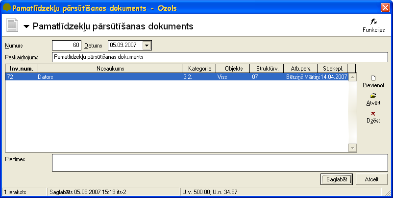
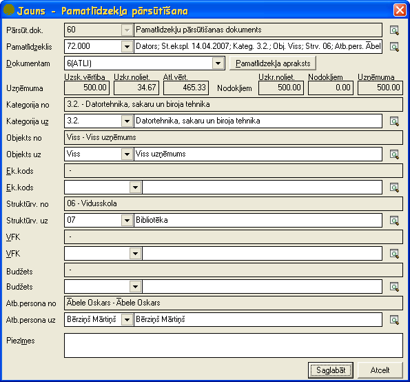

.. 437
 
Pamatlīdzekļu pārsūtīšanas dokuments
****************************************
 


Pamatlīdzekļu pārsūtīšanas dokumentu paredzēts veidot pamatlīdzekļu
pārvietošanai starp materiāli atbildīgām personām, struktūrvienībām
un/vai citām uzņēmumā izmantotām dimensijām. Dokuments pēc
saglabāšanas ir pieejams :doc:`Pamatlīdzekļu dokumentu sarakstā<233>`
.


|images_ozols/24545.gif| Pirms pamatlīdzekļu pārsūtīšanas
jāpārliecinās vai visiem pārsūtāmajiem pamatlīdzekļiem ir aprēķināts
nolietojums.


Pievienojot jaunu pamatlīdzekļu dokumentu jāizvēlas dokumenta veids
Pamatlīdzekļu pārsūtīšanas dokuments .


|images_ozols/25173.png|


Numurs - jānorāda pamatlīdzekļa dokumenta numurs. Šis numurs strādājot
ar sistēmu tiek piešķirts automātiski pēc iebūvētā :doc:` numeratora
<139>` . Visiem pamatlīdzekļu dokumentiem ir viena numerācija.

Datums - pamatlīdzekļu dokumenta izveidošanas datums.

Paskaidrojums - jānorāda dokumenta paskaidrojums.Šī informācijatiek
rādīta pamatlīdzkļu uzskaites kartītē saimnieciskā darījuma aprakstā.

Piezīmes - iespējams norādīt piezīmes par dokumentu un šīs piezīmes
domātas tikai grāmatvedim. Pamatlīdzekļu atskaitēs šīs piezīmes netiek
uzrādītas.


Saglabāt - pēc dokumenta datu un pamatlīdzekļu(skat. zemāk Pārsūtāmo
pamatlīdzekļupievienošana Pamatlīdzekļupārsūtīšanas dokumentam )
pievienošanas jāspiež šī komandpoga lai saglabātu izveidoto dokumentu.

Atcelt - ja lietotājs nevēlas saglabāt veiktās izmaiņas, jāspiež
komandpoga Atcelt.


|images_ozols/24545.gif| Lai izveidotā Pamatlīdzekļupārsūtīšanas
dokumenta dati stātos spēkā obligāti pēc saglabāšanas dokuments ir
jāapstiprina ar funkciju |images_ozols/24715.JPG| .


Pārsūtāmo pamatlīdzekļupievienošana Pamatlīdzekļupārsūtīšanas
dokumentam
``````````

Pēc dokumenta datu aizpildīšanas ir jāaizpilda dati parpārsūtāmajiem
pamatlīdzekļiem. Dokumentam jaunupārsūtāmo pamatlīdzekli pievieno
atvērtā Pamatlīdzekļupārsūtīšanas dokumentaformā ar funkciju
|images_ozols/24708.png| .

Datus parpārsūtāmo pamatlīdzekli iespējams labot atvērtā
Pamatlīdzekļupārsūtīšanas dokumentaformā ar funkciju
|images_ozols/24709.png| .

Pamatlīdzekli dzēš atvērtā Pamatlīdzekļupārsūtīšanas dokumenta formā
ar funkciju |images_ozols/24719.JPG| .


|images_ozols/25174.png|


Pārsūt.dok. - informatīvs lauks ar pārsūtīšanas dokumenta numuru.

Pamatlīdzeklis - no pamatlīdzekļu saraksta jāizvēlas pārsūtāmais
pamatlīdzeklis.

Dokumentam - tiek rādīts dokuments ar kuru pamatlīdzeklis ir ņemts
uzskaitē.

Uzņēmuma:

Uzsk.vērtība - izvēlētā pamatlīdzekļa uzskaites vērtība finanšu
vajadzībām.

Uzkr.noliet. - izvēlētā pamatlīdzekļa uzkrātais nolietojums finanšu
vajadzībām.

Atl.vērt. - izvēlētā pamatlīdzekļa atlikusī vērtība finanšu
vajadzībām.

Nodokļiem:

Uzkr.noliet. - izvēlētā pamatlīdzekļa uzskaites vērtība nodokļiem.

Nodokļiem - izvēlētā pamatlīdzekļa uzkrātais nolietojums nodokļiem.

Uzņēmuma - izvēlētā pamatlīdzekļa atlikusī vērtība nodokļiem.

Kategorija no/uz - iespēja norādīt pamatlīdzeklim jaunu Kategoriju.

Objekts no/uz - iespēja pamatlīdzeklim norādīt jaunu Objektu.

Dimensijas no/uz - iespēja norādīt pamatlīdzeklim jaunās Dimensijas.

Struktūrvienība no/uz - iespēja norādīt pamatlīdzeklim jaunu
struktūrvienību.

Atb.persona no/uz - iespēja norādīt pamatlīdzeklim jaunu atbildīgo
personu.

Piezīmes - iespējams norādīt piezīmes parpārsūtāmo pamatlīdzekliun šīs
piezīmes domātas tikai grāmatvedim. Pamatlīdzekļu atskaitēs šīs
piezīmes netiek uzrādītas.


Saglabāt - jāspiež šī komandpoga lai saglabātu ievadītos datus
parpārsūtāmo pamatlīdzekli.

Atcelt - jāspiež šī komandpoga, ja lietotājs nevēlas saglabāt
aizpildītos datus par pamatlīdzekli.


.. |images_ozols/24545.gif| image:: images_ozols/24545.gif
       :scale: 100%



.. |images_ozols/24545.gif| image:: images_ozols/24545.gif
       :scale: 100%

.. |images_ozols/24715.JPG| image:: images_ozols/24715.JPG
       :scale: 100%

.. |images_ozols/24708.png| image:: images_ozols/24708.png
       :scale: 100%

.. |images_ozols/24709.png| image:: images_ozols/24709.png
       :scale: 100%

.. |images_ozols/24719.JPG| image:: images_ozols/24719.JPG
       :scale: 100%




 
