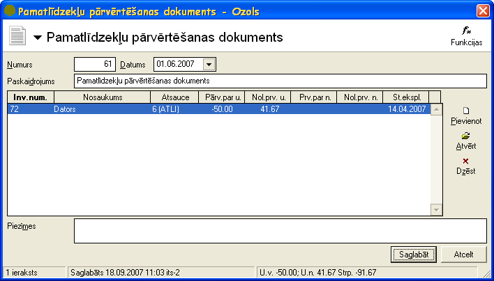
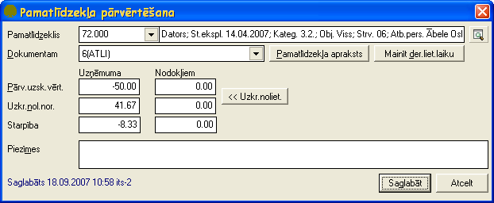

.. 438
 
Pamatlīdzekļu pārvērtēšanas dokuments
*****************************************
 

Pamatlīdzekļu pārvērtēšanas dokuments paredzēts veidot
pamatlīdzekļiem, kuriem pārvērtēšanas rezultātā ir mainījusies
uzskaites vērtība. Dokuments pēc saglabāšanas ir pieejams
:doc:`Pamatlīdzekļu dokumentu sarakstā<233>` .

|images_ozols/24545.gif| Pirms pamatlīdzekļu pārvērtēšanas
jāpārliecinās vai visiem pārvērtējamiem pamatlīdzekļiem ir aprēķināts
nolietojums.

Pievienojot jaunu pamatlīdzekļu dokumentu jāizvēlas dokumenta veids
Pamatlīdzekļu pārvērtēšanas dokuments .

|images_ozols/25240.png|

Numurs - jānorāda pamatlīdzekļa dokumenta numurs. Šis numurs strādājot
ar sistēmu tiek piešķirts automātiski pēc iebūvētā :doc:` numeratora
<139>` . Visiem pamatlīdzekļu dokumentiem ir viena numerācija.

Datums - pamatlīdzekļu dokumenta izveidošanas datums.

Paskaidrojums - jānorāda dokumenta paskaidrojums. Šī informācija tiek
rādīta pamatlīdzkļu uzskaites kartītē saimnieciskā darījuma aprakstā.

Piezīmes - iespējams norādīt piezīmes par dokumentu un šīs piezīmes
domātas tikai grāmatvedim. Pamatlīdzekļu atskaitēs šīs piezīmes netiek
uzrādītas.

Saglabāt - pēc dokumenta datu un pamatlīdzekļu (skat. zemāk
Pārvērtējamo pamatlīdzekļu pievienošana Pamatlīdzekļu pārvērtēšanas
dokumentam ) pievienošanas jāspiež šī komandpoga lai saglabātu
izveidoto dokumentu.

Atcelt - ja lietotājs nevēlas saglabāt veiktās izmaiņas, jāspiež
komandpoga Atcelt.

|images_ozols/24545.gif| Lai izveidotā Pamatlīdzekļu pārvērtēšanas
dokumenta dati stātos spēkā obligāti pēc saglabāšanas dokuments ir
jāapstiprina ar funkciju |images_ozols/24715.JPG| .

|images_ozols/24545.gif| Pēc dokumenta apstiprināšanas Pamatlīdzekļu
pārvērtēšanas dokuments ir :doc:`jānogrāmato<14044>` .

Pārvērtējamo pamatlīdzekļu pievienošana Pamatlīdzekļu pārvērtēšanas
dokumentam
~~~~~~~~~~

Pēc dokumenta datu aizpildīšanas ir jāaizpilda dati par pārvērtējamiem
pamatlīdzekļiem. Dokumentam jaunu pārvērtējamo pamatlīdzekli pievieno
atvērtā Pamatlīdzekļu pārvērtēšanas dokumenta formā ar funkciju
|images_ozols/24708.png| .

Datus par pārvērtējamo pamatlīdzekli iespējams labot atvērtā
Pamatlīdzekļu pārvērtēšanas dokumenta formā ar funkciju
|images_ozols/24709.png| .

Pamatlīdzekli dzēš atvērtā Pamatlīdzekļu pārvērtēšanas dokumenta formā
ar funkciju |images_ozols/24719.JPG| .

|images_ozols/25241.png|

Pamatlīdzeklis - jānorāda pamatlīdzeklis, kuram veikta pārvērtēšana.

Dokumentam - sistēma automātiski norāda pārvērtētā pamatlīdzekļa
ņemšanas uzskaitē dokumentu, kuru lietotājam nav jāmaina.

Uzņēmuma :

Pārv.uzsk.vērt. - summa, par kādu tiek pārvērtēts pamatlīdzeklis
finanšu vajadzībām. Ja pārvērtēšanas rezultātā pamatlīdzekļa uzskaites
vērtība samazinās, tad šajā laukā jānorāda starpība ar mīnus zīmi.

Uzkr.nol.nor. - pamatlīdzekļa uzkrātais nolietojums uz pamatlīdzekļa
pārvērtēšanas brīdi finanšu vajadzībām.

Starpība - starpība starp pamatlīdzekļa pārvērtējamo summu un
pamatlīdzekļa uzkrāto nolietojumu finanšu vajadzībām.

Nodokļiem:

Pārv.uzsk.vērt. - summa, par kādu tiek pārvērtēts
pamatlīdzeklisnodokļu vajadzībām. Ja pārvērtēšanas rezultātā
pamatlīdzekļa uzskaites vērtība samazinās, tad šajā laukā jānorāda
starpība ar mīnus zīmi.

Uzkr.nol.nor. - pamatlīdzekļa uzkrātais nolietojums uz pamatlīdzekļa
pārvērtēšanas brīdinodokļu vajadzībām.

Starpība - starpība starp pamatlīdzekļa pārvērtējamo summu un
pamatlīdzekļa uzkrāto nolietojumunodokļu vajadzībām.

Piezīmes - iespēja norādīt piezīmes parpārvērtējamo pamatlīdzekliun
šīs piezīmes domātas tikai grāmatvedim. Pamatlīdzekļu atskaitēs šīs
piezīmes netiek uzrādītas.

Saglabāt - jāspiež šī komandpoga lai saglabātu ievadītos datus par
pārvērtēto pamatlīdzekli.

Atcelt - jāspiež šī komandpoga, ja lietotājs nevēlas saglabāt
aizpildītos datus par pamatlīdzekli.

.. |images_ozols/24545.gif| image:: images_ozols/24545.gif
       :scale: 100%

.. |images_ozols/24545.gif| image:: images_ozols/24545.gif
       :scale: 100%

.. |images_ozols/24715.JPG| image:: images_ozols/24715.JPG
       :scale: 100%

.. |images_ozols/24545.gif| image:: images_ozols/24545.gif
       :scale: 100%

.. |images_ozols/24708.png| image:: images_ozols/24708.png
       :scale: 100%

.. |images_ozols/24709.png| image:: images_ozols/24709.png
       :scale: 100%

.. |images_ozols/24719.JPG| image:: images_ozols/24719.JPG
       :scale: 100%


 
