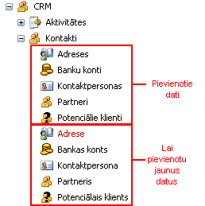
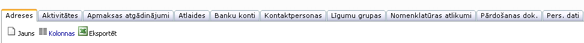

.. 4425
 
============
Kontakti
============
 
CRM sadaļā kontakti, tiek pievienoti jauni partnera dati, un tiek
veidoti datu saraksti, kur saglabājas pievienotie dati:

|images_ozols/25835.png|

Atverot pievienotos viena partnera datus ( :doc:`adreses<4432>` ,
:doc:`bankas kontus<4431>` , :doc:`kontaktpersonas<4428>` vai
:doc:`partnera aprakstu<4427>` ), logā ir iespējams redzēt visas
informatīvās sadaļas, kas saistīta ar izvēlēto partneri. Sadaļās,
kurās ir poga |images_ozols/25850.png| , iespējams pievienot jaunus
datus ( :doc:`jaunu adresi<4439>` , :doc:`jaunu bankas kontu<4440>` ,
:doc:`jaunu kontaktpersonu<4438>` ):

|images_ozols/25849.png|

Adreses : partnerim :doc:`pievienotās adreses<4439>` ;

Aktivitātes : visas ar partneri saistītās :doc:`aktivitātes<4447>` ;

Apmaksas atgādinājumi : partnerim piesaistītie apmaksas atgādinājumi;

Atlaides : partnerim nodefinētās atlaides;

Banku konti : partnera :doc:`banku konti<4431>` ;

Kontaktpersonas : partnerim pievienotās :doc:`kontaktpersonas<4428>` ;

Līgumu grupas : partnera līgumu grupas;

Nomenklatūras atlikumi : :doc:`nomenklatūras atlikumi<4456>` ;

Pārdošanas dok .: :doc:`Pārdošanas dokumenti<4433>` ;

Pers. dati : :doc:`personas dati<4409>` .

.. |images_ozols/25850.png| image:: images_ozols/25850.png
       :scale: 100%


 
.. toctree::
   :maxdepth: 5
 
   4439.rst
   4432.rst
   4440.rst
   4431.rst
   4438.rst
   5211.rst
   4430.rst
   4427.rst
   4429.rst
