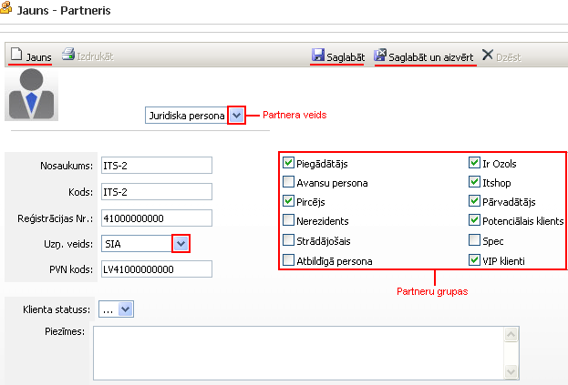

.. 4429
 
Partneris
*************
 
Lai pievienotu jaunu partneri:

|images_ozols/25844.png|

Pievienojot partneri, ir jānorāda partnera veids: juridiska persona
vai fiziska persona ;

Nosaukums : partnera pilns nosaukums (fiziskai personai - vārds un
uzvārds);

Kods : partnera apzīmējums vai nosaukuma saīsinājums (bez
mīkstinājumzīmēm, bez garumzīmēm);

Reģistrācijas Nr .: juridiskās personas reģistrācijas numurs BEZ
valsts koda (fiziskai personai - personas kods);

Uzņ. veids : uzņēmējdarbības veids (jāizvēlas no saraksta);

PVN kods : ja uzņēmums ir PVN maksātājs, tad jānorāda PVN kods;

Partneru grupas : pievienotais partneris tiek piesaistīts
nodefinētajām :doc:`partneru grupām<113>` , lai būtu iespējams grupēt
partnerus.

Lai saglabātu pievienotā partnera datus, jānospiež poga
|images_ozols/25829.png| , un, lai labotu, jānospiež poga
|images_ozols/25832.png| , bet, lai pievienotu jaunu partneri,
jānospiež poga |images_ozols/25831.png| . Lai dzēstu, jānospiež poga
|images_ozols/25830.png| .

Visi pievienotie partneri un to dati tiek saglabāti :doc:`partneru
žurnālā<4427>` .

.. |images_ozols/25829.png| image:: images_ozols/25829.png
       :scale: 100%

.. |images_ozols/25832.png| image:: images_ozols/25832.png
       :scale: 100%

.. |images_ozols/25831.png| image:: images_ozols/25831.png
       :scale: 100%


 
.. toctree::
   :maxdepth: 4
 
   5275.rst
   4436.rst
   4435.rst
   5279.rst
   5246.rst
   4437.rst
   5280.rst
   5276.rst
   5277.rst
   5278.rst
