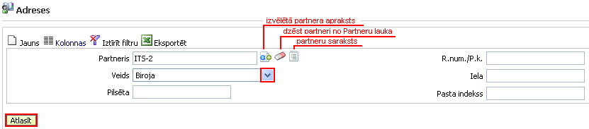
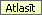

.. 4432
 
Adreses
***********
 
Adrešu žurnālā tiek saglabātas visas pievienotās partneru
:doc:`adreses<4439>` .

Ar filtru iespējams atlasīt partneru adreses pēc dažādiem izvēlētiem
atlasīšanas kritērijiem:

|images_ozols/25847.png|

Partneris : iespēja atlasīt viena izvēlēta partnera adreses;

Veids : iespēja atlasīt viena veida adreses vienam vai visiem
partneriem;

Pilsēta : vienas noteiktas pilsētas partneru adreses;

R.num./p.k .: atlasīšana pēc reģistrācijas numura (juridiskai
personai) vai personas koda (fiziskai personai);

Iela : atlasīšana pēc ielas;

Pasta indekss : atlasīšana pēc pasta indeksa:

Ja visi atlasīšanas kritēriji norādīti un izvēlēti, jānospiež poga
|images_ozols/25810.png| . Ja filtrā netiek norādīti vai izvēlēti
nekādi kritēriji, tad tiek atlasīts visu partneru adrešu saraksts.

Lai labotu adresi, jānospiež poga |images_ozols/25832.png| , bet lai
pievienotu jaunu adresi jau pievienotam partnerim, jānospiež poga
|images_ozols/25831.png| un jāpievieno dati kā norādīts :doc:`Jaunas
adreses pievienošanas sadaļā<4439>` .

.. |images_ozols/25832.png| image:: images_ozols/25832.png
       :scale: 100%

.. |images_ozols/25831.png| image:: images_ozols/25831.png
       :scale: 100%


 
