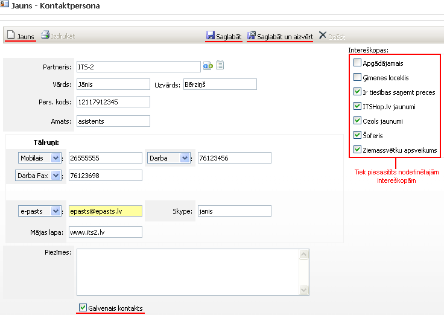

.. 4438
 
Kontaktpersona
******************
 
Kontaktpersonavar tikt pievienota arī jau esošam
:doc:`partnerim<4427>` ,un vienam partnerim ir iespējams pievienot
vairākas kontaktpersonas, piesaistot tās dažādām nokonfigurētajām
:doc:`intereškopām<5020>` :

|images_ozols/25842.png|

Partneris : partneris, kuram tiks pievienota kontaktpersona;

Vārds, Uzvārds : kontaktpersonas vārds un uzvārds;

Pers.kods : kontaktpersonas personas kods;

Amats : kontaktpersonas amats;

Tālruņi : kontaktpersonas tālruņi un papildus kontakti (e-pasts,
skype, mājas lapa);

|images_ozols/25843.png| : ja vienam partnerim tiek pievienotas
vairākas kontaktpersonas,tadšī būs galvenā kontaktpersona.

Lai saglabātu pievienotās kontaktpersonas datus, jānospiež poga
|images_ozols/25829.png| , un, lai labotu, jānospiež poga
|images_ozols/25832.png| , bet lai pievienotu jaunu kontaktpersonu,
jānospiež poga |images_ozols/25831.png| . Lai dzēstu, jānospiež poga
|images_ozols/25830.png| .

Visas pievienotās kontaktpersonas tiek saglabātas :doc:`kontaktpersonu
žurnālā<4428>` .

.. |images_ozols/25832.png| image:: images_ozols/25832.png
       :scale: 100%

.. |images_ozols/25831.png| image:: images_ozols/25831.png
       :scale: 100%


 
