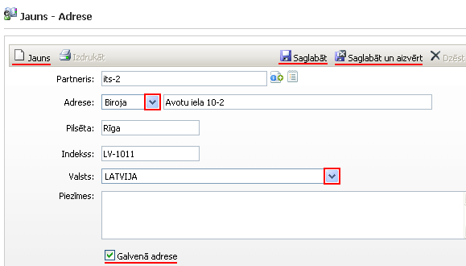
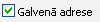
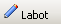

.. 4439
 
Adrese
**********
 
Jauna adrese tiek pievienota jau esošam Partnerim:

|images_ozols/25836.png|

Partneris: partneris, kuram tiks pievienota jauna adrese (iespējams
izvēlēties no partneru saraksta caur pogu |images_ozols/25837.png| );

Adrese : jānodefinē adrese, izvēloties no saraksta veidu
(biroja,deklarētā, faktiskā, juridiskā, u.c.) un precīzi norādot
adresi;

Pilsēta : pilsēta;

Indekss : pasta indekss;

Valsts : no valstu saraksta jāizvēlas partnera adreses valsts;

Piezīmes : iespējams pievienot piezīmes.

|images_ozols/25839.png| : partnerim šī adrese ir kā galvenā adrese,
noklusētā adrese.

Ja visi dati ievadīti, lai tos saglabātu, jānospiež poga
|images_ozols/25829.png| , adrese tiek saglabāta :doc:`adrešu
žurnālā<4432>` , un, lai labotu, jānospiež poga
|images_ozols/25832.png| , bet lai pievienotu jaunu adresi, jānospiež
poga |images_ozols/25831.png| .

Visas pievienotās adreses tiek saglabātas :doc:`adrešu žurnālā<4432>`
.

.. |images_ozols/25829.png| image:: images_ozols/25829.png
       :scale: 100%

.. |images_ozols/25831.png| image:: images_ozols/25831.png
       :scale: 100%


 
