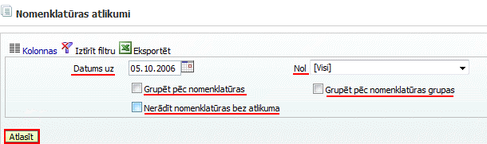

.. 4456
 
Nomenklatūras atlikumi
**************************
 

Atskaitē -Nomenklatūras atlikumimateriāli atbildīgajām personām ir
iespēja aplūkot uz savu vārdu reģistrētus krājumu atlikumus.
Nomenklatūras atlikumus atskaitē iespējams sagrupēt pēc nomenklatūras
grupas, atzīmējot izvēles rūtiņu "Grupēt pēc nomenklatūras grupas":

|images_ozols/25826.png|

Lai atskaitē netiktu iekļauti nomenklatūras ieraksti, kuriem uz filtrā
norādīto datumu nav atlikuma, nepieciešams atzīmēt izvēles rūtiņu:
"Nerādīt nomenklatūras bez atlikuma".

Sagatavojot atskaiti, ir iespējams konkrētas kolonnas datus sakārtot
augošā vai dilstošā secībā, pēc alfabēta,nospiežot uz kolonnas
nosaukuma.


 
.. toctree::
   :maxdepth: 3
 
   5312.rst
