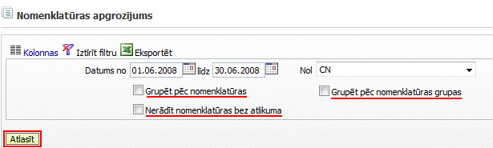

.. 4457
 
Nomenklatūras apgrozījums
*****************************
 

Nomenklatūras apgrozījuma atskaiteparādakrājumu sākuma atlikumus,
apgrozījuma un beigu atlikumus, atbilstoši izvēlētajiem filtra
kritērijiem:

:scale: 100%

.. image:: images_ozols/24545.gif
:scale: 100%
Atskaitē sagatavojamos dati tiks attēloti sagrupēti, ja tiks atzīmēta
kāda no izvēles rūtiņām "Grupēt pēc nomenklatūras", "Grupēt pēc
nomenklatūras grupas".

Lai atskaitē netiktu iekļauti nomenklatūras ieraksti, kuriem filtrā
norādītajā periodā nav bijis apgrozījums, nepieciešams atzīmēt izvēles
rūtiņu: "Nerādīt nomenklatūras bez atlikumiem".


 
