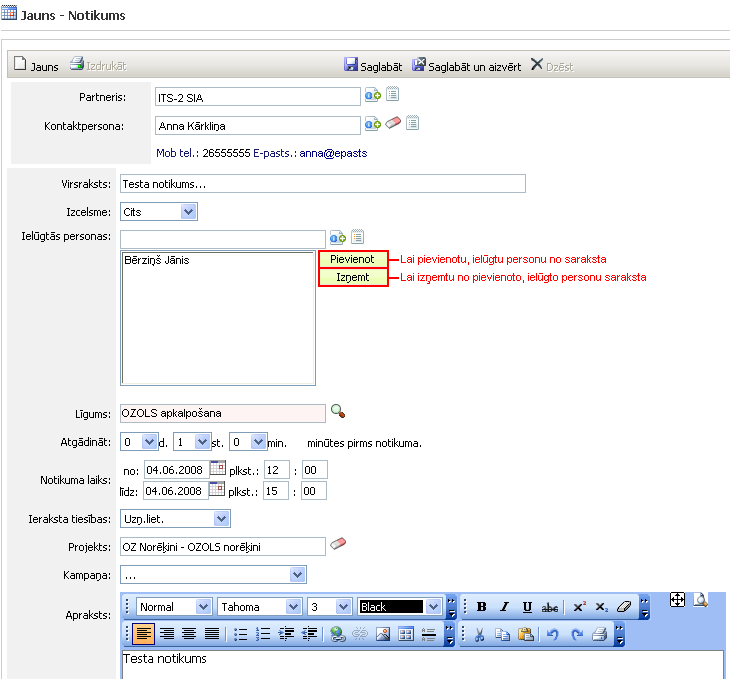

.. 4462
 
Tikšanās
************
 
Lai pievienotu, reģistrētu jaunu Notikumu:

|images_ozols/25890.png|

Partneris : partneris, klients uz kuru attieksies šis notikums;

Kontaktpersona : partnera kontaktpersona;

Virsraksts : notikuma virsraksts, nosaukums;

Izcelsme : notikuma izcelsme;

Ielūgtās personas : iespējams pievienot vairākas personas, kuras tiks
ielūgtas uz notikumu (tiks nosūtīts e-pasts ar paziņojumu un
ierakstīts katras ielūgtās :doc:`personas kalendārā<4426>` un
:doc:`uzņēmuma kalendārā<4482>` , grafikā), vai arī izņemt no ielūgto
personu saraksta;

Līgums : iespējams izvēlēties partnerim piesaistītu līgumu uz kuru
attiecas notikums;

Atgādināt... minūtes pirms notikuma : iespējams uzlikt atgādinātāju
pirms notikuma izpildes (tiks atgādināts visām ielūgtajām personām);

Notikuma laiks : notikuma datums un laiks;

Ieraksta tiesības : iespējams norādīt ieraksta tiesības;

Projekts : notikumam iespējams piesaistīt projektu;

Kampaņa : iespējams piesaistīt kampaņu;

Apraksts : notikuma apraksts.

Ja visa notikuma informācija ievadīta, lai saglabātu
notikumu,jānospiež poga |images_ozols/25829.png| :

|images_ozols/25894.png|

Saglabājot notikumu, tā Statuss ir Paziņots. Izveidotam notikumam
iespējams veikt dažādas darbības, un tāspa e-pastutiks paziņotas
katrai ielūgtajai personai.

Lai pievienotu jaunu notikumu, jānospiež poga |images_ozols/25831.png|
. Bet, lai saglabātu un aizvērtu notikumu, jānospiež poga
|images_ozols/25828.png| . Notikumu iespējams izdrukāt, nospiežot pogu
|images_ozols/25892.png| , un/vai labot, nospiežot pogu
|images_ozols/25893.png| . Visi pievienotie notikumi tiek saglabāti
:doc:`Notikumu žurnālā<4459>` , tie ir redzami :doc:`uzņēmuma
kalendārā<4482>` un ielūgto :doc:`personu kalendārā (grafikā),<4426>`
un :doc:`visu aktivitāšu sarakstā<4472>` .

.. |images_ozols/25829.png| image:: images_ozols/25829.png
       :scale: 100%

.. |images_ozols/25894.png| image:: images_ozols/25894.png
       :scale: 100%

.. |images_ozols/25831.png| image:: images_ozols/25831.png
       :scale: 100%


 
.. toctree::
   :maxdepth: 4
 
   4463.rst
