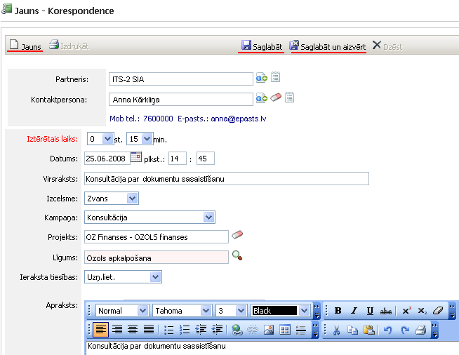

.. 4465
 
Korespondence
*****************
 
Pievienojot jaunu korespondenci, tiek atvērts logs, kur jāievada
attiecīgā informācija:

:scale: 100%

Partneris : partneris,uz kuru attiecaskorespondence;

Kontaktpersona : kontaktpersona, ar kuru tika veikta korespondence;

Iztērētais laiks : iztērētais laiks;

Datums : datums, kurā notikusi korespondence;

Virsraksts : korespondences virsraksts, nosaukums;

Izcelsme : iespējams norādīt korespondences izcelsmi;

Kampaņa : iespējams norādīt kampaņu;

Projekts : iespējams norādīt projektu;

Līgums : jānorāda piesaistītais līgums;

Ieraksta tiesības : iespējams norādīt ieraksta tiesības;

Apraksts : korespondences apraksts.

Ja visa informācija ievadīta, jānospiež poga .. image::
images_ozols/25829.png
:scale: 100%
un ir iespējams izveidot jaunu korespondenci, nospiežot pogu ..
image:: images_ozols/25831.png
:scale: 100%
. Vai, lai saglabātu un aizvērtu, jānospiež poga .. image::
images_ozols/25828.png
:scale: 100%
. Visas pievienotās korespondences tiek saglabāts :doc:`korespondenču
žurnālā<4460>` .


 
