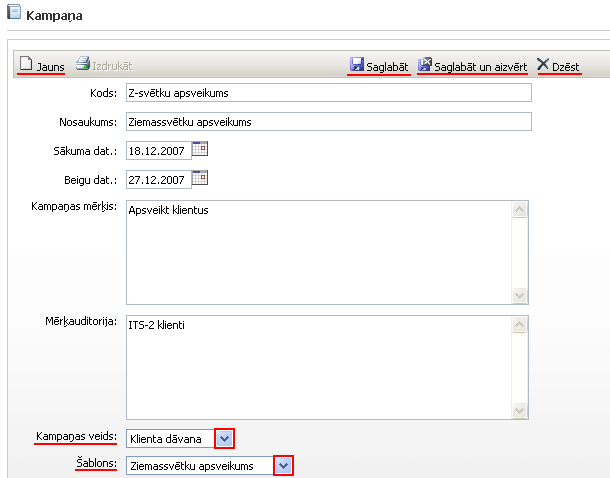

.. 4469
 
Kampaņa
***********
 
Pievienotās kampaņas tiek saglabātas :doc:`kampaņu žurnālā<4470>` , un
tiek lietotas :doc:`Kontaktu kampaņu organizātorā<5016>` .

Jaunas kampaņas pievienošana:

|images_ozols/25827.png|

Kods: brīvi nodefinēts kampaņas kods (piemēram, nosaukuma
saīsinājums);

Nosaukums: kampaņas nosaukums;

Sākuma dat.: kampaņas sākuma datums;

Beigu dat.: kampaņas beigu datums;

Kampaņas mērķis: nodefinēts kampaņas mērķis;

Mērķauditorija: kampaņas mērķauditorija;

Kampaņas veids: veids no kampaņas veidu saraksta;

Šablons: iespējams pievienot kādu no izveidotajiem
:doc:`šabloniem<5014>` ;

Kad visi kapmaņas dati aizpildīti, lai saglabātu kampaņu :doc:`kampaņu
sarakstā<4470>` , jānospiež poga |images_ozols/25829.png| , un lai
pievienotu jaunu kampaņu, tad jānospiež poga |images_ozols/25831.png|
, bet, ja netiks pievienota jauna kampaņa, tad jānospiež poga
|images_ozols/25828.png| . Lai dzēstu kamapņu, jānospiež poga
|images_ozols/25830.png| .

.. |images_ozols/25829.png| image:: images_ozols/25829.png
       :scale: 100%

.. |images_ozols/25828.png| image:: images_ozols/25828.png
       :scale: 100%

.. |images_ozols/25830.png| image:: images_ozols/25830.png
       :scale: 100%


 
