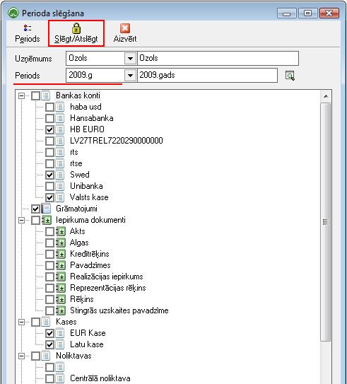
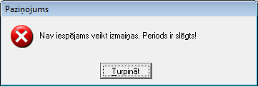
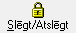

.. 453
 
====================
Perioda slēgšana
====================
 
Perioda slēgšana tiek izmantota iepriekšējā perioda dokumentu
slēgšanai. Slēgtos dokumentus nav iespējams labot bez to atslēgšanas.

Lai slēgtu perioda dokumentus

#. Kopējie saraksti-> :doc:`Periodi<156>` - jāpievieno **dokumentu
   periods** par kuru nepieciešams slēgt dokumentus. Pēc perioda
   pievienošanas iespējams uzsākt perioda dokumentu slēgšanu.
#. Jānorāda uzņēmums (ja vienā datu bāzē tiek veikta uzskaite par
   vairākiem uzņēmumiem), jānorāda pievienotais Dokumentu periods,
   jāatzīmē dokumenti, kuri tiks slēgti un jānospiež poga Slēgt/Atslēgt:

|images_ozols/26438.png|

Pēc atzīmēto dokumentu slēgšanas konkrētajā periodā, sistēmas
lietotājiem, veicot darbības ar slēgtā perioda dokumentiem, tiks
parādīts paziņojums un aizlieta darbība ar dokumentu:

|images_ozols/26439.png|

Lai atslēgtu perioda dokumentus, jāveic tādas pat darbības kā pie
perioda dokumentu slēgšanas - jāatzīmē dokumenti izņemot atzīmes,kurus
nepieciešams atslēgt un jānospiež poga |images_ozols/26440.png| . Ar
šo pogu tiek gan slēgti gan atslēgti konkrētā perioda dokumenti.


 
