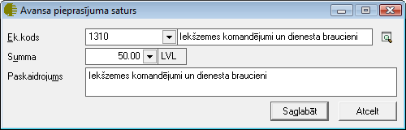

.. 465
 
Avansa maksājums
********************
 
Ja saņemto un atpakaļ atgriezto avansu summu uzskaite netiek veikta ar
kases un bankas dokumentu palīdzību, iespējams izmantot avansa
dokumenta veidu avansa maksājums. Dokuments tiks saglabāts
:doc:`Avansu norēķinu<232>` žurnālā.


JaunaAvansu maksājuma pievienošana
``````````````````````````````````

Izvēloties dokumenta veidu Avansa maksājums, tiks atvērts jauns logs:


|images_ozols/25253.png|


Avansa pieprasījuma Virsraksta aizpildīšana
+++++++++++++++++++++++++++++++++++++++++++


Lai aizpildītudokumenta Virsrakstu, nepieciešams:


1. Norādīt Uzņēmuma struktūrvienību, kam piesaistīta Avansu norēķina
persona, kurai šis Avansa maksājums tiks veikts:


|images_ozols/25254.png|


2. No saraksta izvēlēties nepieciešamo :doc:`Avansu personu<196>` ,
kurai šis dokuments tiks noformēts:


|images_ozols/25255.png|


3. Izvēlēties Datumu, kurā šisAvansa pieprasījums tiek veidots:


|images_ozols/24811.png|


4.Ievadīt kopējo Avansa pieprasījuma summu:


|images_ozols/24812.png|


Avansa pieprasījuma Satura aizpildīšana
+++++++++++++++++++++++++++++++++++++++

Lai aizpildītuAvansa pieprasījumaSaturu, dokumenta satura daļā
nepieciešams nospiest |images_ozols/24708.png| un tiks atvērts
operācijas satura logs, kurā nepieciešams aizpildīt satura ierakstus
(uzņēmumā izmantotās dimensijas) un norādīt satura ieraksta summu:


|images_ozols/25256.png|


|images_ozols/24545.gif| Dokumenta saturs var sastāvēt no vairākiem
satura ierakstiem, kas kopsummā veido Dokumenta Virsrakstā norādīto
summu.Pievienot nākamo satura ierakstu iespējams, satura daļā
nospiežot pogu |images_ozols/24708.png| .


Pievienotā Avansa maksājuma labošana
````````````````````````````````````

Labojumus saglabātajādokumentā iespējams veikt atverot Avansa
pieprasījumu, kurš pieejams apskatei/labošanai :doc:`Avansu
norēķinu<232>` žurnālā. Lai veiktu labojumusAvansa
pieprasījumā,dokumentunepieciešams atvērt, izmantojot rīku joslas pogu
|images_ozols/24709.png| (ALT+A), unatvērtajāierakstā iespējams
veiktnepieciešamos labojumus:


|images_ozols/25257.png|


Pēc labojumu veikšanas, veiktā izmaiņas iespējams
|images_ozols/24615.jpg| vai |images_ozols/24617.jpg| .


.. |images_ozols/24811.png| image:: images_ozols/24811.png
       :scale: 100%

.. |images_ozols/24812.png| image:: images_ozols/24812.png
       :scale: 100%

.. |images_ozols/24708.png| image:: images_ozols/24708.png
       :scale: 100%



.. |images_ozols/24545.gif| image:: images_ozols/24545.gif
       :scale: 100%

.. |images_ozols/24708.png| image:: images_ozols/24708.png
       :scale: 100%

.. |images_ozols/24709.png| image:: images_ozols/24709.png
       :scale: 100%


.. |images_ozols/24615.jpg| image:: images_ozols/24615.jpg
       :scale: 100%

.. |images_ozols/24617.jpg| image:: images_ozols/24617.jpg
       :scale: 100%


 
