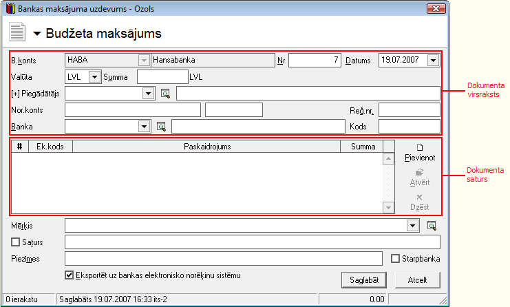
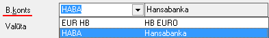
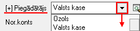
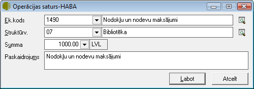
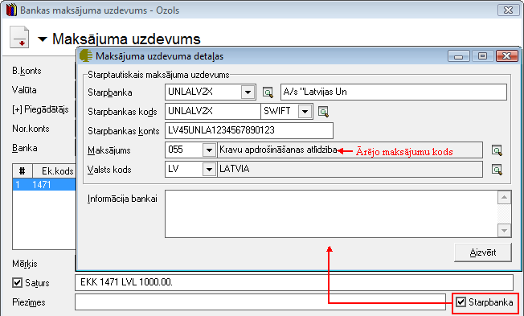
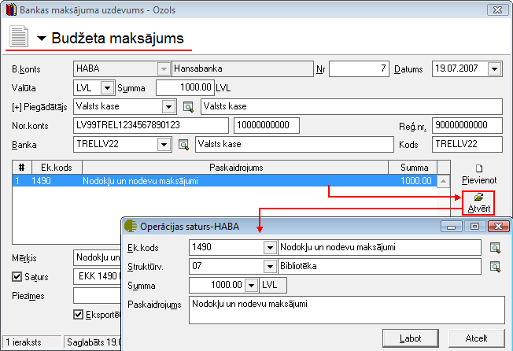

.. 468
 
Bankas budžeta maksājums
****************************
 


Atsevišķu :doc:`Banku elektronisko norēķinu sistēmu<160>` datu
apmaiņas formāts pieprasa atdalīt naudas saņēmēja kontu un subkontu
atsevišķos laukos. Izmantojot budžeta maksājuma uzdevumu, tas tiek
nodrošināts. Bankas budžeta maksājums tiek drukāts kā standarta
maksājuma uzdevums un tiek saglabāts žurnālā :doc:`Bankas
izdevumi<224>` . Ja elektroniskie norēķini netiek izmantoti, tad
budžeta maksājuma uzdevuma vietā var izmantot dokumentu veidu
:doc:`Bankas maksājuma uzdevums<347>` . Maksājuma uzdevuma izdrukā
saņēmēja konts un subkonts tiek atdalīts automatizēti.


Jauna Bankas budžeta maksājuma uzdevuma pievienošana
````````````````````````````````````````````````````

Izvēloties dokumenta veidu Bankas budžeta maksājuma uzdevums, tiks
atvērts jauns logs:


|images_ozols/24987.png|


Bankas budžeta maksājuma uzdevuma Virsraksta aizpildīšana
+++++++++++++++++++++++++++++++++++++++++++++++++++++++++


Lai aizpildītu Bankas budžeta maksājuma uzdevuma Virsrakstu,
nepieciešams:


1. Norādīt Uzņēmuma bankas kontu, no kura šis maksājums tiks
izpildīts:


|images_ozols/24724.png|


2. Izvēlēties Datumu, kurā šis Bankas maksājuma uzdevums tiek veidots:


|images_ozols/24725.png|


3. Norādīt nepieciešamo Bankas maksājuma valūtu un ievadīt kopējo
Dokumenta summu:


|images_ozols/24726.png|


4. No saraksta izvēlēties nepieciešamo partneri (Piegādātāju), kuram
šis naudas pārskaitījums tiks noformēts:


|images_ozols/24749.png|


Izvēloties nepieciešamo Piegādātāju, lauki Nor.konts , Reģ.nr. , Banka
un Kods tiks aizpildīti automātiski no :doc:`Partnera kartiņas<312>` .


Tā kā atsevišķu :doc:`Bankas elektronisko norēķinu sistēmu<160>` datu
apmaiņas formāts pieprasa atdalīt naudas saņēmēja kontu un subkontu
atsevišķos laukos, tad laukā Subkonts ir iespēja norādīt nepieciešamo
subkontu:


|images_ozols/24750.png|


Bankas budžeta maksājuma uzdevumaSatura aizpildīšana
++++++++++++++++++++++++++++++++++++++++++++++++++++

Lai aizpildītu Bankas budžeta maksājuma uzdevuma Saturu, dokumenta
satura daļā nepieciešams nospiest |images_ozols/24708.png| un tiks
atvērts operācijas satura logs, kurā nepieciešams aizpildīt satura
ierakstus (uzņēmumā izmantotās dimensijas) un norādīt satura ieraksta
summu:


|images_ozols/24751.png|


|images_ozols/24545.gif| Dokumenta saturs var sastāvēt no vairākiem
satura ierakstiem, kas kopsummā veido Dokumenta Virsrakstā norādīto
summu.Pievienot nākamo satura ierakstu iespējams, satura daļā
nospiežot pogu |images_ozols/24708.png| .


Budžeta maksājuma dokumenta Mērķa un Satura aizpildīšana
++++++++++++++++++++++++++++++++++++++++++++++++++++++++


Maksājuma dokumentu lauki Mērķis un Saturs tiek drukāti maksājuma
uzdevuma rindā Maksājuma mērķis.

Lauku Bankas budžeta maksājuma uzdevuma Mērķis, iespējams aizpildīt
manuāli vai izvēloties no :doc:`Bankas paskaidrojumu saraksta<147>` :


|images_ozols/24752.png|


Aktivizējot izvēli Saturs, laukā tiek salikti dokumenta satura finanšu
(EK) kodi un summas, līdz ar to iespējams automatizēti iegūt
informāciju par summas sadalījumu pa EK kodiem vai maksājuma PVN
summu:


|images_ozols/24753.png|


Sagatavojot Bankas budžeta maksājuma uzdevumu, dokumentam, kurš
sagatavots izvēloties uzņēmuma :doc:`Banku kontu<141>` , kuram
piesaistīta kāda no :doc:`Bankas elektronisko norēķinu sistēmām<160>`
, ekrāna formā automātiski ir aktivizēta izvēle Eksportēt uz bankas
elektronisko norēķinu sistēmu:


|images_ozols/24733.png|


Visi dokumenti, kuriem ir šāda izvēle, var tik eksportēti uz
elektronisko banku norēķinu sistēmu, lai būtu iespējams veikt
:doc:`Datu apmaiņa ar banku<451>` .


Budžeta maksājumu uzdevuma starpbankas datu aizpildīšana
++++++++++++++++++++++++++++++++++++++++++++++++++++++++


Bankas izdevumu dokumentiem iespējams aizpildīt datus par starpbanku,
Maksājuma uzdevuma logā aktivizējot izvēli Starpbanka:

|images_ozols/24732.png|

Kad visi nepieciešamie lauki ir aizpildīti, Bankas budžetamaksājuma
uzdevums ir sagatavots un to ir iespējams:

1. Saglabāt,nospiežot pogu |images_ozols/24615.jpg| -dokuments tiks
saglabāts un būs pieejams apskatei/labošanai/grāmatošanai :doc:`Bankas
izdevumu žurnālā<224>` .

2. Apstiprināt, nospiežot rīku joslā pogu |images_ozols/24740.png| -
Bankas budžeta maksājuma uzdevums tiks Apstiprināts un to būs
iespējams Grāmatot.


Bankas budžeta maksājuma uzdevuma grāmatošana
`````````````````````````````````````````````

Bankas budžeta maksājumu uzdevumu iespējams grāmatot no atvērta Bankas
budžeta maksājuma uzdevuma dokumenta vai izvēloties
(iezīmējot)dokumentu :doc:`Bankas izdevumu žurnālā<224>` .

Lai iegrāmatotu Bankas budžeta maksājuma uzdevumu, dokumentu
nepieciešams Apstiprināt, nospiežot rīku joslā pogu
|images_ozols/24740.png| .

Apstiprinātu dokumentu ir iespējams grāmatot, nospiežot rīku joslā
pogu |images_ozols/24741.png| .


Instrukcija - :doc:` Dokumentu grāmatošanas principi <14044>`


Pievienotā Bankasbudžeta maksājuma uzdevumalabošana
```````````````````````````````````````````````````

Labojumus saglabātajādokumentā iespējams veikt atverot Bankas budžeta
maksājuma uzdevumu, kurš pieejams apskatei/labošanai :doc:`Bankas
izdevumu žurnālā<224>` .Lai veiktu labojumusBankas budžeta maksājuma
uzdevumā,dokumentunepieciešams atvērt, izmantojot rīku joslas pogu
|images_ozols/24709.png| (ALT+A), unatvērtajāierakstā iespējams
veiktnepieciešamos labojumus:


|images_ozols/24754.png|


Pēc labojumu veikšanas, veiktā izmaiņas iespējams
|images_ozols/24615.jpg| vai |images_ozols/24617.jpg| .





.. |images_ozols/24725.png| image:: images_ozols/24725.png
       :scale: 100%





.. |images_ozols/24708.png| image:: images_ozols/24708.png
       :scale: 100%



.. |images_ozols/24545.gif| image:: images_ozols/24545.gif
       :scale: 100%

.. |images_ozols/24708.png| image:: images_ozols/24708.png
       :scale: 100%


.. |images_ozols/24733.png| image:: images_ozols/24733.png
       :scale: 100%



.. |images_ozols/24615.jpg| image:: images_ozols/24615.jpg
       :scale: 100%

.. |images_ozols/24740.png| image:: images_ozols/24740.png
       :scale: 100%

.. |images_ozols/24740.png| image:: images_ozols/24740.png
       :scale: 100%

.. |images_ozols/24741.png| image:: images_ozols/24741.png
       :scale: 100%

.. |images_ozols/24709.png| image:: images_ozols/24709.png
       :scale: 100%



.. |images_ozols/24615.jpg| image:: images_ozols/24615.jpg
       :scale: 100%

.. |images_ozols/24617.jpg| image:: images_ozols/24617.jpg
       :scale: 100%


 
