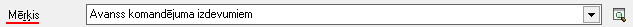
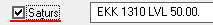
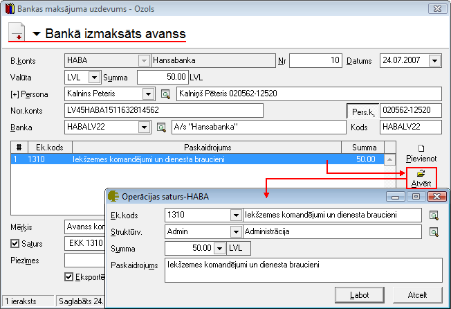

.. 469
 
Bankā izmaksāts avanss
**************************
 


Bankas izejošā dokumenta veids Bankā izmaksāts avanss jāveido, kad
tiek izmaksāta nauda uzņēmuma :doc:`Avansu personai<196>` . Šī
dokumenta veida izmantošana nodrošina automatizētu izmaksāto avansa
summu uzskaiti :doc:`Avansa norēķinu<375>` dokumentā. Bankas avansa
maksājums vienlaicīgi tiek parādīts :doc:`Bankas izdevumu<224>` un
:doc:`Avansu norēķinu<232>` dokumentu žurnālos. Dokumenta izdruka ir
standarta maksājuma uzdevums.


JaunaBankā izmaksāta avansa dokumentapievienošana
`````````````````````````````````````````````````

Lai uzskaitītu izmaksātās avansu summas, un tās parādītos avansu
norēķinu dokumentā, izmaksājot avansus, dokuments ir jāveido kā Bankā
izmaksāts avanss. Dokumentā ir pieejams lauks persona, kur no
:doc:`Partneru saraksta<112>` var izvēlēties personas, kuru aprakstā
ir pazīme :doc:`Avansu persona<196>` .


Izvēloties dokumenta veidu Bankā izmaksāts avanss, tiks atvērts jauns
logs:


|images_ozols/24986.png|


Bankā izmaksāta avansa Virsraksta aizpildīšana
++++++++++++++++++++++++++++++++++++++++++++++


Lai aizpildītudokumenta Virsrakstu, nepieciešams:


1. Norādīt Uzņēmuma bankas kontu, no kura šis maksājums tiks
izpildīts:


|images_ozols/24724.png|


2. Izvēlēties Datumu, kurā šisdokuments tiek veidots:


|images_ozols/24725.png|


3. Norādīt nepieciešamo Bankas maksājuma valūtu un ievadīt kopējo
Dokumenta summu:


|images_ozols/24726.png|


4. No saraksta izvēlēties nepieciešamo personu, kuras aprakstā ir
pazīme :doc:`Avansu persona<196>` , kurai šis naudas avansa
pārskaitījums tiks noformēts:


|images_ozols/24799.png|


Izvēloties nepieciešamo Personu, lauki Nor.konts , Pers.k. , Banka un
Kods tiks aizpildīti automātiski no :doc:`Partnera kartiņas<112>` .


Bankā izmaksāta avansaSatura aizpildīšana
+++++++++++++++++++++++++++++++++++++++++

Lai aizpildītu dokumenta Saturu, dokumenta satura daļā nepieciešams
nospiest pogu |images_ozols/24708.png| un tiks atvērts operācijas
satura logs, kurā nepieciešams aizpildīt satura ierakstus (uzņēmumā
izmantotās dimensijas) un norādīt satura ieraksta summu:


|images_ozols/24800.png|


|images_ozols/24545.gif| Dokumenta saturs var sastāvēt no vairākiem
satura ierakstiem, kas kopsummā veido Dokumenta Virsrakstā norādīto
summu.Pievienot nākamo satura ierakstu iespējams, satura daļā
atkārtoti nospiežot pogu |images_ozols/24708.png| .


Maksājuma dokumenta Mērķa un Satura aizpildīšana
++++++++++++++++++++++++++++++++++++++++++++++++


Maksājuma dokumentu lauki Mērķis un Saturs tiek drukāti maksājuma
uzdevuma rindā Maksājuma mērķis.

Lauku Mērķis , iespējams aizpildīt manuāli vai izvēloties no
:doc:`Bankas paskaidrojumu saraksta<147>` :


|images_ozols/24801.png|


Aktivizējot izvēli Saturs, laukā tiek salikti dokumenta satura finanšu
(EK) kodi un summas, līdz ar to iespējams automatizēti iegūt
informāciju par summas sadalījumu pa EK kodiem (Fin.kat.)vai maksājuma
PVN summu:


|images_ozols/24802.png|


Sagatavojot Bankā izmaksātu avansu, dokumentam, kurš sagatavots
izvēloties uzņēmuma :doc:`Banku kontu<141>` , kuram piesaistīta kāda
no :doc:`Bankas elektronisko norēķinu sistēmām<160>` , ekrāna formā
automātiski ir aktivizēta izvēle Eksportēt uz bankas elektronisko
norēķinu sistēmu:


|images_ozols/24733.png|


Visi dokumenti, kuriem ir šāda izvēle, var tik eksportēti uz
elektronisko banku norēķinu sistēmu, lai būtu iespējams veikt
:doc:`Datu apmaiņa ar banku<451>` .


Bankā izmaksāta avansastarpbankas datu aizpildīšana
+++++++++++++++++++++++++++++++++++++++++++++++++++


Bankas izdevumu dokumentiem iespējams aizpildīt datus par starpbanku,
Maksājuma uzdevuma logā aktivizējot izvēli Starpbanka:


|images_ozols/24803.png|


Kad visi nepieciešamie lauki ir aizpildīti, Bankā izmaksāts avanssir
sagatavots un to ir iespējams:

1. Saglabāt,nospiežot pogu |images_ozols/24615.jpg| -dokuments tiks
saglabāts un būs pieejams apskatei/labošanai/grāmatošanai :doc:`Bankas
izdevumu žurnālā<224>` .

2. Apstiprināt, nospiežot rīku joslā pogu |images_ozols/24740.png| -
Bankā izmaksāts avansstiks Apstiprināts un to būs iespējams Grāmatot.


Dokumenta - Bankā izmaksāts avanss grāmatošana
``````````````````````````````````````````````

Bankā izmaksātu avansu iespējams grāmatot no atvērta dokumenta vai
izvēloties (iezīmējot)dokumentu :doc:`Bankas izdevumu žurnālā<224>` .

Lai iegrāmatotu Bankā izmaksātu avansu, dokumentu nepieciešams
Apstiprināt, nospiežot rīku joslā pogu |images_ozols/24740.png| .

Apstiprinātu dokumentu ir iespējams grāmatot, nospiežot rīku joslā
pogu |images_ozols/24741.png| .


Instrukcija - :doc:`Dokumentu grāmatošanas principi<14044>`


PievienotāBankā izmaksātāavansalabošana
```````````````````````````````````````

Labojumus saglabātajādokumentā iespējams veikt atverot dokumentu Bankā
izmaksāts avanss, kurš vienlaicīgi pieejams apskatei/labošanai
:doc:`Bankas izdevumu<224>` un :doc:`Avansu norēķinu<232>` dokumentu
žurnālos. Lai veiktu labojumus,dokumentunepieciešams atvērt,
izmantojot rīku joslas pogu |images_ozols/24709.png| (ALT+A),
unatvērtajāierakstā iespējams veiktnepieciešamos labojumus:


|images_ozols/24804.png|


Pēc labojumu veikšanas, veiktā izmaiņas iespējams
|images_ozols/24615.jpg| vai |images_ozols/24617.jpg| .


.. |images_ozols/24724.png| image:: images_ozols/24724.png
       :scale: 100%

.. |images_ozols/24725.png| image:: images_ozols/24725.png
       :scale: 100%

.. |images_ozols/24726.png| image:: images_ozols/24726.png
       :scale: 100%


.. |images_ozols/24708.png| image:: images_ozols/24708.png
       :scale: 100%

.. |images_ozols/24800.png| image:: images_ozols/24800.png
       :scale: 100%

.. |images_ozols/24545.gif| image:: images_ozols/24545.gif
       :scale: 100%

.. |images_ozols/24708.png| image:: images_ozols/24708.png
       :scale: 100%





.. |images_ozols/24733.png| image:: images_ozols/24733.png
       :scale: 100%

.. |images_ozols/24803.png| image:: images_ozols/24803.png
       :scale: 100%

.. |images_ozols/24615.jpg| image:: images_ozols/24615.jpg
       :scale: 100%

.. |images_ozols/24740.png| image:: images_ozols/24740.png
       :scale: 100%

.. |images_ozols/24740.png| image:: images_ozols/24740.png
       :scale: 100%

.. |images_ozols/24741.png| image:: images_ozols/24741.png
       :scale: 100%

.. |images_ozols/24709.png| image:: images_ozols/24709.png
       :scale: 100%



.. |images_ozols/24615.jpg| image:: images_ozols/24615.jpg
       :scale: 100%

.. |images_ozols/24617.jpg| image:: images_ozols/24617.jpg
       :scale: 100%


 
