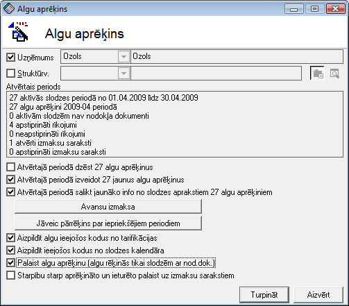

.. 498
 
Algu aprēķins
*****************
 

Algu aprēķinarīks paredzēts automatizētai algu aprēķināšanai un/vai
izmaksu veikšanai uz izmaksu sarakstiemvisiem darbiniekiem vai
lietotāja norādītai darbinieku grupai. Pēc lietotāja norādīto darbību
veikšanas algu aprēķini ir pieejami :doc:`Algu aprēķinu žurnālā<212>`
.

|images_ozols/24545.gif| Pirms aprēķinu veikšanas jāpārbauda, vai ir
savadīti visi dati :doc:`Algu tarifikācijā<728>` , :doc:`Nodokļu
dokumentu žurnālā<208>` , :doc:`Rīkojumu žurnālā<209>` par attiecīgo
periodu lai varētu veikt algu aprēķinuun izveidoti :doc:`Izmaksu
saraksti<238>` par attiecīgo periodu lai veiktu aprēķinu izmaksu uz
izmaksu sarakstiem.

Lai veiktu algu aprēķinu un/vai izmaksu uz izmaksu sarakstiem
lietotājam jānorāda atlases un darbību nosacījumi.

|images_ozols/26277.png|

Uzņēmums - šis lauks ir informatīvs un to šajā formā mainīt nedrīkst.
Šis lauks ir paredzēts lai lietotājs redzētuuzņēmumu, kuram tiks
veikts algu aprēķins un/vai izmaksa, ja sistēmā uzskaite tiek veikta
vairākiem uzņēmumiem.

Struktūrv. - šī izvēles rūtiņa ir jāatzīmē, ja lietotājs vēlas veikt
aprēķinus un/vai izmaksas vienai struktūrvienībai. Pēc izvēles rūtīņas
atzīmēšanas lietotājam jāizvēlas struktūrvienība. Izvēles rūtiņas
atzīme jāizņem, ja lietotājs vēlas veikt algu aprēķinus un/vai algu
izmaksas visam uzņēmumam.

Atvērtajā periodā dzēst X algu aprēķinus - šī izvēles rūtiņa jāatzīmē,
ja lietotājs vēlas dzēst par attiecīgo periodu jau izveidotos algu
aprēķinus.

Atvērtajā periodā izveidot X jaunus algu aprēķnus - šī izvēles rūtiņa
jāatzīmē, ja lietotājs vēlasattiecīgajā periodāizveidot jaunus algu
aprēķinus.

|images_ozols/24545.gif| Lietotājam jāņem vērā, ka atzīmējot izvēles
rūtiņu Atvērtajā periodā dzēst X algu aprēķinus, esošie par attiecīgo
periodualgu aprēķini tiks neatgriezeniski izdzēsti. Kā arī atzīmējot
izvēles rūtiņu Atvērtajā periodā izveidot X jaunus algu aprēķnus,
esošie algu aprēķioni tiks aizstāti ar jaunizveidotajiem, iepriekšējos
dzēšot.

Atvērtajā periodā salikt jaunāko info no slodzes aprakstiem X algu
aprēķiniem - atzīmējot šo izvēles rūtiņu tiks izveidoti algu
aprēķinipar attiecīgo periodu (nedzēšot esošos) un tiks izpildītas
pārējās darbības, kas atzīmētas šajā formā.

Aizpildīt algu ieejošos kodus no tarifikācijas - atzīmējot šo izvēles
rūtiņu sistēma izveidotajos algu aprēķinos aizpildīs datus no
:doc:`Algu tarifikācijas<728>` .

Aizpildīt ieejošos kodus no slodzes kalendāra - atzīmējot šo izvēles
rūtiņu sistēma izveidotajos algu aprēķinos aizpildīs datus no
:doc:`Rīkojumiem<209>` .

Palaist algu aprēķinu (algu rēķinās tikai slodzēm ar nod.dok.) -
atzīmējot šo izvēles rūtiņu sistēma veiks par attiecīgo periodu algu
aprēķinus izveidotajiem algu aprēķiniem :doc:`Algu aprēķinu
žurnālā<212>` .

Starpību starp aprēķināto un ieturēto palaist uz izmaksu sarakstiem -
atzīmējot šo izvēles rūtiņu sistēma algu aprēķinu izmaksājamās summas
aizpildīs Izmaksu sarakstos. Lai sistēma varētu veiksmīgi veikt šo
darbību, lietotājam pirms tam ir jāizveido Izmkasu saraksts
:doc:`Izmaksu sarakstu žurnālā<238>` .

Pēc atlases un darbību datu aizpildīšanas jāspiež poga Turpināt , lai
sistēma veiktu lietotāja norādītās darbības algu aprēķinā.

.. |images_ozols/24545.gif| image:: images_ozols/24545.gif
       :scale: 100%

.. |images_ozols/24545.gif| image:: images_ozols/24545.gif
       :scale: 100%


 
