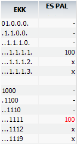

.. 5034
 
Budžeta pieprasījums
************************
 
Kad budžeta pieprasījums ir saglabāts par konkrētu periodu konkrētam
uzņēmumam un iesniegts pieprasījuma aizpildīšanai, nepieciešams
norādīt dimensijas uz kurā tiks veidots budžata summas pieprasījuma
ieņēmumi un izdevumi:

|images_ozols/26302.png|

Budžata pieprasījuma dokuments: dokumenta numurs, periods par kuru
tika pieprasīts budžets, dokumenta veids (BP-budžata pieprasījums),
tiek aizpildīts.

EKK Ieņēmumu: janorāda budžeta ieņēmumu ekonomiskās klasifikācijas
kods;

EKK Izdevumu: jānorāda budžeta izdevumu ekonomiskās klasifikācijas
kods;

Finansēšana, bankas konts, struktūrvienība un salīdzināšanas periods.

|images_ozols/24545.gif| Budžeta pieprasījuma aizpildīšanā jāaizpilda
visi lauki, un uz vienu kontu var būt vairāki budžeti.

Jānospiež poga Atlasīt, lai norādītu budžetu. Pēc budžeta norādīšanas,
tiek attēlots saraksts ar ieņēmumu un izdevumu EK kodiem, sagrupētus
uz augstākiem līmeņiem:

|images_ozols/26305.png|

EKK, kuru cipari ir atdalīti ar punktiem, ir Ieņēmumi, bet EKK, kur ir
skaitlis, ir Izdevumi.

|images_ozols/24545.gif| Budžeta pieprasījuma ieņēmumu un izdevumu
summai ir jāsakrīt, lai starpība būtu 0.00

x apzīmējumi pretī EKK norāda, ka uz šiem EKK ir iespējams aizpildīt
budžeta pieprasījuma summas;

- apzīmējums, caur kuru iespējams atvērt un caur saraksta funkciju
izdrukāt visu kopējo sagatvoto konkrētā budžeta pieprasījumu sarakstu
- budžeta ieņēmum un izdevumu tāmi.

Atverot konkrēto EK kodu caur x, jānorāda ieņēmumu budžeta summu un
jānospiež poga |images_ozols/25799.png| . Tāpat jānorāda budžeta summu
arī uz izdevumu EKK,un jāsaglabā.

Rezultātā budžeta ieņēmumu un izdevumu summām ir jāsakrīt:

|images_ozols/26308.png|

|images_ozols/26310.png|

Budžeta pieprasījuma summas ir redzamas :doc:`budžeta pieprasījuma
žurnālā<5035>` konkrētajam pieprasījumam.

.. |images_ozols/26302.png| image:: images_ozols/26302.png
       :scale: 100%

.. |images_ozols/24545.gif| image:: images_ozols/24545.gif
       :scale: 100%

.. |images_ozols/26305.png| image:: images_ozols/26305.png
       :scale: 100%

.. |images_ozols/24545.gif| image:: images_ozols/24545.gif
       :scale: 100%

.. |images_ozols/25799.png| image:: images_ozols/25799.png
       :scale: 100%

.. |images_ozols/26310.png| image:: images_ozols/26310.png
       :scale: 100%


 
.. toctree::
   :maxdepth: 4
 
   6663.rst
