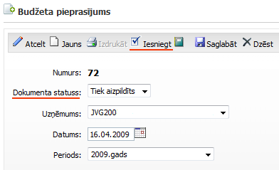

.. 5035
 
Budžeta pieprasījumu žurnāls
********************************
 
Budžeta pieprasījumu žurnāla saraksta veidā tiek saglabāti visi
pievienotie un saglabātie budžeta pieprasījumi.

Ar filtra parametriem ir iespējams atlasīt konkrētus pieprasījumus
dažādiem kritērijiem.

Atverotizveidotu pieprasījumu arstatusu Tiek izpildīts, tas jāiesniedz
izskatīšanai:
Atverot pieprasījumu, jānospiež poga |images_ozols/26316.png| , lai
dokumentstiktu nosūtītsuz pieprasījumu izskatīšanu:

|images_ozols/26301.png|

Pieprasījuma dokuments ir iesniegts :doc:`budžeta pieprasījumu
izskatīšanai<5041>` .

|images_ozols/26299.png|

Pēc dokumenta statusa varsekot līdzi budžeta pieprasījuma procesam un
izmaiņām.

Pieprasījums tiek nosūtīts budžeta pieprasījumu izskatītājam un
pieprasītājam izveidotais pieprasījums nav pieejams. Pēc budžeta
pieprasījuma nosūtīšanas pieprasījumu izskatītājam, tiek nosūtīts
paziņojums uz e-pastu.

Kad budžetu pieprasījums ir izskatīts, pieprasītājs saņem apstiprinātu
pieprasījumu ar apstiprinātām summām un vienību skaitiem, kā
arī,e-pasta paziņojumu. Saņemto apstiprināto pieprasījumu no
izskatītāja puses, pieprasītājs var komentēt. Lai pievienotu
komentārus, pieprasījuma žurnālā jaatver konkrētais pieprasījums un
jānospiež komentāru kolonnā uz dzeltenās pogas. Tiek atvērts komentāru
logs, kurā jāieraskta komentās un jāsaglabā:

|images_ozols/26324.png|

Pēc komentāru pievienošanas budžeta pieprasījuma saturā, lai nosūtītu
pieprasījumu izskatītājam, jānospiež poga |images_ozols/26325.png|

Pēc komentāru pievienošanas un nosūtīšanas pieprasījumu izskatītājam,
pieprasītājama nav iespējas atkārtoti komentēt pieprasījumu. Tālāk ir
iespējams skatīties pieprasījumu statusu, apstiprināto summu un
stāšanās spēkā informāciju.


 
