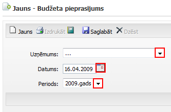
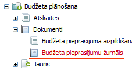

.. 5039
 
Budžeta grozījumu pieprasījumu žurnāls
******************************************
 
Budžeta pieprasīšanai tiek izveidoti Budžeta pieprasījuma dokumenti,
kuri tiek saglabāti :doc:`Budžeta pieprasījumu<5035>` žurnālā.

Jauna budžeta pieprasījuma pievienošana
+++++++++++++++++++++++++++++++++++++++

|images_ozols/24545.gif| Konkrēta lietotāja kontā (konfigurācijās)
norāda ar kuru uzņēmumu lietotājam ir tiesības strādāt.

|images_ozols/24545.gif| Uz gadu ir iespējams izveidot 1 dokumentu par
1 budžetu vienam uzņēmumam. Ja dokuments ir jau izveidots,
pieprasījuma izvēlnē neparādās periods - gads.

|images_ozols/26292.png|

Uzņēmums: no izvēlnes, nospiežot uz bultiņu, norāda uzņēmumu, kuram
tiks veidots budžeta pieprasījums;

Datums: norāda datumu, kurā tiek sagatavots piepasījuma dokuments;

Periods: par kuru periodu tiek pieprasīts budžets.

Lai saglabātu pieprasījumu, jānospiež poga |images_ozols/25799.png|

Pieprasījums tiek saglabāts Budžeta pieprasījumu žurnālā:

|images_ozols/26294.png|

.. |images_ozols/24545.gif| image:: images_ozols/24545.gif
       :scale: 100%

.. |images_ozols/24545.gif| image:: images_ozols/24545.gif
       :scale: 100%


 
