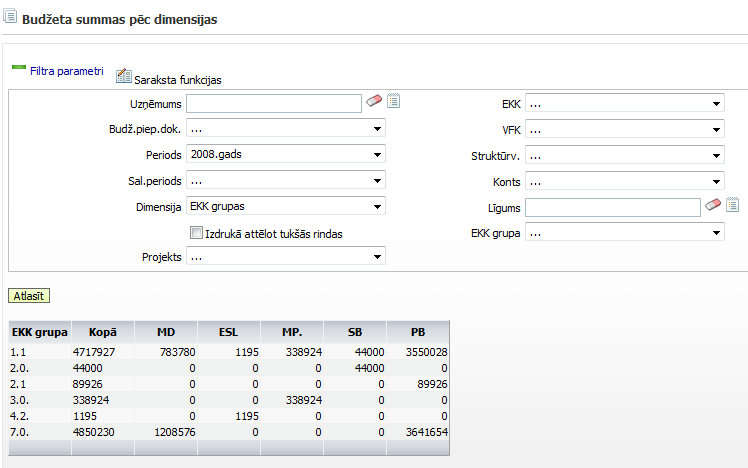

.. 5048
 
Budžeta summas pēc dimensijas
*********************************
 
Atskaite, par budžeta summu pēc dimensijas, tiek sagatvota, ja
nepieciešams attēlot budžeta sadalījumu pēc dažādiem atlases
kritērijiem un pēc konkrētas dimensijas. Atskaitē sagatavotā
informācija tiek ņemta no :doc:`budžeta dokumentiem<5035>` .

Dimensijas laukā ir jānorāda konkrēta dimensija, pēc kuras tiks
sagatavota atskaite ar budžeta summām. Lai sagatavotu atskaiti, filtra
parametros jānorāda vēlamie atlases kritēriji un konkrētā dimensija,
pēc kuras tiks sadalītas budžeta summas un jānospiež poga Atlasīt.
Norādot budžetu EKK grupas un Periodu - 2008.gads, 2008.gada budžeta
dokumentu summas tiek sagrupēras un sasummētas pēc EKK grupām:

|images_ozols/26338.png|


 
