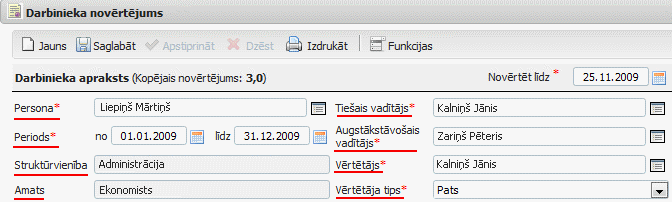
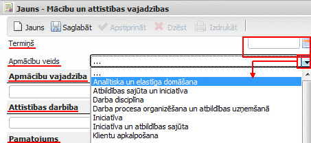

.. 5182
 
Darbinieka novērtējums
**************************
 

1. Novērtēšanas anketas aizpildīšana
++++++++++++++++++++++++++++++++++++

Pamatdati par pašu darbinieku (darbinieka apraksts)jau ir ievadīti un
atkārtotiNAV jāpārvada:

|images_ozols/26400.png|

Aizpildāmās sadaļas Darbinieka novērtējuma anketā:

1) Nākamajā periodā sasniedzamie rezultāti -> Lai pievienotu jaunu
ierakstu, nepieciešams nospiest pogu "Jauns ieraksts" -> Un tiks
atvērts jauns Sasniedzamo mērķu satura logs, kurā nepieciešams ievadīt
Mērķi, sagaidāmo Rezultātu un norādīt Svarīguma pakāpi, ar bultiņas
palīdzību izvēloties to no saraksta:

|images_ozols/26380.png|

Lai saglabātu pievienoto ierakstu nepieciešams nospiest pogu
|images_ozols/26381.png| . Lai atkārtoti pievienotu jaunu - nākamo
ierakstu, nepieciešams nospiest pogu: |images_ozols/26382.png| .

2) Amata pienākumu izpilde atbilstoši amata aprakstā noteiktajām
prasībām -> Obligāti aizpildāms lauks, kurbrīvā formā nepieciešams
ievadīt novērtējuma saturu, labajā pusē izvēloties atbilstošo
vērtējumu no saraksta:

|images_ozols/26383.png|

3) Rezultātu sasniegšanu un amata pienākumu izpildi veicinošie un
kavējošie faktori -> Obligāti aizpildāmi lauki, kur brīvā formā
nepieciešams ievadi veicinošos un kavējošos faktorus.

4) Kompetences -> Obligāti aizpildāmie lauki atzīmēti ar
|images_ozols/26384.png| - brīvā formā nepieciešams ievadīt satura
informāciju par katru no kompetencēm. Iepazīties ar katras kompetences
pilnu aprakstuiespējams, ar peli uzejot uz atbilstošās kompetences
nosaukumu:

|images_ozols/26385.png|

Katras kompetences apraksta lauka labajā pusē nepieciešams norādīt
vērtējumu, izvēloties to no saraksta (nospiežot uz bultiņas tiek
atvērts pilns vērtējumu saraksts).

5) Apmācības -> Lai pievienotu jaunu ierakstu, nepieciešams nospiest
pogu "Jauns ieraksts" -> Un tiks atvērts jaunsMācību un attīstības
vajadzībusatura logs, kurā nepieciešams ievadīt mācību termiņu, no
saraksta izvēlēties Apmācību veidu, brīvā formā atbilstošajos laukos
ierakstīt: Apmācību vajadzību, Attīstības darbību, kā arī Pamatojumu.

|images_ozols/26386.png|

Lai saglabātu pievienoto ierakstu nepieciešams nospiest pogu
|images_ozols/26381.png| . Lai atkārtoti pievienotu jaunu - nākamo
ierakstu, nepieciešams nospiest pogu: |images_ozols/26382.png| .

6) Nepieciešamās izmaiņas amata aprakstā ->Obligāti aizpildāms lauks,
kur brīvā formā nepieciešams ievadi informāciju par nepieciešamajām
izmaiņām esošajā amata aprakstā.

7) Iespējamā karjeras attīstība -> Obligāti aizpildāms lauks, kur
brīvā formā nepieciešams ievadi informāciju par iespējamo karjeras
attīstību.

8) Nozīmīgākais, kas nepieciešams, lai Sabiedrībā paaugstinātos darba
efektivitāte -> Obligāti aizpildāms lauks, kur brīvā formā
nepieciešams ievadi informāciju.

2. Novērtēšanas anketas saglabāšana, apstiprināšana un izdruka
++++++++++++++++++++++++++++++++++++++++++++++++++++++++++++++

Ja visa nepieciešamā informācija ir aizpildīta, tad anketai
nepieciešams norādīt parakstīšanas datumu :

|images_ozols/26387.png|

Pirms anketas saglabāšanas, apstiprināšanas un drukāšanas ->
Nepieciešams pārliecināties vai visa informācija ir aizpildīta.

|images_ozols/24545.gif| Tiklīdz anketa tiek apstiprināta, to vairsNAV
iespējams labot. Ja nepieciešams aizpildīto anketu saglabāt, bet vēl
neapstiprināt, nepieciešams izmantot anketas augšējā daļā pieejamo
pogu: |images_ozols/26381.png|

Ja visa informācija ir pārbaudīta un atbilstošie lauki aizpildīt, lai
pilnībā pabeigtu anketas aizpildīšanu, nepieciešams nospiest pogu:

|images_ozols/26388.png|

Pēc pogas nospiešanas, tiks uzdots kontroljautājums "Vai saglabāt,
apstiprināt un izdrukāt ierakstu?" -> atbildot apstiprinoši, tiks
apstiprināta aizpildītā anketa - tā vairs darbiniekam nebūs pieejama
labošanai, un uz darbinieka un tiešā vadītāja e-pastiem tiks nosūtīta
informācija par to, ka darbinieks anketu ir aizpildījis.

Lai izdrukātu aizpildīto anketu, nepieciešams izmantot anketas augšējā
daļā pieejamo pogu: |images_ozols/26389.png|

.. |images_ozols/26380.png| image:: images_ozols/26380.png
       :scale: 100%

.. |images_ozols/26382.png| image:: images_ozols/26382.png
       :scale: 100%

.. |images_ozols/26383.png| image:: images_ozols/26383.png
       :scale: 100%

.. |images_ozols/26382.png| image:: images_ozols/26382.png
       :scale: 100%

.. |images_ozols/26387.png| image:: images_ozols/26387.png
       :scale: 100%

.. |images_ozols/24545.gif| image:: images_ozols/24545.gif
       :scale: 100%

.. |images_ozols/26388.png| image:: images_ozols/26388.png
       :scale: 100%


 
   5187.rst
   5190.rst
   5192.rst
