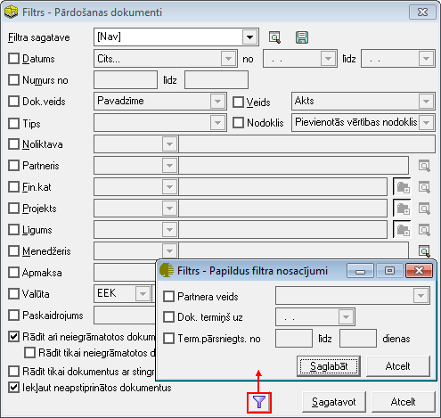

.. 539
 
Pārdošanas dokumenti
************************
 
Pārdošanas dokumentu atskaite tiek sagatavota par noteiktu periodu pēc
noteiktiem izvēlētiem kritērijiem.
Filtrs jāaizpilda, lai sagatavotu atskaiti. Atskaitē tiek ņemti dati
no :doc:`pārdošanas dokumentu žurnāla<204>` .

Dati uz ekrāna tiek parādīti atbilstoši norādītajiem datu atlases
kritērijiem filtra ekrāna formā. Filtru var uzlikt, lai ierobežotu
kādu datu parādīšanu uz ekrāna, iegūstot nepieciešamās izdrukas, vai
arī ātrāk sameklētu nepieciešamos datus. Filtrs tiek izmantots arī
atskaišu sagatavošanā un atsevišķu dokumentu satura aizpildīšanā.

Datu atlases kritērijus var saglabāt ( |images_ozols/24938.png| ).
Izvēloties izveidoto filtra sagatavi ( |images_ozols/24943.png| ),
filtrs tiek automatizēti aizpildīts no filtra sagataves. Lai izveidotu
atskaiti pēc vēlamajiem kritērijiem, Rīku joslā jānospiež poga
|images_ozols/24535.gif| (Ctrl+F), tiek atvērts filtra logs:

|images_ozols/26510.png|

Datums: periods, par kuru sagatavot iepirkumu dokumentu atskaiti;

Numurs: dokumentu numurs;

Dok. veids: dokumentu veids;

Veids: dokumenta veids;

Tips: iepirkuma dokumenta satura tips;

Nodoklis: iespējams atlasīt pēc nodokļa;

Noliktava: ja ir vairākas noliktavas, tad jāizvēlas noliktava, par
kuru tiks gatavota atskaite;

Partneris: iespējams atlasīt arī par partneri;

Noliktava: dimensiju dalījums;

Apmaksa: dokumenta apmaksas kritērijs;

Valūta: pārdošanas dokumentu valūta;

Paskaidrojums: atlasīšana pēc iepirkuma dokumentos nodefinētajiem
paskaidrojumiem;

Rādīt arī neiegrāmatotos dokumentus: lai atskaitē iekļautu arī
neiegrāmatotos dokumentus;

Rādīt tika neiegrāmatotos dokumentus: lai sagatavotu atskaiti tikai
par neiegrāmatotajiem dokumentiem;

Rādīt tikai dokumentus ar stingrās uzskaites numuriem: lai sagatavotu
atskaiti tikai parpārdošanas dokumentiem arstingrās uzskaites
numuriem;

Iekļaut neapstiprinātos dokumentus: lai iekļautu atskaitē arī
neapstiprinātos dokumentus.

Sagatavojot atskaiti, iespējams definēt arī papildus filtra
nosacījumus, un tad nospiežot pogu |images_ozols/25621.png| , un, ja
filtrā visi atskaites kritēriji izvēlēti, jānospiež poga
|images_ozols/25619.png| . Sagatavotos atskaites datus ir iespējams
arī izdrukāt. Lai drukātu datus, rīko joslā jānospiež poga
|images_ozols/24944.png| (Ctrl+P), un poga |images_ozols/25620.png| .

.. |images_ozols/24938.png| image:: images_ozols/24938.png
       :scale: 100%

.. |images_ozols/24943.png| image:: images_ozols/24943.png
       :scale: 100%

.. |images_ozols/24535.gif| image:: images_ozols/24535.gif
       :scale: 100%

.. |images_ozols/25621.png| image:: images_ozols/25621.png
       :scale: 100%

.. |images_ozols/25619.png| image:: images_ozols/25619.png
       :scale: 100%

.. |images_ozols/24944.png| image:: images_ozols/24944.png
       :scale: 100%

.. |images_ozols/25620.png| image:: images_ozols/25620.png
       :scale: 100%


 
