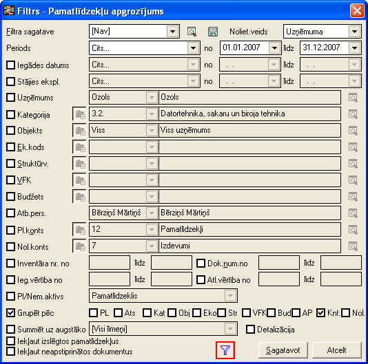

.. 565
 
Pamatlīdzekļu apgrozījums
*****************************
 
Pamatlīdzekļu apgrozījuma atskaite tiek sagatavota par norādīto
periodu pēc noteiktiem izvēlētajiem kritērijiem.

Filtrs jāaizpilda, lai sagatavotu atskaiti.

Dati uz ekrāna tiek parādīti atbilstoši norādītajiem datu atlases
kritērijiem filtra ekrāna formā. Filtru var uzlikt, lai ierobežotu
kādu datu parādīšanu uz ekrāna, iegūstot nepieciešamās izdrukas, vai
arī ātrāk sameklētu nepieciešamos datus. Filtrs tiek izmantots arī
atskaišu sagatavošanā un atsevišķu dokumentu satura aizpildīšanā.

Datu atlases kritērijus var saglabāt ( |images_ozols/24938.png| ).
Izvēloties izveidoto filtra sagatavi ( |images_ozols/24943.png| ),
filtrs tiek automatizēti aizpildīts no filtra sagataves. Lai izveidotu
atskaiti pēc vēlamajiem kritērijiem, Rīku joslā jānospiež poga
|images_ozols/24535.gif| (Ctrl+F), tiek atvērts filtra logs:

|images_ozols/25546.png|

Noliet. veids: jāizvēlas nolietojuma aprēķināšanas veids
|images_ozols/25505.png| (uzņēmuma vai nodokļiem);

Pārskats uz: periods uz kuru tiks veidota atskaite;

Iegādes datums: pamatlīdzekļu vai nemateriālo aktīvu iegādes datums
(periods);

Stājies ekspl.: pamatlīdzekļu vai nemateriālo aktīvu stāšanās
ekspluatācijā datums (periods);

Uzņēmums: atskaite par vienu noteiktu uzņēmumu;

Kategorija: pamatlīdzekļu kategorija;

Objekts: objekts, par kuru tiks veidota atskaite (dimensiju dalījums);

Ek.kods: ekonomiskās klasifikācijas kods (dimensiju dalījums);

Struktūrv.: stuktūrvienība (dimensiju dalījums);

VFK: (dimensiju dalījums);

Budžets: (dimensiju dalījums);

Atb.pers.: atlasīt pēc atbildīgās personas;

Pl. konts: pamatlīdzekļu konts;

Nol.konts: pamatlīdzekļu nolietojuma konts;

Inventāra nr.no...līdz... : iespēja atlasīt pēc pamatlīdzekļu
inventāra numura;

Dok. nr.no... līdz...: iespēja atlasīt arī pēc pamatlīdzekļu dokumenta
numura;

Iegādes vērtība no: atskaites kritērijs pēc iegādes vērtības;

Atl.vērtība: pamatlīdzekļu atlikusī vērtība;

Pl./Nem.aktīvs: iespējams izvēlēties pamatlīdzekļus vai nemateriālos
aktīvus;

Grupēt pēc: iespējams grūpēt pēc:

+ PL - pamatlīdzekļa paraksta;
+ Ats - atsauces;
+ Kat. - pamatlīdzekļu kategorijas;
+ Obj. - objekta;
+ Eko - ekonomiskās klasifikācijas kods;
+ Str - struktūrvienība;
+ Bud - budžets;
+ AP - atbildīgā persona, partneris;
+ Knt. - pamatlīdzekļa konts;
+ Nol. - pamtlīdzekļa nolietojuma konts.

Summēt uz augstāko: iespējams summēt pa dažādiem līmeņiem;

Detalizācija: attēlot atskaitē pamatlīdzekļu detalizāciju;

Iekļaut izslēgtos pamatlīdzekļus: lai iekļautu atskaitē arī izslēgtos
pamatlīdzekļus;

Iekļaut neapstiprinātos dokumentus: lai iekļautu atskaitē arī datus no
neapstiprinātajiem pamatlīdzekļu dokumentiem.

Kad filtra loga kritēriji ir izvēlēti, ir iespējams nodefinēt Papildus
filtra parametrus, nospiežot pogu |images_ozols/24535.gif| atvērtajā
filtra logā. Tiek atvērts papildus filtra nosacījumu logs:

|images_ozols/25547.png|

Dok. Veids: sarakstlodziņa labajā pusē, noklikšķinot uz podziņu
|images_ozols/25530.png| tiek atvērts dokumenta veidu izvēlņu
saraksts, kur iespējams izvēlēties kādu no pamatlīdzekļu dokumenta
veidiem;

Pl.Izsl.datums: pamatlīdzekļu izslēgšanas datums (periods);

Piegādātāja valsts: piegādātāja valsts no :doc:`Valstu saraksta<103>`
;

Pl.nosaukums: pamatlīdzekļa nosaukums;

Īpašuma veids: īpašuma veids kurš nodefinēts :doc:`pamatlīdzekļu
īpašuma veidu sarakstā<183>` ;

Amats: iespējams izvēlēties atbildīgās personas amatu kurš nodefinēts
:doc:`Amatu sarakstā<186>` ;

Pazīme: pazīme, kura nodefinēta :doc:`Pamatlīdzekļu pazīmju
sarakstā<130>` ;

Uzsk.vērt. no: uzskaites vērtība;

Uzkr.nol.no: uzkrātais nolietojums;

Atl.vērt.p.s.: atlikusī vērtība perioda sākumā;

Nolietojums no: nolietojums;

Rādīt nulles atlikumus: iespējams atlasīt pamatlīdzekļus arī ar nulles
atlikumu.

Kad papildus filtra kritēriji izvēlēti, jānospiež paga
|images_ozols/25533.png| un pamatlīdzekļu apgrozījuma filtra logā, ja
visi atskaites datu kritēriji izvēlēti, jānospiež poga
|images_ozols/25504.png| .

Sagatavotos atskaites datus ir iespējams arī izdrukāt. Lai drukātu
datus, rīko joslā jānospiež poga |images_ozols/24944.png| (Ctrl+P), un
jāizvēlās iebūvētā izdrukas forma "pamatlīdzekļu apgrozījums
(kopsavilkums)", un jānospiež poga |images_ozols/25507.png| .

.. |images_ozols/24938.png| image:: images_ozols/24938.png
       :scale: 100%

.. |images_ozols/24943.png| image:: images_ozols/24943.png
       :scale: 100%

.. |images_ozols/24535.gif| image:: images_ozols/24535.gif
       :scale: 100%

.. |images_ozols/25505.png| image:: images_ozols/25505.png
       :scale: 100%

.. |images_ozols/24535.gif| image:: images_ozols/24535.gif
       :scale: 100%

.. |images_ozols/25530.png| image:: images_ozols/25530.png
       :scale: 100%

.. |images_ozols/25533.png| image:: images_ozols/25533.png
       :scale: 100%

.. |images_ozols/25504.png| image:: images_ozols/25504.png
       :scale: 100%

.. |images_ozols/25507.png| image:: images_ozols/25507.png
       :scale: 100%


 
