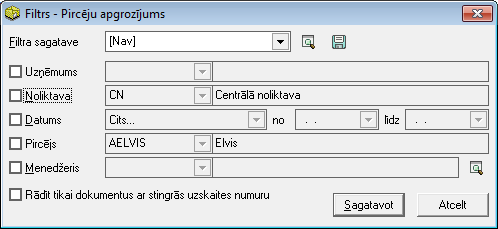

.. 583
 
Pircēju apgrozījums
***********************
 

Atskaiti par pircēju apgrozījumu iespējams sagatavot pēc noteiktiem
atlasīšanas kritērijiem.

Filtrs jāaizpilda, lai sagatavotu atskaiti.

Dati uz ekrāna tiek parādīti atbilstoši norādītajiem datu atlases
kritērijiem filtra ekrāna formā. Filtru var uzlikt, lai ierobežotu
kādu datu parādīšanu uz ekrāna, iegūstot nepieciešamās izdrukas, vai
arī ātrāk sameklētu nepieciešamos datus. Filtrs tiek izmantots arī
atskaišu sagatavošanā un atsevišķu dokumentu satura aizpildīšanā.

Datu atlases kritērijus var saglabāt ( |images_ozols/24938.png| ).
Izvēloties izveidoto filtra sagatavi ( |images_ozols/24943.png| ),
filtrs tiek automatizēti aizpildīts no filtra sagataves. Lai izveidotu
atskaiti pēc vēlamajiem kritērijiem, Rīku joslā jānospiež poga
|images_ozols/24535.gif| (Ctrl+F), tiek atvērts filtra logs:

|images_ozols/26512.png|

Uzņēmums: uzņēmums, par kuru tiks gatavota atskaite;

Noliktava: noliktava, par kuru dati tiks sagatavoti (pārdošanas
dokumenti izvēlētajā noliktavā)

Datums: periods, par kuru tiks gatavota atskaite;

Pircējs: iespēja atlasīt datus par konkrētu pircēju;

Menedžeris: iespēja atlasīt datus par konkrētu :doc:`Klientu
menedžeri<14136>` ;

Rādīt tikai dokumentus ar stingrās uzskaites numuru: atzīmējot šo
izvēles rūtiņu, tiks atlasīti apgrozījuma atskaitē tikai tie
dokumenti,kuriem fiksēts stingrās uzskaites numurs.

Sagatavojot atskaiti, iespējams definēt arī papildus filtra
nosacījumus (izvēloties dokumenta veidu) un nospiežot pogu
|images_ozols/25621.png| , un, ja filtrā visi atskaites kritēriji
izvēlēti, jānospiež poga |images_ozols/25619.png| . Sagatavotos
atskaites datus ir iespējams arī izdrukāt. Lai drukātu datus, rīko
joslā jānospiež poga |images_ozols/24944.png| (Ctrl+P), un jānospiež
poga |images_ozols/25620.png| .

.. |images_ozols/24938.png| image:: images_ozols/24938.png
       :scale: 100%

.. |images_ozols/24943.png| image:: images_ozols/24943.png
       :scale: 100%

.. |images_ozols/24535.gif| image:: images_ozols/24535.gif
       :scale: 100%

.. |images_ozols/25621.png| image:: images_ozols/25621.png
       :scale: 100%

.. |images_ozols/25619.png| image:: images_ozols/25619.png
       :scale: 100%

.. |images_ozols/24944.png| image:: images_ozols/24944.png
       :scale: 100%

.. |images_ozols/25620.png| image:: images_ozols/25620.png
       :scale: 100%


 
