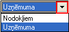
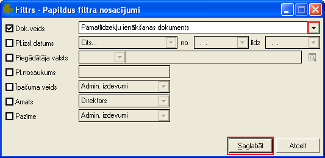

.. 586
 
Pamatlīdzekļu kustība
*************************
 
Pamatlīdzekļu kustības atskaite tiek sagatavota par norādīto periodu
pēc noteiktiem izvēlētajiem kritērijiem. Filtrs jāaizpilda, lai
sagatavotu atskaiti.

Dati uz ekrāna tiek parādīti atbilstoši norādītajiem datu atlases
kritērijiem filtra logā. Filtru var uzlikt, lai ierobežotu kādu datu
parādīšanu uz ekrāna, iegūstot nepieciešamās izdrukas, vai arī ātrāk
sameklētu nepieciešamos datus. Filtrs tiek izmantots arī atskaišu
sagatavošanā un atsevišķu dokumentu satura aizpildīšanā.

Datu atlases kritērijus var saglabāt ( |images_ozols/24938.png| ).
Izvēloties izveidoto filtra sagatavi ( |images_ozols/24943.png|
),filtrs tiek automatizēti aizpildīts no filtra sagataves. Lai
izveidotu atskaiti pēc vēlamajiem kritērijiem, rīku joslā jānospiež
poga |images_ozols/24535.gif| (Ctrl+F), tiek atvērts filtra logs:

|images_ozols/25509.png|

Noliet. veids: jāizvēlas nolietojuma aprēķināšanas veids
|images_ozols/25505.png| (uzņēmuma vai nodokļiem);

Periods: periods par kuru tiks veidota atskaite;

Stājies ekspl.: pamatlīdzekļu vai nemateriālo aktīvu stāšanās
ekspluatācijā datums (periods);

Uzņēmums: atskaite par vienu noteiktu uzņēmumu;

Kategorija no: kustība no pamatlīdzekļu kategorijas;

Kategorija uz: kustība uz pamatlīdzekļu kategoriju;

Objekts no: objekts, no kura tika veikta pamatlīdzekļu kustība;

Objekts uz: objekts, uz kuru tika veikta pamatlīdzekļu kustība;

Struktūrv.no: stuktūrvienība, no kuras tika veikta pamatlīdzekļu
kustība;

Struktūrv.uz: stuktūrvienība, uz kuru tika veikta pamatlīdzekļu
kustība;

Atb.pers.no: atlasīt pēc atbildīgās personas, no kuras notika
pamatlīdzekļu kustība;

Atb.pers.uz: atlasīt pēc atbildīgās personas, uz kuru notika
pamatlīdzekļu kustība;
Inventāra nr.no...līdz... : iespēja atlasīt pēc pamatlīdzekļu
inventāra numura;
Dok. nr.no... līdz...: iespēja atlasīt arī pēc pamatlīdzekļu dokumenta
numura;

Pl./Nem.aktīvs: iespējams izvēlēties pamatlīdzekļus vai nemateriālos
aktīvus;

Grupēt pēc: |images_ozols/25510.png| jāizvēlas pēc kura kritērija
grupēt;

Iekļaut nolietojuma dokumentus: lai iekļautu atskaitē arī
pamatlīdzekļu nolietojuma dokumentus;

Iekļaut izslēgtos pamatlīdzekļus: lai iekļautu atskaitē arī izslēgtos
pamatlīdzekļus;

Iekļaut neapstiprinātos dokumentus: lai iekļautu atskaitē arī
neapstiprinātos kustību dokumentus

Kad filtra loga kritēriji ir izvēlēti, ir iespējams nodefinēt Papildus
filtra parametrus, nospiežot pogu |images_ozols/24535.gif| atvērtajā
filtra logā. Tiek atvērts papildus filtra nosacījumu logs:

|images_ozols/25529.png|

Dok. Veids: sarakstlodziņa labajā pusē, noklikšķinot uz podziņu
|images_ozols/25530.png| tiek atvērts dokumenta veidu izvēlņu
saraksts, kur iespējams izvēlēties kādu no pamatlīdzekļu dokumenta
veidiem;

Pl.Izsl.datums: pamatlīdzekļu izslēgšanas datums (periods);

Piegādātāja valsts: piegādātāja valsts no :doc:`Valstu saraksta<103>`
;

Pl.nosaukums: pamatlīdzekļa nosaukums;

Īpašuma veids: īpašuma veids kurš nodefinēts :doc:`pamatlīdzekļu
īpašuma veidu sarakstā<183>` ;

Amats: iespējams izvēlēties atbildīgās personas amatu kurš nodefinēts
:doc:`Amatu sarakstā<186>` ;

Pazīme: pazīme, kura nodefinēta :doc:`Pamatlīdzekļu pazīmju
sarakstā<130>` ;

Kad papildus filtra kritēriji izvēlēti, jānospiež paga
|images_ozols/25533.png| . Kad arī pamatlīdzekļu kustību filtra logā
visi atskaites datu kritēriji izvēlēti, jānospiež poga
|images_ozols/25504.png| .

Sagatavotos atskaites datus ir iespējams arī izdrukāt. Lai drukātu
datus, rīko joslā jānospiež poga |images_ozols/24944.png| (Ctrl+P), un
jāizvēlās iebūvētā izdrukas forma "pamatlīdzekļu kustība", jānospiež
poga |images_ozols/25507.png| . Katru pamatlīdzekļa kustības dokumentu
ir iespējams arī atvērt un apsaktīties tā saturu. Lai atvērtu
dokumentu, rīku joslā janospiež poga |images_ozols/24709.png| , tiek
atvērta pamatlīdzekļu kartīte;

|images_ozols/25524.png|

Pamatlīdzekļu kartītē redzams pamatlīdzekļa apraksts un dokumenti,
kuri sasitīti ar šo pamatlīdzekli. Lai atvērtu kādu no šiem, ar
pamatlīdzekli saistītajiem dokumentiem, jāizvēlas attiecīgais
dokuments un jānospiež poga |images_ozols/25525.png| , tā tiek atvērts
izvēlētais pirmdokuments. Lai atvērtu pamatlīdzekļa aprakstu un/vai
mainītu Derīgās lietošanas laiku, jānospiež poga
|images_ozols/25526.png| . Lai aizvērtu dokumentu, jānospiež poga
|images_ozols/25527.png| .

.. |images_ozols/24938.png| image:: images_ozols/24938.png
       :scale: 100%

.. |images_ozols/24943.png| image:: images_ozols/24943.png
       :scale: 100%

.. |images_ozols/24535.gif| image:: images_ozols/24535.gif
       :scale: 100%

.. |images_ozols/24535.gif| image:: images_ozols/24535.gif
       :scale: 100%

.. |images_ozols/24944.png| image:: images_ozols/24944.png
       :scale: 100%

.. |images_ozols/25507.png| image:: images_ozols/25507.png
       :scale: 100%

.. |images_ozols/24709.png| image:: images_ozols/24709.png
       :scale: 100%

.. |images_ozols/25524.png| image:: images_ozols/25524.png
       :scale: 100%


 
