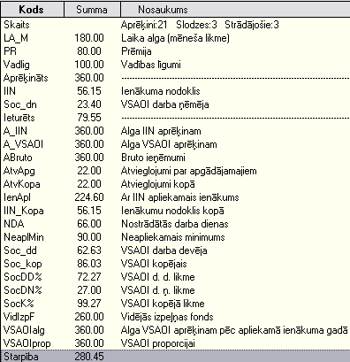

.. 589
 
Rezultātu kopsavilkums
**************************
 
Atskaite parāda algu aprēķina datus izvēlētajā periodā kopsavilkuma
veidā. Atskaitē saraksta veidā tiek parādīti izvēlētā perioda visi
algu aprēķinā iesaistītie ieejošie aprēķina dati, ieturējumi un
rezultāti.
Atskaiti var sagatavot noteiktam aprēķina periodam, atsevišķai
struktūrvienībai, finansējumam, atlasot datus par amatiem, slodzes
veidiem, personāla kategorijām. Datus var filtrēt pēc dzīvesvietas
koda un sociālā nodokļa aprēķina metodes.
|images_ozols/24545.gif| Kad ir veikts algu aprēķins un summas
nosūtītas uz izmaksu sarakstiem, sagatavojot šo atskati, iespējams
pārbaudīt vaiaprēķinātā alga no visiem aprēķiniem nosūtīta uz izmaksu
sarakstiem.Ja atskaite neuzrāda starpību, tad visas algu aprēķina
darbības ir veiktas. Starpība atskaitē parādās gadījumos, ja visas
izmaksājamās summas nav nosūtītas uz izmaksu sarakstiem.

|images_ozols/26555.png|

Algu aprēķins ir veikts pilnībā, pareizi, ja nav starpības starp
aprēķināto summu un ieturēto summu. Visbiežāk starpība varētu rasties,
ja nav visas aprēķinātās summas nosūtītas uz izmaksu sarakstiem. Ja
šajā atskaitē rindā Starpība parādās summa, algu periodu nevar slēgt,
jo algu aprēķins nav pabeigts.
No rezultātu kopsavilkuma rindām var atvērt atskaites rindas
atšifrējumu –atskaiti rezultāti vertikāli.

.. |images_ozols/24545.gif| image:: images_ozols/24545.gif
       :scale: 100%


 
