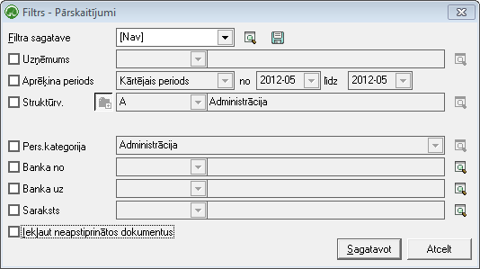

.. 615
 
Pārskaitījumi
*****************
 
Atskaite Pārskaitījumi parāda sagatavotos :doc:`izmaksu
sarakstus<238>` , tajos iekļautos ierakstu skaitus – izmaksas
strādājošajiem, kopsummu, pārskaitījumu kustību starp bankām.

Atskaiti iespējams sagatavot par:
- dažādiem laika periodiem;
- atlasot datus pa finansējumiem ( datu uzskaites dimensijām);
- vienai :doc:`personāla kategorijai<127>` ;
- norādot bankas, starp kurām naudas kustība ir noteikta izmaksu
sarakstos;
- vienam konkrētam :doc:`izmaksu sarakstam<238>`

|images_ozols/26545.png|

Datu atlases kritērijus var saglabāt ( |images_ozols/24938.png| ).
Izvēloties izveidoto filtra sagatavi ( |images_ozols/24943.png| ),
filtrs tiek automatizēti aizpildīts no filtra sagataves.

.. |images_ozols/24938.png| image:: images_ozols/24938.png
       :scale: 100%

.. |images_ozols/24943.png| image:: images_ozols/24943.png
       :scale: 100%


 
