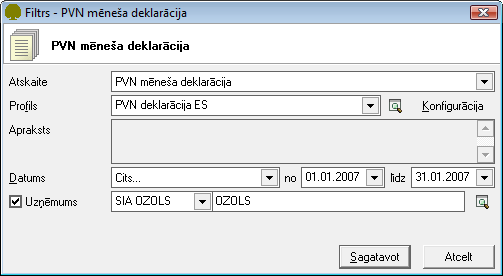
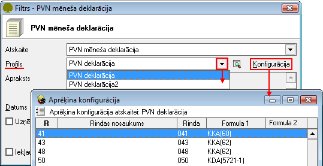
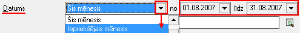
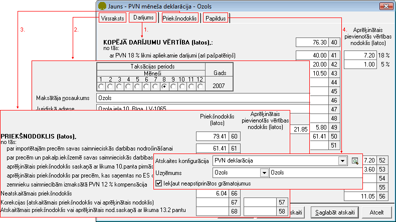

.. 641
 
PVN mēneša deklarācija 2008
*******************************
 

Sagatavotās PVN deklarācijas tiek saglabātas atskaišu
:doc:`Sarakstā<531>` . Deklarācijai ir iebūvēta Ministru kabineta
noteikta standarta izdrukas forma. Atskaites dati ir sadalīti ekrāna
formās Virsraksts, Darījums, Priekšnodoklis, Papildus, katrā no formām
iekļaujot noteiktus atskaites datus. Atskaite ir konfigurējama,
nosakot kādu kontu dati tiks parādīti katrā no atskaites rindiņām. No
atskaites ekrāna formas var labot atskaites konfigurāciju un
pārrēķināt atskaites datus, neveidojot jaunu atskaiti.

Lai būtu iespējams sagatavot PVN mēneša deklarāciju,iepriekš jābūt
izveidotai :doc:`Grāmatojumu atskaišu konfigurācijai<179>` .

PVN mēneša deklarācijassagatavošana
+++++++++++++++++++++++++++++++++++

1. Izvēloties Virsgrāmatas atskaiti - PVN mēneša deklarācija, tiks
atvērt filtra logs, kur jānorāda nepieciešamie parametri, pēc kādiem
atskaite tiks sagatavota:

|images_ozols/25069.png|

2. Nepieciešams norādīt attiecīgo profilu - :doc:`atskaites
konfigurāciju<179>` , pēc kādiem konfigurācijas datiem atskaite tiks
sagatavota:

|images_ozols/25070.png|

3. Nepieciešams norādīt periodu, par kuru atskaite tiks sagatavota,
izvēloties kādu no definētajiem datuma nosacījumiem vai arī "cits" un
ievadot datumus manuāli:

|images_ozols/25046.png|

4. Ja vienā Ozols datu bāzē tiek veikta grāmatvedības uzskaite
vairākiem uzņēmumiem,filtrā iespējams izvēlēties, pēc kura uzņēmuma
datiem atskaite tiks sagatavota:

|images_ozols/25047.png|

5.Atzīmējot izvēles rūtiņu, iespējams atskaitē iekļaut arī
neapstiprinātos grāmatojumus:

|images_ozols/25071.png|

6.PVN deklarācijatiks sagatavota, nospiežot pogu
|images_ozols/25049.png| :

|images_ozols/25072.png|

1. Sadaļā "Darījums" tiek parādīta sagatavotā atskaites informācija,
pēc filtrā norādītajiem parametriem - norādītās konfigurācijas. Tiek
parādītasPVN deklarācijasrindas un summas, kas tiek aprēķinātas
balstoties uz atskaites konfigurācijā norādītajām formulām
atbilstošajām rindiņām (40-56 rinda).

2. Sadaļā "Virsraksts" tiek parādīta atskaites Virsraksta informācija
- taksācijas periods, priekšnodokļa un aprēķinātā PVN kopsummas,
informācija par uzņēmumu (nosaukums, reģistrācijas nr., adrese,
atbildīgā persona) un atskaites nosaukums, kas nosaukumā ietver
periodu, par kuru atskaite tiek sagatavota.

3. Sadaļā "Priekšnodoklis" tiek parādīta informācija par aprēķināto
priekšnodokli, kas tiek aprēķināts balstoties uz atskaites
konfigurācijā norādītajām formulām atbilstošajām rindiņām (57-68
rinda).

4. Sadaļā "Papildus" tiek parādīta vispārēja informācija, kas ņemta no
norādītajiem filtra parametriem sagatavojot atskaiti: izvēlētā
atskaites konfigurācija, izvēlētais uzņēmums, pēc kura datiem šī
atskaite tika sagatavota un izvēles rūtiņa "Iekļaut neapstiprinātos
grāmatojumus", kuru iespējams atzīmēt, ja deklarācija jāsagatavo
iekļaujot tajā arī neapstiprinātos grāmatojumus.

7. Ekrāna formā ir pieejams atskaišu konfigurācijas saraksts.
Nospiežot pogu |images_ozols/25055.png| , komanda izsauc atskaites
konfigurācijas ekrāna formu, to var papildināt neaizverot atskaiti.

8. Ja pēc atskaites sagatavošanas veiktas izmaiņas :doc:`atskaites
konfigurācijā<179>` , atskaiti pēc izmanītās konfigurācijas datiem var
pārrēķināt, nospiežot pogu: |images_ozols/25053.png| . Pārrēķinot
atskaiti, tajā tiek parādīti jaunākie dati.

9. Sagatavoto atskaiti iespējams saglabāt :doc:`VID atskaišu
sarakstā<531>` , kur tā būs pieejama labošanai/drukāšanai, nospiežot
pogu: |images_ozols/25054.png| .

10. Nospiežot pogu |images_ozols/24617.jpg| atskaite sagatavota netiks
un darbība tiks atcelta. Ja atskaite tiek izveidota un nav jāsaglabā,
jālieto komanda Atcelt . Ja atskaite ir saglabāta sarakstā, komandu
Atcelt var izmantot, lai nesaglabātu atskaitē veiktās izmaiņas.

.. |images_ozols/25047.png| image:: images_ozols/25047.png
       :scale: 100%

.. |images_ozols/25054.png| image:: images_ozols/25054.png
       :scale: 100%

.. |images_ozols/24617.jpg| image:: images_ozols/24617.jpg
       :scale: 100%


 
