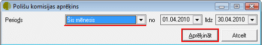
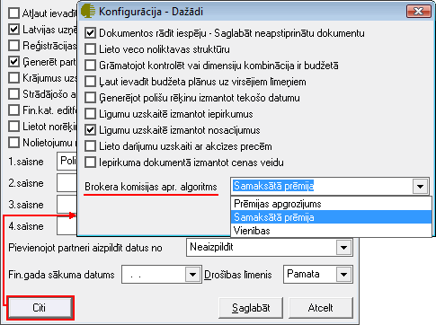

.. 6517
 
Polišu komisijas aprēķins
*****************************
 

Priekšnosacījumi brokeru komisijas sekmīgam aprēķinam
+++++++++++++++++++++++++++++++++++++++++++++++++++++

1. Sadarbības līgumu ievade (sadarbības līgumi ar starpniekiem un
apdrošināšanas sabiedrībām)

2. Korekti aizpildīta informācija Polises aprakstā

Polišu komisijas aprēķinu veikšana
++++++++++++++++++++++++++++++++++

1. Lai aprēķinātu Polišu komisijas, nepieciešams norādīt periodu
(vēlams vienu mēnesi, lai aprēķina process neieilgtu), par kuru šis
aprēķins tiks veikts:

|images_ozols/26410.png|

2. Izvēloties nepieciešamo aprēķina periodu, nospiežot pogu
|images_ozols/25439.png| tiks aprēķinātas Polišu komisijas, balstoties
uz Konfigurācija>Iestādījumi>Kopīgie> :doc:`Dažādi<739>` noteikto
Brokera komisijas aprēķina algoritmu:

|images_ozols/25440.png|

Prēmijas apgrozījums - līgumā nodefinēto procentu aprēķins no perioda
kopējās prēmijas apgrozījuma.

Samaksātā prēmija - līgumā nodefinēto procentu aprēķins no periodā
izrakstīto polišu samaksātas prēmijas apjoma.

Vienības - konkrētā periodā parakstīto prēmiju komisijas tiek
aprēķināta vienībās.


 
