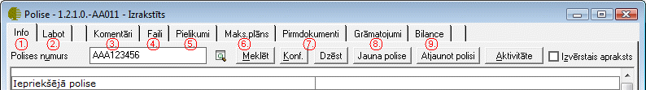
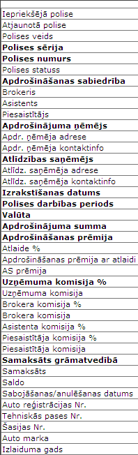

.. 6521
 
Polise
**********
 

Darba režīms Polise paredzēts pilnas informācijas iegūšanai par Polisi
- Polises pamatinformāciju, Brokeri, Asistentu, Piesaistītāju un
komisijas %, kā arī maksājuma plāniem, pirmdokumentiem un
grāmatojumiem saistībā ar šo polisi.

Izvēloties darba režīmu Polise, tiks atvērts šāds logs:

|images_ozols/25467.png|

1. Polises apraksta Info lapa
+++++++++++++++++++++++++++++

Info sadaļā jūs varēsiet redzēt visu informāciju, kas atiecās uz katru
polišu līgumu. Šajā sadaļā jūs datus nevarēsiet izlabot, tikai
aplūkot.
Info sadaļa veidojas no sadaļas "Labot". Tiklīdz sadaļā labot jūs
izdarīsiet kādus datu ierakstus tā šī informācija parādīsies sadaļā
Info.
Laukus kurus jūs varat aplūkot:

|images_ozols/25469.png|

2. Sadaļa "Labot"
+++++++++++++++++

3. Komentāri
++++++++++++

4. Faili
++++++++

5. Pielikumi
++++++++++++

6. Maksājumu plāns
++++++++++++++++++

7. Pirmdokumenti
++++++++++++++++

8. Grāmatojumi
++++++++++++++

9. Bilande
++++++++++


 
