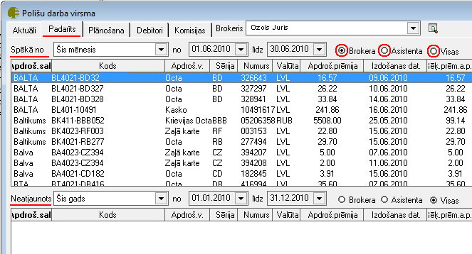
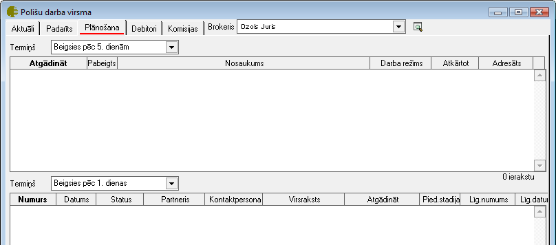
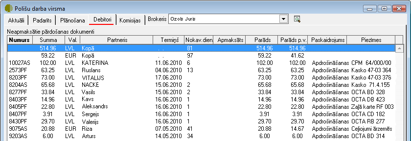
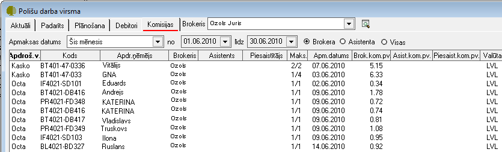

.. 6523
 
Polišu darba virsma
***********************
 

Polišu darba virsma (ātrais taustiņš F9) ir paredzēta brokerim
aktuālās informācijas iegūšanai - aktuālie līgumi un izrakstītie
rēķini, padarītie darbi, rēķini, kuriem tuvojas maksājuma termiņš,
plānošana un piedāvājumi, debitori, un nopelnītās kā brokera,
asistenta un piesaistītāja komisijas.

Polišu darba virsmā ir iespējams apskatīt piecas lapaspuses (Aktuāli,
Padarīts, Plānošana, Debitori un Komisijas)

Laukā |images_ozols/25899.png| , iespējams izvēlēties attiecīgo
brokeri par kuru dati tiks atlasīti.

Aktuāli
+++++++

Lapaspusē Aktuāli ir iespējams iegūt datus par aktuālajām polisēm,
kurām tuvojas beigu termiņš. Izvēles laukā Termiņš, uzstādot attiecīgo
termiņa periodu, tiks atlasīti dati pēc norādītajiem kritērijiem:

|images_ozols/26425.png|

Padarīts
++++++++

Lapaspusē Padarīts ir iespējams apskatīt datus par padarītajiem
darbiem - informācija par parakstītajām polisēm un nenoslēgtiem polišu
līgumiem.Tāpat ir iespējams norādīts kādi ir parakstītie līgumi kā
Brokeri, kā Asistentam vai kā Visi (gan kā brokeris,asistents un
piesaistītājs). Norādot attiecīgo Parakstīšanas un Neatjaunošanas
periodu, iespēja atlasīt visas izvēlētā perioda datus.

|images_ozols/26426.png|

Plānošana
+++++++++

Lapaspuse Plānošana ir paredzēta, lai būtu iespējams iegūt informāciju
par plānotajiem darbiem attiecīgā periodā.

Izvēles laukā Termiņš, uzstādot attiecīgo termiņa periodu, tiks
atlasīti dati pēc norādītajiem kritērijiem:

informācija par visām aktivitātēm, notikumiem, korespondenci un darba
uzdevumiem un informācija par veidotajiem piedāvājumiem.

|images_ozols/26427.png|

Debitori
++++++++

Lapaspusē Debitori iespējams iegūt datus par neapmaksātajiem
pārdošanas dokumentiem (Polišu faktūrrēķiniem un Apdrošināšanas
sabiedrības rēķiniem):

|images_ozols/26428.png|

Komisijas
+++++++++

Lapaspusē Komisijas iespējams iegūt datus par attiecīgā perioda
sastrādātajām komisijām. Periodu jāizvēlas pēc nepieciešamības.

|images_ozols/26429.png|


 
