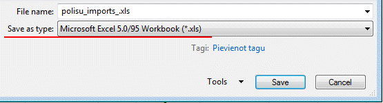
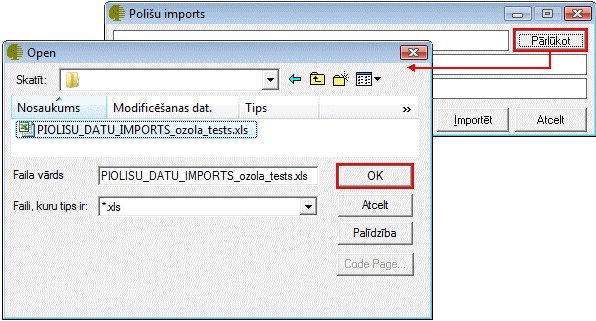
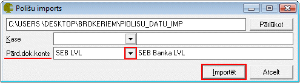

.. 6525
 
Polišu imports
******************
 
Polišu imports nodrošina liela apjoma polišu datu importēšanu sistēmā
no sagatavota excel datu faila. Polišu datu importēšanas procesā
notiek :doc:`Partnera kartiņas<312>` izveide ar partnerim norādīto
kontaktinformāciju, :doc:`polises izveide<6510>` , polišu
:doc:`rēķina<304>` izveide un :doc:`bankas<349>` vai :doc:`kases
ieņēmuma<350>` izveide un sasaiste ar maksājumu.

Lai veiktu polišu importu:

1. Jāsagatavo un jānoformē importējamos polišu datus atbilstoši
prasībām;

2. Jāsaglabā Microsoft Excel 5.0/95 Workbook.xls formātā;

:scale: 100%

3. Jāatver Polišu importa rīks un caur pogu Pārlūkot, jānorāda ceļš uz
saglabāto polišu datu failu:

:scale: 100%

4. Ja sagatavotajā failā ir norādīti stingrās uzskaites kvīšu numuri,
tad nepieciešams norādīt Kasi, uz kuru tiks veidoti kases ieņēmumu
orderi.

.. image:: images_ozols/24545.gif
:scale: 100%
Ja nav nepieciešams polišu rēķinus saistīt ar :doc:`Kases
ieņēmumie<350>` /apmaksām, tad pie polišu importa nav jānorāda Kase.

5. Jānorāda uzņēmuma Bankas konts, kurš tiks norādīts polišu
maksājumos/:doc:`rēķinos<304>` :

:scale: 100%

6. Lai uzsāktu polišu importu no datu faila, pēc faila un bankas konta
norādīšanas, jānospiež poga Importēt, un jāgaida, līdz sistēma parādīs
cik ilgā laikā ir veikst polišu imports.

.. image:: images_ozols/24545.gif
:scale: 100%
Iportētajām polisēm netiek automātiski izveidots :doc:`POP<14080>`
(polišu parakstīšanas) grāmatojums. Lai izveidotu POP grāmatojumus
importētajām polisēm. :doc:`Polišu atskaitē<6513>` pēc konkrētiem
parametriem jāatlasa polises, kuras tika importētas, jāiezīmē un, rīku
joslā nospiežot funkcijas pogu, jāizvēlas funkcija Izveidot POP
grāmatojumu.


 
