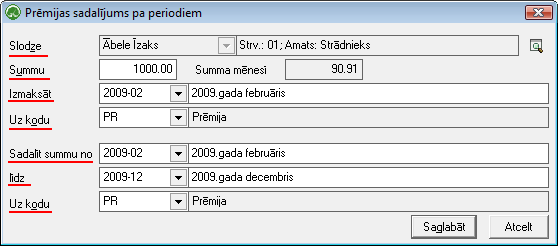

.. 659
 
Prēmiju sadalījums pa periodiem
***********************************
 

Izmantojot darba režīmu "Prēmiju sadalījums par periodiem", iespējams
pārdalīt strādājošajiem pienākošās prēmijas vairāku periodu garumā.
Prēmiju sadalījumu ievades mērķis ir izveidotos datus automatizēti
pievienot strādājošā algu aprēķinam norādītajā periodā, ielādējot
datus no tarifikācijas.

Jaunu prēmiju sadalījumu strādājošajam iespējams pievienot, rīku joslā
nospiežot pogu: |images_ozols/25605.png|

|images_ozols/26253.png|

Slodze: no saraksta jāizvēlas strādājošā slodze, kurai Prēmijas
sadalījums tiks definēts

Summu: nepieciešams ievadīt pilno prēmijas summu, kas tiks sadalīta
vairāku periodu garumā

Summa mēnesī: lauks nav jāaizpilda - tiks aprēķināts automātiski no
norādītajiem izejas datiem: summa / periodu skaits

Izmaksāt: algas aprēķina periods, kurā tiks ielādēts ieejošais algu
kods ar pilno prēmijas summu

Uz kodu: nepieciešams norādīt uz kādu algu kodu kopējā prēmijas summa
tiks ielādēta

Sadalīt summu no: nepieciešams norādīt periodu, sākot no kura sadalītā
prēmijas summa mēnesī tiks izmaksāta

līdz: nepieciešams norādīt periodu, līdz kuram sadalītā prēmijas summa
mēnesī tiks izmaksāta

Uz kodu: nepieciešams norādīt uz kādu algu kodu izmaksa tiks veikta

Lai saglabātu pievienotos datus, jānospiež poga
|images_ozols/24615.jpg| .

.. |images_ozols/25605.png| image:: images_ozols/25605.png
       :scale: 100%

.. |images_ozols/24615.jpg| image:: images_ozols/24615.jpg
       :scale: 100%


 
