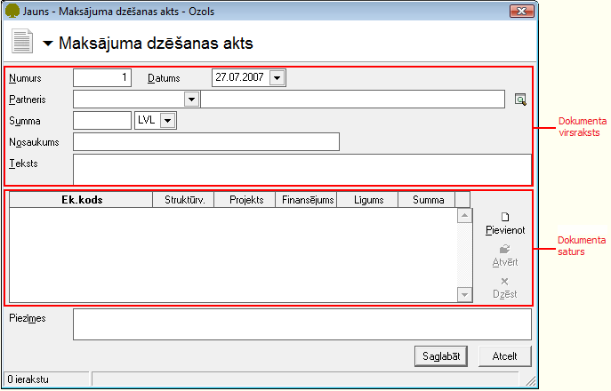
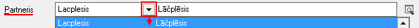
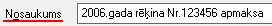

.. 671
 
Maksājuma dzēšanas akts
***************************
 
Maksājuma dzēšanasakts ir paredzēts Kases/Bankas ieņēmumu/izdevumu
nenosegto summu dzēšanai, ja nav atbilstoša norēķinu dokumenta.


Jauna Maksājuma dzēšanas akta pievienošana
``````````````````````````````````````````

Jaunu Maksājuma dzēšanas aktu iespējams pievienot divos veidos:


1. Izvēloties dokumenta veidu Maksājuma dzēšanas akts, tiks atvērts
jauns logs:
+++++++++++



:scale: 100%


Maksājuma dzēšanas aktaVirsraksta aizpildīšana
++++++++++++++++++++++++++++++++++++++++++++++


Lai aizpildītu Maksājuma dzēšanas akta Virsrakstu, nepieciešams:


1. Izvēlēties Datumu, kurā šis Maksājuma dzēšanas akt tiek veidots:


.. image:: images_ozols/24725.png
:scale: 100%


2. No saraksta izvēlēties nepieciešamo Partneri, kuram šis Maksājuma
dzēšanas akts tiks veidots:



:scale: 100%


3.Ievadīt kopējo Maksājuma dzēšanas akta summu:


.. image:: images_ozols/24812.png
:scale: 100%


4. Laukā Nosaukums iespējams ievadīt Maksājuma dzēšanas akta
nosaukumu:



:scale: 100%


5. Laukā Teksts iespējams ievadīts paskaidrojošo informāciju par šo
Maksājuma dzēšanas aktu.


2.Jauna Maksājuma akta sagatavošana no dokumentu saistīšanas ekrāna
formas
++++++

Jebkuram Bankas izdevumu dokumentam iespējams izveidot Maksājuma
dzēšanas aktu, nospiežot rīku joslā pogu .. image::
images_ozols/24978.png
:scale: 100%
.

Jauna Maksājuma dzēšanasakta sagatavošana ir paredzēta no dokumentu
saistīšanas ekrāna formas, izmantojot komandpogu "Jauns maksājuma akts
...":


.. image:: images_ozols/24980.png
:scale: 100%


Izvēloties šo Maksājuma dzēšanas akta sagatavošanas veidu, lauki
Partneris un Summa jau tiek automātiski aizpildīti no izvēlētā
maksājumu dokumenta.


Maksājuma dzēšanas aktaSatura aizpildīšana
++++++++++++++++++++++++++++++++++++++++++

Lai aizpildītu Maksājuma dzēšanas akta Saturu, dokumenta satura daļā
nepieciešams nospiest .. image:: images_ozols/24708.png
:scale: 100%
un tiks atvērts operācijas satura logs, kurā nepieciešams aizpildīt
satura ierakstus (uzņēmumā izmantotās dimensijas) un norādīt satura
ieraksta summu:


.. image:: images_ozols/24728.png
:scale: 100%


Maksājuma dzēšanas akta grāmatošana
```````````````````````````````````

Maksājuma dzēšanas aktuiespējams grāmatot no atvērtadokumenta vai
izvēloties (iezīmējot)dokumentu :doc:`Maksājumu dzēšanas aktu
žurnālā<253>` .

Lai iegrāmatotu Maksājuma dzēšanas aktu, dokumentu nepieciešams
Apstiprināt, nospiežot rīku joslā pogu .. image::
images_ozols/24740.png
:scale: 100%
.

Apstiprinātu dokumentu ir iespējams grāmatot, nospiežot rīku joslā
pogu .. image:: images_ozols/24741.png
:scale: 100%
.


Instrukcija - :doc:`Dokumentu grāmatošanas principi<14044>`


Pievienotā Maksājuma dzēšanas akta labošana
```````````````````````````````````````````

Labojumus saglabātajādokumentā iespējams veikt atverot Maksājuma
dzēšanas aktu, kurš pieejams apskatei/labošanai:doc:`Maksājumu
dzēšanas aktu žurnālā<253>` . Lai veiktu labojumusMaksājuma dzēšanas
aktā,dokumentunepieciešams atvērt, izmantojot rīku joslas pogu..
image:: images_ozols/24709.png
:scale: 100%
(ALT+A), unatvērtajāierakstā iespējams veiktnepieciešamos labojumus:


.. image:: images_ozols/24981.png
:scale: 100%


Pēc labojumu veikšanas, veiktās izmaiņas iespējams .. image::
images_ozols/24615.jpg
:scale: 100%
vai .. image:: images_ozols/24617.jpg
:scale: 100%
.


 
