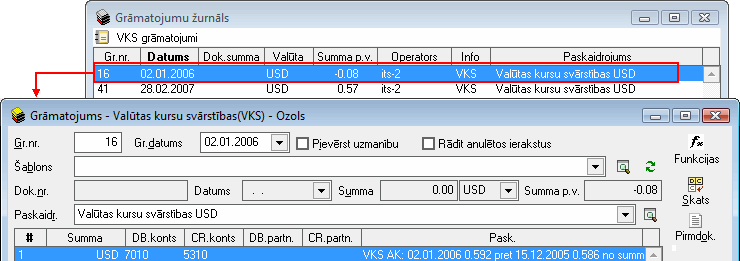

.. 675
 
Valūtu kursu svārstību aprēķins
***********************************
 

Priekšnosacījumi valūtu kursa svārstību sekmīgam aprēķinam
++++++++++++++++++++++++++++++++++++++++++++++++++++++++++

1. Grāmatvediskajiem kontiem, kuriem nepieciešams rēķināt valūtu kursa
svārstību, konta aprakstā, kas pieejams atverot kontu no :doc:`Kontu
plāna<114>` , jābūt atzīmētai izvēles rūtiņai VKS:

|images_ozols/25130.png|

Ja uzņēmuma grāmatvedības uzskaitē tiek izmantotas datu uzskaites
dimensijas un valūtas kursa svārstību rezultātā radušos peļņu vai
zaudējumus nepieciešams sadalīt pa dimensijām, konta aprakstā jāatzīmē
arī izvēles rūtiņa: |images_ozols/25131.png|

2. Konfigurācijas kopīgajos :doc:`Grāmatojumu iestādījumos<707>` jābūt
atzīmētiem kontiem:

|images_ozols/25132.png|

3. Kopējajos sarakstos, sarakstā :doc:`Valūtu kursi<230>` , jābūt
importētiem valūtu kursiem par periodu, par kuru nepieciešams veikt
valūtu kursu svārstību aprēķinu:

|images_ozols/25133.png|

Valūtu kursu svārstību aprēķina veikšana
++++++++++++++++++++++++++++++++++++++++

1. Lai veiktu Valūtu kursu svārstību aprēķinu, nepieciešams norādīt
periodu, par kuru šis aprēķins tiks veikts:

|images_ozols/25217.png|

2. Ja nepieciešams Valūtu kursu svārstības rēķināt visiem atlikumiem
perioda beidzamajā dienā, jāatzīmē izvēles rūtiņa:

|images_ozols/25219.png|

3. Pēc izvēlētā perioda norādīšanas, iespējams veikt valūtu kursu
svārstību aprēķinu, nospiežot komandpogu |images_ozols/25220.png| :

|images_ozols/25224.png|

Notiks Valūtu kursu svārstību aprēķina process, kā rezultātā tiks
izveidoti grāmatojumi, kurus iespējams apskatīt, Valūtu kursu
svārstību aprēķina logā nospiežot komandpogu "JĀ":

|images_ozols/25225.png|

Tiks atvērts grāmatojumu žurnāla logs, kurā būs pieejami valūtu kursu
svārstību aprēķina rezultātā izveidotie grāmatojumi, kurus iespējams
atvērt, izmantojot rīku joslā pieejamo komandpogu
|images_ozols/24709.png| :

|images_ozols/25226.png|

Valūtu kursu svārstību aprēķina rezultātā izveidotie grāmatojumi
pieejami :doc:`Grāmatojumu žurnālā<131>` , kur tos iespējams atlasīt,
grāmatojuma žurnāla filtrā, norādot attiecīgo grāmatojuma veidu:

|images_ozols/25228.png|

.. |images_ozols/25131.png| image:: images_ozols/25131.png
       :scale: 100%

.. |images_ozols/25132.png| image:: images_ozols/25132.png
       :scale: 100%

.. |images_ozols/25133.png| image:: images_ozols/25133.png
       :scale: 100%

.. |images_ozols/25217.png| image:: images_ozols/25217.png
       :scale: 100%

.. |images_ozols/25219.png| image:: images_ozols/25219.png
       :scale: 100%

.. |images_ozols/25220.png| image:: images_ozols/25220.png
       :scale: 100%

.. |images_ozols/25224.png| image:: images_ozols/25224.png
       :scale: 100%

.. |images_ozols/24709.png| image:: images_ozols/24709.png
       :scale: 100%

.. |images_ozols/25228.png| image:: images_ozols/25228.png
       :scale: 100%


 
